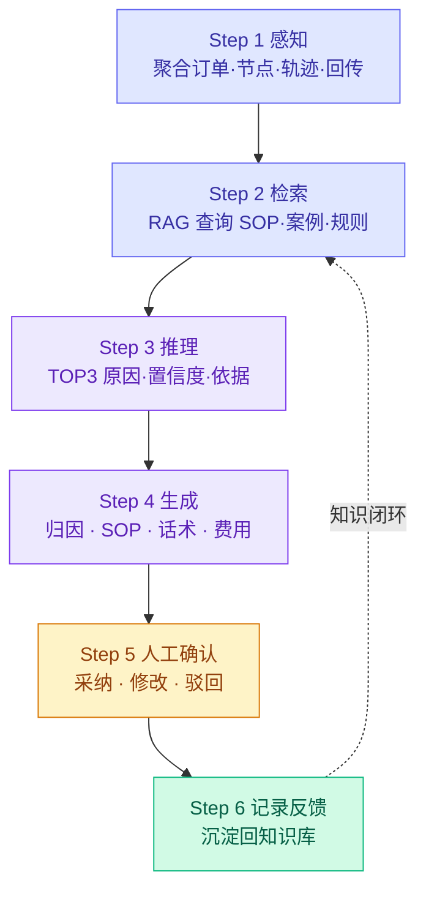

# 跨境 TMS AI 产品专项方案：异常处理 Agent 与知识闭环设计

版本：v4.0 | 2026年5月
定位：AI 能力专项方案，可独立阅读，建议配合《东南亚跨境 TMS MVP PRD v5》使用
核心场景：深圳→胡志明，目的国清关超时，Agent + SOP RAG 辅助异常处理全闭环

---

## 0. 写给面试官的导读

### 0.1 这份方案是什么

这是主 PRD 的 AI 能力专项展开。

主 PRD 回答"系统长什么样、有哪些页面、流程怎么走"，这份方案回答更深一层的问题：**AI 这部分具体怎么设计、为什么这样设计、哪些能做哪些不能做。**

如果你已经看过主 PRD，可以直接从第2章开始。如果你是第一次看，用这段话理解背景：

> 一票深圳发往越南胡志明的跨境订单，在目的国清关节点超时。TMS 规则引擎触发异常工单，AI Agent 介入辅助运营处理——聚合上下文、检索 SOP、输出归因和话术草稿。整个过程 AI 只提建议，人工负责所有高风险决策。这份方案说的就是这个 AI 是怎么设计的。

### 0.2 我的设计判断来自哪里

我过往真实落地过的 AI 项目是港口 CV 视觉智能验箱系统，不是LLM大语言模型。但这段经历让我形成了三条产品原则，直接迁移到了这份方案的每一个设计决策里：

**原则一：先定义边界，再定义能力。**
验箱系统上线前，我们最重要的决策不是选哪家模型，而是明确"AI 不需要验所有残损，高模糊度案例推人工"。这个边界决定了产品的信任基础。没有这个边界，验箱员会对 AI 输出产生抵触，系统很快被绕过。这份方案同理——确定性判断用规则（节点是否超时），经验型判断用 AI（异常归因），高风险决策必须人工确认（改派、赔付、发送客户通知）。

**原则二：置信度分层，不是二值判断。**
验箱项目里有一次 AI 判定"通过"，但现场验箱员坚持认为有问题，最后证明确实有残损。那次之后我意识到：AI 说"没问题"比 AI 说"我不确定"更危险，因为前者会关闭人的判断通道。从此所有 AI 输出必须附置信度和依据来源，置信度低于阈值时不允许一键采纳。这份方案里，AI 每次输出都附置信度和依据来源，低置信度时不允许一键采纳，而且四个模块分开审核，归因对了话术还可以再改。

**原则三：没有反馈闭环的 AI 产品会越用越差。**
港口验箱的漏检率从 8% 降到 1.5%，不是因为换了模型，而是三个月的运营反馈数据持续校准了判定阈值。验箱项目上线后最大的隐性成本不是服务器费用，而是维护——模型升级后某类残损的误报率从 2% 跳到 8%，花了两天才定位是新模型对光照更敏感。TMS 的 Prompt 版本回滚机制就是从这个教训来的。这份方案里，每次 AI 建议的采纳、修改、驳回都强制记录原因，形成"检索→生成→反馈→迭代"的闭环。

**我还没有答案的一个问题：**
知识库冷启动比我预想的难。港口验箱那时候是靠现场工程师手动标注了几百张照片才勉强跑起来的——TMS 的知识在运营的脑子里，不是图片，更难迁移。我估计冷启动会比验箱项目更痛，主要难点在于：运营主管愿意系统性地整理和口述知识吗？谁来验证 SOP 的准确性？这个问题我在方案里给了一个框架（5.6节），但具体执行需要进入现场才能评估。

### 0.3 核心设计判断一览

| 判断 | 说明 |
|---|---|
| 先选场景，不先堆能力 | 目的国清关超时：高频、客户感知强、经验依赖重、风险可控，是第一类 AI 异常处理场景的最优选择 |
| 先规则触发，再 AI 辅助 | 节点是否超时由履约计划和规则判断，AI 不负责建单和最终判定 |
| 先检索企业知识，再生成建议 | RAG 命中国家规则、SOP、历史案例后，AI 才输出归因、SOP 推荐、话术草稿和费用提示 |
| 先人工确认，再逐步自动化 | AI 不自动判责、不承诺签收时间、不发送通知、不关闭工单、不决定费用责任 |
| 一个 Agent 不用四个 | 共享上下文保证一致性，信息隔离在架构层挡死污染风险 |
| 分步可见不一键处理 | 每一步对运营可见、可质疑、可修正，建立信任比追求效率更重要 |
| 嵌入业务 Tab 而非独立聊天窗口 | 用户在处理工单时不会主动打开另一个对话框；嵌入式 AI 的反馈可以直接关联到工单记录里，独立聊天窗口做不到这一点 |

### 0.4 与主 PRD 的关系

| 材料 | 回答的问题 | 读者 |
|---|---|---|
| 主 PRD | 系统有什么页面、流程怎么走、谁用、状态怎么定义 | 所有面试官 |
| 本方案 | AI 这部分怎么设计、为什么、边界在哪 | 关注 AI 能力的面试官 |

两份材料互补，不重复。主 PRD 的异常工单 Tab（3.7）和 AI 知识库页（3.12）是 what，本方案是 how + why。

---

## 1. 为什么选目的国清关超时作为 AI 主场景

选场景比选技术更重要。一个好的 AI 落地场景，应该同时满足：高频、经验依赖重、风险可控、适合 Agent 编排。目的国清关超时四条全中。

| 判断维度 | 说明 | 为什么适合做 AI 主场景 |
|---|---|---|
| 高频 | 东南亚跨境清关资料、查验、税费、服务商响应都可能造成延误 | 不是边缘问题，值得沉淀 SOP 和历史案例 |
| 强客户感知 | 客户看到状态停在"清关中"容易催问 | AI 可帮客服把内部状态转成客户可理解说明 |
| 强经验依赖 | 新运营不一定知道先查资料、联系清关行还是先同步客户 | RAG 可把老员工经验变成可检索知识 |
| 适合 Agent 编排 | 处理过程是感知、检索、推理、生成、确认、反馈的连续动作，不是单次问答 | 可展示 Agent 在物流场景中的真实产品落地方式 |
| 风险可控 | AI 可以给建议，但不能自动判责、承诺时效或关闭工单 | 适合展示人机协同和边界设计 |

### 1.1 为什么不做成独立聊天窗口

这是一个值得明确回答的设计选择，因为"在系统旁边加一个 AI 对话框"是最直观的做法。

我当时考虑过这个方案，最终放弃，有三个具体原因：

**原因一：使用门槛高。** 运营在处理异常工单时，注意力集中在工单详情页。要求他们同时打开另一个对话窗口询问 AI，认知负荷翻倍。实际上在港口验箱项目里，我们曾经做过一个独立的"AI 问答"入口，让验箱员可以问"这个残损是什么类型"。上线两个月后几乎没人用——验箱员在工位上盯着屏幕，没有时间切换到另一个窗口敲字。

**原因二：反馈无法关联工单。** 聊天式 AI 的输出结果散落在对话历史里，无法自动关联到工单记录。这意味着无法统计哪条 AI 建议被采纳了、哪条被驳回了、驳回原因是什么——而这些数据是知识库和 Prompt 持续迭代的根基。没有结构化反馈，AI 产品就只有使用，没有改善。

**原因三：语境丢失。** 聊天窗口里运营每次都要重新描述"订单 XXX，清关超时了，现在怎么办"——而嵌入式 AI 在工单触发时已经自动聚合了订单、节点、轨迹、服务商回传等所有上下文，运营不需要重新描述。上下文丢失会让 AI 建议的质量大幅下降。

**结论：** 嵌入业务 Tab 而非做聊天窗口，不是技术选择，是产品信念——AI 在哪里最有用，就嵌在哪里，不做噱头。

### 1.2 为什么不先做其他异常场景

面试官可能会问：为什么不先做"末端配送失败"或"干线轨迹断点"，而是选清关超时？

因为不同场景的 AI 适配性差异很大：

| 异常场景 | 高频？ | 经验依赖重？ | SOP 可结构化？ | 风险可控？ | AI 适配性评分 |
|---|---|---|---|---|---|
| 目的国清关超时 | ✅ 高 | ✅ 强 | ✅ 可以 | ✅ 是 | **优先** |
| 末端配送失败 | ✅ 高 | 中 | 部分可以 | ✅ 是 | 次优 |
| 干线轨迹断点 | 中 | 低（多靠系统自动识别） | 简单 | ✅ 是 | 第三 |
| 清关资料缺失 | ✅ 高 | 低（接单阶段规则可拦截） | 可以 | ✅ 是 | 第四（可与清关超时并行） |
| 服务商拒单/超时响应 | 中 | 低 | 简单 | ✅ 是 | 低优先 |

清关超时在高频、经验依赖、SOP可结构化、风险可控四个维度都满足，是第一版 AI 落地的最优切入点。末端配送失败频次也高，但处理路径更分散（找收件人、重新派送、退件各自不同），SOP 结构化难度更高，放 MVP2。

---

## 2. 业务背景与 AI 嵌入位置

### 2.1 异常处理主流程

```text
履约计划生成关键节点最晚完成时间
  → 目的国清关节点超过最晚完成时间且未完成
  → 规则引擎触发异常预警，系统生成异常工单
  → Agent 聚合上下文（订单、节点、轨迹、清关状态、服务商回传）
  → RAG 检索 SOP / 历史案例 / 国家规则 / 客户规则
  → AI 输出四模块建议：归因 · SOP · 话术草稿 · 费用影响提示
  → 运营确认原因和处理动作
  → 客服确认客户同步内容后发送
  → 财务确认是否产生异常费用
  → 异常关闭，处理结果沉淀回知识库
```

### 2.2 AI 嵌入 TMS 页面的位置

AI 能力不单独做成聊天入口，而是嵌入 TMS 关键操作页面：

| TMS 页面 | AI 出现的位置 | 主要输出 | 人工确认点 |
|---|---|---|---|
| 异常工单 Tab | 清关超时工单详情区（上下文区 + AI 辅助区） | TOP3 归因·置信度·SOP 推荐·话术草稿·费用提示 | 四模块逐项确认（采纳/修改后采纳/驳回/标记无效） |
| 客户同步 Tab | 话术编辑区 | AI 话术草稿·风险词检测·合规检查清单 | 人工确认后发送，风险词未消除时发送按钮置灰 |
| 费用对账 Tab | 异常费用影响提示区 | 可能费用类型·关联节点·缺失凭证·费用规则命中 | 财务确认费用状态、责任方和承担方 |
| AI 知识库管理页 | 知识维护和效果评估 | RAG 命中率·驳回原因分布·待审核队列 | SOP 维护人审核后入库，AI 不自动修改规则 |

---

## 3. Agent 工作流

### 3.0 架构决策：一个 Agent + 四组 Prompt，而非四个 Agent

当前方案采用「一个 Agent 引擎 + Step 4 串行调用四组独立 Prompt」的架构，而非四个独立 Agent。

**为什么不用四个 Agent？**

四个 Agent 各自独立运行，归因 Agent 产出的结论话术 Agent 不知道，上下文割裂。且冷启动阶段单个 Agent 都还不准，串联四个只会放大误差——中间的 Agent 一旦偏了，后面的全偏。执行速度也更慢。

**当前架构的优势：**

Step 1-3 产出同一份上下文摘要、RAG 检索结果、归因结论 → 四组 Prompt 共享但各自过滤输入 → Step 4 逐模块串行生成。共享上下文保证一致性，隔离输出保证安全性——归因语言永远不会出现在话术模块的输入模板中，这不是靠人盯着 AI，是靠信息隔离在架构层面挡死的。

**四个模块的依赖关系：**

归因先出 → SOP 基于归因类型匹配（清关超时→匹配清关类 SOP）→ 话术基于 SOP 动作生成（"联系客户补资料"→生成"您的订单清关处理中"）→ 费用基于归因和 SOP 提示（"补资料"→可能涉及补资料费）。如果归因置信度 <50%，后续模块仍然生成但不强推，页面明确标注「建议人工主导判断」。

**Prompt 与 RAG 的关系：**

Prompt 是给 AI 的"岗位说明书"（角色指令+输入模板+输出约束），RAG 是 AI 的"资料库管理员"（从知识库检索相关 SOP/案例/规则）。四个模块共享同一次 RAG 检索结果，但各自 Prompt 对输入数据做了过滤——归因模块能拿服务商回传原文，话术模块不能拿。RAG 负责从知识库翻出相关内容，Prompt 负责告诉 AI 怎么用这些内容、产出什么、不能产出什么。

### 3.1 六步工作流

异常处理 Agent 不应该一次性输出"原因 + SOP + 话术 + 费用判断"。更稳的设计是分步执行，让每一步都能被审核、修改和驳回。



### 3.2 每一步的输入输出与耗时目标

| Agent 步骤 | 输入 | 输出 | 校验点 | 耗时目标 |
|---|---|---|---|---|
| 感知 | 订单摘要、当前节点、超时时长、轨迹、清关状态、服务商回传 | 异常上下文包 + 结构化摘要 | 关键字段缺失时标记"上下文不足" | <5s |
| 检索 | 异常类型、国家、线路、客户等级、承运商 | 命中的 SOP、历史案例、话术模板、费用规则 | 必须展示来源和版本 | <3s |
| 推理 | 异常上下文 + RAG 命中内容 | 可能原因、置信度、依据、不确定点 | 不得直接判定最终责任方 | <8s |
| 生成 | 已确认或待确认的可能原因、SOP、客户规则 | 四个模块输出（归因·SOP·话术·费用） | 归因语言不进话术；话术不含赔付/责任 | <5s |
| 人工确认 | AI 建议和业务上下文 | 采纳、修改后采纳、驳回、标记无效 | 高风险动作必须人工确认 | — |
| 反馈沉淀 | 最终原因、处理结果、客户反馈、费用结果 | 新案例、SOP 修订建议、AI 评估数据 | 样本入库需脱敏和审核 | — |

### 3.3 上下文聚合设计（Step 1 感知层）

当规则触发异常工单后，Agent 第一步不是直接推理，而是聚合上下文——把分散在多个系统中的碎片化信息拼成一幅完整画面。运营不需要登录 4-5 个系统才能知道发生了什么。

| 聚合维度   | 数据来源        | 示例（深圳→胡志明清关超时）              |
| ------ | ----------- | --------------------------- |
| 订单上下文  | TMS 履约单     | KA 客户·时效承诺 5-7 工作日·当前已超时 6h |
| 节点上下文  | 履约计划引擎      | 目的国清关·计划完成时间·最晚完成时间·已超时     |
| 轨迹上下文  | 承运商 API/EDI | 最近轨迹时间和内容·更新频率              |
| 清关状态   | 目的国清关服务商回传  | 服务商回传原文（如"资料复核中"）           |
| 服务商上下文 | 承运商能力档案     | 该清关服务商历史平均响应时长、当前状态         |
| 历史案例   | 异常案例库/RAG   | 命中的相似案例数量和摘要                |
| 费用上下文  | 报价规则/合同条款   | 已产生仓储费天数、免费期剩余              |

### 3.4 为什么要分步执行

分步执行的价值不是为了让流程更复杂，而是为了保留人工控制权。

如果 AI 一次性输出原因、SOP、话术和费用，运营很难单独判断"归因对不对""SOP 是否适用""话术能不能发"。四个结果混在一起时，只要第一步归因错了，后面的建议就会连带失真。真实场景里归因和 SOP 和话术的准确度不同步——归因可能是对的（确实是补资料），但 SOP 可能有更适合的方案（老员工知道这个清关行节假日邮件不看），话术可能需要按客户风格调整。

因此本方案要求：
- 归因、SOP 匹配、客户话术、费用提示分开生成，各自独立审核
- 每一步都记录输入、输出、依据和版本
- 低置信、无命中、涉及判责和费用的场景必须人工介入
- AI 被采纳或驳回都要记录原因，用于后续优化

### 3.5 人工确认的四种反馈设计

运营面对 AI 建议时，真实反应比「对/错」复杂得多。因此确认操作不是两个按钮，而是四种反馈类型：

**采纳** — 单模块变绿打勾「已采纳」，不弹窗，运营可继续确认其他模块。数据记录：模块·动作:采纳·AI原文·操作人·时间戳·关联Prompt版本号。用于统计该场景采纳率。

**修改后采纳** — AI 方向对了但细节不对。模块进入编辑态，保存时自动生成 diff 对比。归因模块可编辑原因描述，SOP 模块可删步骤和插入经验步骤，话术模块可改写。这是反馈闭环最有价值的数据——它不是"AI 错了"，而是"AI 对了但不够好"。修改后的内容进入知识库待审核。

**驳回** — AI 判断错了。点击后弹出原因选择器（必填），下拉四选一：① 归因错误 ② SOP 不适用 ③ 话术风格不符 ④ 费用判断不准。选中后强制触发文本框，运营必须手写具体原因。模块标记红色「已驳回」。

**标记无效** — 不是 AI 错了，是这个建议根本不适配当前场景。弹出确认框后模块灰掉标注无效。与驳回的关键区别：不计入 AI 错误率，计入场景匹配率，用于评估 RAG 检索精准度。

**关闭工单时校验：** 归因模块和 SOP 模块必须已确认（采纳/修改/驳回均可，但不能是未操作状态），话术和费用模块可选。关闭后整条工单打包写入反馈日志库，驳回记录按月汇总进入 Prompt 评估报告，逐模块、逐线路分析驳回率和驳回原因分布。

### 3.6 新手运营的引导设计

方案设计时容易把"运营"默认成懂业务、会判断的老手。但实际上使用频率最高的往往是新入职的运营，他们需要在 AI 辅助区遇到陌生概念时有明确的引导。

**置信度的含义提示：** 置信度数字旁边常驻问号图标，悬停展示说明："置信度 ≥ 80%：AI 依据充分，建议直接判断是否采纳；50%～80%：AI 有一定依据但存在不确定点，建议结合上下文区核实；< 50%：AI 依据不足，建议以人工判断为主。"

**驳回与标记无效的区别提示：** 两个操作的选择界面顶部有一行说明："驳回 = AI判断方向错了；标记无效 = AI判断可能对，但不适合当前情况。"

**升级提示：** 以下三种情况系统主动提示"建议升级主管处理"：归因置信度全部 < 50% 且 RAG 未命中；客户等级为 KA 且异常超时超过 24h；同一客户同月第二次清关异常。提示不强制，运营可忽略并填写原因继续处理。

### 3.7 异常关闭后的完整收尾

工单关闭不等于异常处理完成。关闭只是内部处理动作的终止，但异常产生的下游影响还没有全部收尾。

关闭前系统校验三件事：处理动作已确认、客户同步已完成或主动选择不同步并填写原因、节点状态已恢复或标注"仍在处理中"。三件事有未完成项，关闭按钮置灰。

关闭后系统自动触发四件事：

| 收尾动作 | 说明 | 执行方式 |
|---|---|---|
| 客户关闭通知 | 若异常期间已同步客户，关闭时自动生成"问题已解决"草稿，客服确认后发送 | 人工确认后发送，不自动发 |
| 费用状态收尾 | 若有异常费用关联，关闭时检查费用是否已进入"确认"或"对账中"状态 | 系统检查，未完成则弹出提示 |
| 处理记录归档 | 完整工单打包归档，可在订单详情页永久回溯 | 系统自动执行 |
| 知识沉淀 | 处理结果写入知识库待审核队列 | 系统自动触发，SOP维护人审核后入库 |

---

## 4. 四组 Prompt 设计

本章详细描述四个输出模块各自的 Prompt 结构。每个 Prompt 按三段设计：**角色指令**（告诉 AI 它是谁，权限边界在哪）、**输入模板**（定义能拿什么数据，过滤掉不能拿的）、**输出约束**（必须输出什么、禁止输出什么）。四个 Prompt 独立版本管理、独立评估、独立迭代。

### 4.1 模块1 — 异常归因 Prompt

**角色指令：** 你是跨境物流异常归因分析助手。基于提供的订单上下文、节点时间、轨迹数据和 RAG 检索结果，对异常的可能原因进行排序分析。你必须给出置信度、依据来源和不确定点标注，但你不做最终责任方判定——这不属于你的权限范围。

**输入模板：** `[订单]` 客户等级、服务产品、SLA 要求 / `[节点]` 当前节点、计划/最晚完成时间、超时时长 / `[轨迹]` 最近轨迹时间、内容原文、更新频率 / `[服务商回传]` 原文 / `[RAG结果]` 命中 SOP 列表、命中案例列表 / `[历史]` 同线路同品类过去 30 天异常统计

**输出约束：**

必须输出：
- TOP3 可能原因，每个附带置信度（0-100%）、依据来源（具体到哪条数据）、缺失关键信息
- 风险等级建议（P0/P1/P2），附带评级理由

禁止输出：
- 「责任方是 XX」之类的最终判定结论
- 无依据的猜测性原因
- 所有置信度 < 50% 时，不强推排序，输出「建议人工主导判断」

### 4.2 模块2 — SOP 推荐 Prompt

**角色指令：** 你是跨境物流 SOP 匹配助手。基于异常归因结论和 RAG 检索到的 SOP 列表，匹配最适用的处理流程。如果 RAG 未命中有效 SOP，你必须明确告知「未命中有效 SOP」，不得编造流程。

**输入模板：** `[归因结论]` 模块1 的 TOP3 原因 + 置信度 / `[RAG-SOP]` 命中的 SOP 名称、版本号、匹配度分数、适用条件 / `[客户规则]` 客户等级、通知策略、异常披露偏好

**输出约束：**

必须输出：
- 命中的 SOP 名称、版本号、生效状态
- 适用条件（国家、线路、异常类型是否匹配）
- 建议的具体动作步骤（按先后顺序）

禁止输出：
- 编造的 SOP 流程（RAG 未命中时不允许生成任何处理步骤）
- 跳过人工确认的自动执行指令

### 4.3 模块3 — 客户话术 Prompt

**角色指令：** 你是客户沟通话术草稿员。基于异常处理进展和客户通知策略，生成可发送给客户的沟通话术。严格遵守：不承诺具体签收时间、不承诺赔付金额、不暴露内部归因结论、不暴露供应商名称。

**输入模板：** `[客户可见状态]` 对外展示的节点状态（如"清关处理中"） / `[已采取动作]` 运营已执行的处理步骤（脱敏后） / `[SOP建议]` 模块2 的动作建议 / `[客户规则]` 客户等级、通知渠道偏好

**输出约束：**

必须输出：
- 客户可见状态（不能用内部状态原文）
- 已采取的动作（脱敏后，不能出现供应商名称）
- 预计下次更新时间（具体时间点）
- 是否需要客户配合

禁止输出：
- 具体签收时间 → 改为「预计下次更新时间为 XX」
- 赔付承诺 → 禁止
- 责任方判断 → 改为「正在核实处理要求」
- 内部归因原文 → 改为「正在协调处理中」

风险控制：含敏感词（赔付/责任方/保证/最晚送达）→ 标红提示 → 人工确认发送。信息隔离是设计底线——归因模块的产出永远不会出现在话术模块的输入模板中。

### 4.4 模块4 — 费用影响提示 Prompt

**角色指令：** 你是费用影响分析助手。基于异常类型、SOP 建议动作和历史费用数据，提示可能产生的异常费用类型和缺失的费用凭证。你不自动判定费用责任方、不修改应收/应付金额、不生成扣费或赔付结论。

**输入模板：** `[异常类型]` 清关超时/查验/补资料等 / `[SOP动作]` 模块2 的处理步骤 / `[费用规则]` 报价合同条款、仓储费标准、滞港费阶梯 / `[当前费用]` 已产生费用明细 / `[历史]` 同类型异常的历史费用统计

**输出约束：**

必须输出：
- 可能产生的费用类型（补资料费/查验费/仓储费/滞港费）
- 关联的履约节点和异常工单号
- 需要补充的费用凭证
- 当前已产生费用和免费期的剩余天数

禁止输出：
- 费用责任方判定
- 自动修改应收/应付金额
- 自动生成扣费或赔付结论

### 4.5 Prompt 版本管理与迭代

每次 Agent 执行记录：使用的 Prompt 模板版本号、RAG 命中情况（命中/未命中/部分命中）、生成耗时、运营的最终反馈。每月按模块、按线路、按驳回原因分组统计。归因模块驳回率高 → 检查输入模板和 RAG 覆盖。话术模块修改率高 → 检查角色指令和输出约束。每个模块独立评估、独立迭代——改归因 Prompt 不影响话术 Prompt。

**Prompt 回滚机制：** 每个 Prompt 保留最近 3 个版本。新版本上线后 48h 内采纳率低于旧版本 20% 以上，自动推送告警。产品可在 AI 管理页一键回滚，无需研发介入，回滚操作留审计日志。

---

## 5. SOP RAG 知识库设计

### 5.1 设计理念：不是文档库，是活的系统

跨境物流最值钱的知识不在系统里，在老员工的脑子里。人离职了，这些知识就没了。知识库的核心设计不是「把 SOP 文档电子化」，而是建一个持续运转的六步闭环。每处理一个异常，知识库就厚一分。


### 5.2 知识库内容结构

| 知识类型 | 示例 | 用途 | 必填元数据 |
|---------|------|------|-----------|
| 国家规则 | 越南清关资料要求、税费规则、节假日 | 判断清关延误是否与规则相关 | 国家、城市/口岸、生效状态、来源 |
| 清关 SOP | 目的国清关超时处理流程、补资料流程 | 给运营推荐下一步动作 | 异常类型、适用节点、版本、维护人 |
| 承运商/服务商 SOP | 清关服务商联系人、升级路径、响应时限 | 指导运营找谁处理 | 服务商、线路、联系人角色、生效状态 |
| 历史案例 | 同线路、同客户、同异常类型的处理记录 | 提供相似案例依据 | 订单类型、异常原因、处理动作、最终结果 |
| 客户话术模板 | 普通客户、KA客户、异常场景模板 | 生成客户同步草稿 | 客户等级、异常等级、禁用措辞、渠道 |
| 费用规则 | 补资料费、查验费、仓储费、滞港费 | 提示费用影响 | 费用类型、依据要求、责任确认规则 |

### 5.3 知识元数据

每条知识不只保存正文，还要保存可检索、可审计、可失效的元数据。不填完整不能提交：

| 字段 | 说明 |
|------|------|
| knowledge_id | 知识唯一编号 |
| knowledge_type | 国家规则 / SOP / 历史案例 / 话术模板 / 费用规则 |
| country | 适用国家（必填，可多选） |
| route | 适用线路（必填，可多选） |
| exception_type | 适用异常类型（SOP 和案例必填） |
| customer_level | 适用客户等级 |
| version | 版本号（SOP和话术自动递增） |
| effective_status | 草稿 / 生效 / 已废弃 |
| owner | 维护人 |
| updated_at | 更新时间 |
| source | 来源（运营访谈/历史工单/合同规则/服务商回传） |

设计理由：RAG 检索不是全文搜索。异常工单标记「越南·胡志明·目的国清关·超时」，RAG 按这些元数据标签匹配，只召回适配当前场景的知识条目——不把知识库里所有跟清关沾边的都捞出来。

### 5.4 数据权限与脱敏规则

| 数据类型 | 运营 | 客服/KAM | 财务 | SOP维护人 | 系统管理员 |
|---|---|---|---|---|---|
| AI 归因结论（含置信度和依据） | ✅ 完整可见 | ❌ 不可见 | ❌ 不可见 | ✅ 完整可见 | ✅ |
| 客户话术草稿 | ✅ | ✅ 完整可见 | ❌ | ✅ | ✅ |
| 费用影响提示 | ✅ 摘要 | ❌ | ✅ 完整可见 | ✅ | ✅ |
| 服务商回传原文 | ✅ | ❌ | ❌ | ✅ | ✅ |
| 历史案例（含客户信息） | ✅ 脱敏后 | ✅ 脱敏后 | ✅ 脱敏后 | ✅ 原始 | ✅ |
| Prompt 版本和评估数据 | ❌ | ❌ | ❌ | ✅ | ✅ |

**设计理由：** 归因结论不给客服看，是因为"AI认为是服务商延误"这类信息一旦被客服引用，会引发客户追责，而 AI 的归因可能是错的。客服只需要看话术草稿，不需要看推理过程。

**脱敏规则：** 历史案例入知识库时自动脱敏：客户公司名 → 「客户A（KA级）」、收货人姓名电话 → 完全隐去、具体合同金额 → 「合同价格区间：中等」。脱敏在写入时执行，不可逆。

### 5.5 检索策略

RAG 检索不应该只按关键词匹配，而要结合订单上下文分层检索：

```text
第一层：国家 + 线路 + 异常类型
第二层：客户等级 + 服务产品 + 承运商 / 清关服务商
第三层：历史相似案例 + 最近处理结果 + 客户反馈
第四层：费用规则 + 客户话术模板
```

如果检索不到有效知识，AI 必须明确输出：

> 未命中有效 SOP / 历史案例，建议人工主导判断。

不得编造流程、联系人、政策、费用规则或责任结论。

### 5.6 冷启动方案

真实落地时，知识库很可能不会一开始就完整。因此 MVP 阶段不追求全量知识库，而是先做"小而准"的冷启动。

| 冷启动内容 | 建议数量 | 来源 |
|--------|-------|------|
| 典型清关异常案例 | 10 条 | 运营主管访谈、历史异常工单 |
| 清关处理 SOP | 5 条 | 清关服务商流程、内部运营经验 |
| 客户同步模板 | 5 条 | 客服历史话术、KA 客户沟通要求 |
| 费用处理规则 | 3-5 条 | 财务对账经验、报价规则 |

冷启动期间 AI 行为：RAG 未命中有效知识时，Agent 不编造建议，明确输出「未命中有效 SOP/历史案例，建议人工主导判断」。

**我对冷启动的真实困惑（面试时可以聊）：** 知识库冷启动这个问题，我到现在也没有特别好的解法。港口验箱那时候我们是靠现场工程师手动标注了几百张照片才勉强跑起来的。TMS 这边的知识是在运营的脑子里，不是图片，更难迁移，我估计冷启动会比验箱更痛。主要卡点有两个：一是运营主管愿不愿意系统性地整理和口述，这取决于他对这套系统的信任程度，而信任需要在使用中建立，是个鸡生蛋蛋生鸡的问题；二是谁来验证 SOP 的准确性——运营说的不一定和清关服务商的流程一致。我的思路是：第一周聚焦最窄的一个场景（深圳→胡志明+清关超时+资料问题），先跑10个案例，拿这些案例的反馈数据来说服运营主管投入更多时间——用数据而不是说服。

### 5.7 知识闭环与迭代

上线后靠四个维度的反馈持续补充：

- **采纳的案例**：自动加固，该案例的置信度权重提高
- **修改后采纳的案例**：运营补充了经验细节，进入待审核队列
- **驳回的案例**：说明 AI 判断错了或知识不够，触发该场景 Prompt 评估
- **标记无效的案例**：说明场景不匹配，用于评估 RAG 检索精准度

---

## 6. 人机协同与风险边界

### 6.1 AI 可以做什么

| 能力 | 说明 |
|------|------|
| 异常归因辅助 | 基于订单上下文和 RAG 命中内容输出可能原因排序 |
| SOP 推荐 | 根据国家、线路、异常类型和客户规则匹配处理流程 |
| 客户话术草稿 | 将内部异常状态转为客户可理解表达，内嵌风险检测 |
| 费用影响提示 | 提醒可能存在补资料费、查验费、仓储费、滞港费等 |
| 知识沉淀 | 将最终原因、处理结果、采纳反馈沉淀为新案例 |
| 效果评估 | 统计采纳率、驳回原因、低置信场景和 SOP 命中率 |

### 6.2 AI 不可以做什么

| 禁止动作 | 原因 |
|---------|------|
| 自动判定最终责任方 | 涉及客户、承运商、清关服务商和内部责任 |
| 自动承诺签收时间 | 需要真实服务商反馈和业务判断 |
| 自动发送客户通知 | 可能产生过度承诺或错误披露 |
| 自动关闭异常工单 | 需要确认处理动作、客户同步和节点恢复 |
| 自动决定费用承担方 | 涉及合同、报价、责任和财务风险 |
| 自动修改 SOP 或规则 | 规则变更需要业务审核和版本管理 |
| 覆盖地图 API 坐标 | 坐标的权威来源是地图 API，不是大模型 |

### 6.3 风险控制机制

| 风险 | 控制方式 |
|------|---------|
| RAG 未命中导致模型编造 | 未命中时明确提示"建议人工主导判断"，不得强行输出结论 |
| AI 归因看似合理但不符合业务 | 输出依据、置信度和不确定点，低置信强制人工判断 |
| 客户话术过度承诺 | Prompt 中禁止承诺时效、赔付和责任归属，发送前人工确认 |
| 归因语言混入客户话术 | 信息隔离在架构层挡死——话术模块的输入模板不包含归因原文 |
| SOP 过期 | 知识库记录版本、生效状态、维护人和更新时间 |
| 运营过度依赖 AI | 记录采纳和驳回原因，定期复盘误判场景 |
| 敏感信息泄露 | 客户姓名、电话、完整地址、费用合同等字段按角色和场景脱敏 |

### 6.4 系统降级与容错设计

AI 能力出现异常时，系统不能让运营陷入"不知道该怎么办"的状态。

| 故障类型         | 触发条件                  | 系统行为                             | 运营看到的                            |
| ------------ | --------------------- | -------------------------------- | -------------------------------- |
| RAG 检索超时     | 检索耗时 > 10s            | Agent 跳过检索，直接输出"知识库暂时不可用，建议人工处理" | 黄色提示框，工单正常可操作                    |
| Agent 执行中途失败 | Step 1-4 任意步骤抛出异常     | 已完成步骤的结果保留展示，未完成步骤标注"生成失败"       | 部分模块灰色，显示"生成失败，可手动填写"            |
| 服务商回传数据格式异常  | 字段缺失或格式不符             | 感知层标记"服务商回传异常"，上下文摘要注明"轨迹数据不完整"  | 上下文区出现橙色标注，归因模块置信度自动降级           |
| 大模型接口超时或不可用  | 调用 LLM 超时 > 15s 或返回错误 | 整个 AI 辅助区降级为"人工模式"，展示历史相似案例供参考   | AI辅助区变灰，顶部提示"AI 暂时不可用，以下为相似历史案例" |
| 知识库无任何命中     | 所有检索层均未命中             | 不生成建议，输出"未命中有效知识，建议人工主导判断"       | 明确文字提示，不显示空白的 AI 辅助区             |

**设计原则：AI 降级不等于系统不可用。** 工单的创建、人工填写处理动作、客户同步、费用确认、关闭工单这些核心操作，在 AI 完全不可用时仍然可以正常执行。AI 辅助区是增强层，不是必经路径。

**故障日志：** 每次降级事件自动写入系统日志，记录故障类型、触发时间、影响工单数、恢复时间。运维可查，产品每周复盘一次降级频率，连续三天同类降级则触发告警。

---

## 7. 指标与验收

### 7.1 核心指标

| 指标 | 观察目的 |
|------|---------|
| 异常发现提前量 | 系统触发是否比客户催问更早 |
| 异常处理时长 | Agent/SOP 是否缩短处理链路 |
| SOP 命中率 | 知识库是否可用 |
| AI 归因采纳率 | 归因是否贴近业务 |
| 话术一次通过率 | 话术是否需要大改才能发送 |
| 客户重复查询量 | 同步是否降低客户焦虑 |
| AI 误判复盘率 | 找到高风险场景持续优化 |
| 知识沉淀率 | RAG 是否越用越准 |

### 7.2 实时监控与告警触发规则

| 告警类型 | 触发条件 | 告警接收人 | 响应要求 |
|---|---|---|---|
| 驳回率骤升 | 某模块单日驳回率 > 上周均值 × 2 且绝对值 > 40% | 产品 + SOP维护人 | 24h内排查，决定是否回滚Prompt版本 |
| RAG命中率持续低 | 连续3天命中率 < 30% | 产品 + SOP维护人 | 48h内补充知识库或调整检索策略 |
| Agent执行失败率升高 | 单日执行失败次数 > 5 | 产品 + 研发 | 2h内排查，确认是否需要降级 |
| Prompt版本上线后采纳率下跌 | 新版本上线后48h内采纳率低于旧版本20%+ | 产品 | 评估是否回滚，最晚72h内决策 |
| KA客户异常处理超时 | KA客户工单超过4h未有任何确认操作 | 运营主管 + KAM | 立即处理 |

**Prompt版本回滚机制：** 每个Prompt保留最近3个版本。触发回滚条件后，产品可在AI管理页一键切换版本，无需研发介入。回滚操作留审计日志，记录操作人、时间、回滚原因。

### 7.3 验收标准（关键场景）

- **规则触发**：目的国清关超时→自动生成异常工单，订单概览状态不变
- **RAG 未命中**：明确提示"未命中有效知识"，不得编造
- **AI 归因**：必须展示置信度+依据来源+不确定点，最终原因由人工确认
- **客户话术**：含签收时间/赔付/责任归属时必须标记风险，确认前不得发送
- **异常关闭**：处理动作/客户同步/节点恢复缺失时阻止关闭
- **模块分离**：归因语言不进入话术模块的输入模板，四个模块独立审核
- **反馈闭环**：每次驳回必须记录原因，用于 Prompt 迭代和知识库补充

### 7.4 试点验证

一条线路（深圳→胡志明）、一个 KA 客户、两周试点。试点前记录基线数据，试点后对比采纳率/命中率/处理时长，数据改善再扩展。

---

## 8. 迭代路线图：从冷启动到规模化

### 8.1 第一阶段：冷启动与验证（第1～2周）

**目标：** 在一条线路、一类异常上跑通最小可用闭环，验证知识库可用性和运营接受度。

| 内容             | 数量   | 来源                |
| -------------- | ---- | ----------------- |
| 深圳→胡志明清关超时典型案例 | 10条  | 运营主管口述 + 历史异常工单   |
| 清关超时处理 SOP     | 5条   | 清关服务商流程 + 内部运营经验  |
| 客户同步话术模板       | 5条   | 客服历史话术 + KA客户沟通要求 |
| 费用处理规则         | 3～5条 | 财务对账经验 + 报价规则     |

**怎么判断阶段成功：** 两周试点后，三个数据同时达标：SOP 命中率 > 60%、AI 归因采纳率 > 50%、话术一次通过率 > 40%。如果数据未达标，优先排查知识库质量，不扩大场景范围。

### 8.2 第二阶段：场景扩展（第3～8周）

**异常场景扩展优先级：**

| 优先级 | 场景 | 扩展理由 |
|---|---|---|
| P0 | 目的国查验（单查/全查） | 清关超时最常见的并发原因，SOP可部分复用 |
| P0 | 清关资料缺失或错误 | 接单阶段前置风控未拦截的漏网之鱼，高频 |
| P1 | 目的国节假日延误 | 有规律可预测，SOP和话术模板可提前准备 |
| P1 | 服务商响应超时 | 需要承运商能力档案支撑，数据准备周期较长 |
| P2 | 末端配送异常 | 涉及末端服务商数据接入，复杂度高，放P2 |

**第二条线路扩展判断标准：** 第一条线路的主要异常类型（覆盖80%以上工单）有SOP和案例，且近4周驳回率稳定在20%以下，再开始第二条线路。

**复用与重建的边界：**
- 可直接复用：Agent 工作流、四组 Prompt 框架、人工确认机制、反馈闭环
- 需要按线路重建：国家规则、清关服务商 SOP、话术模板的语言和风格
- 需要调整：检索策略的元数据标签、部分 Prompt 的角色指令

### 8.3 第三阶段：效率提升与半自动化（第9周以后）

**什么时候可以考虑半自动化：**
- 该场景的 AI 归因采纳率连续4周 > 85%
- 该场景的 SOP 命中率连续4周 > 80%
- 运营主管明确表示"这类情况我信任系统的建议"

三个前提同时满足，才进入半自动化评估。

**可以考虑半自动化的动作（低风险）：**

| 动作 | 半自动方式 | 保留的人工确认点 |
|---|---|---|
| 客户节点状态更新推送 | 节点恢复后自动触发草稿，人工一键发送 | 发送前人工确认内容 |
| 同类低优先级异常的 SOP 推荐 | 置信度 > 90% 时自动高亮推荐，不需要手动选择 | 运营仍需确认采纳，不自动执行 |
| 知识库新案例入库 | 采纳率 > 85% 的案例自动进入待审核队列 | SOP维护人仍需审核后才正式入库 |

**永远不做半自动化的动作（高风险）：**
判责、赔付、改派承运商、发送正式赔偿通知、关闭工单、修改费用记录。这些动作的人工确认要求是产品设计的底线，不随采纳率提升而放开。

