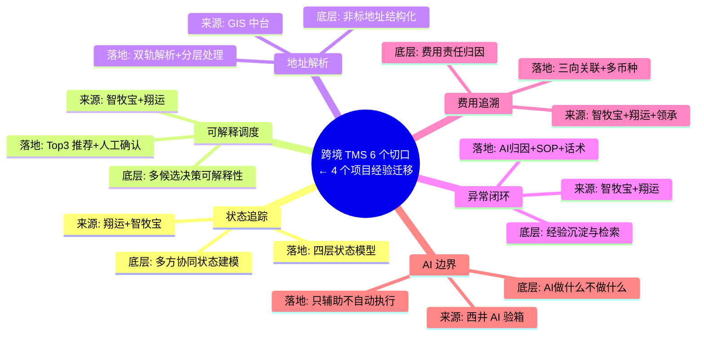
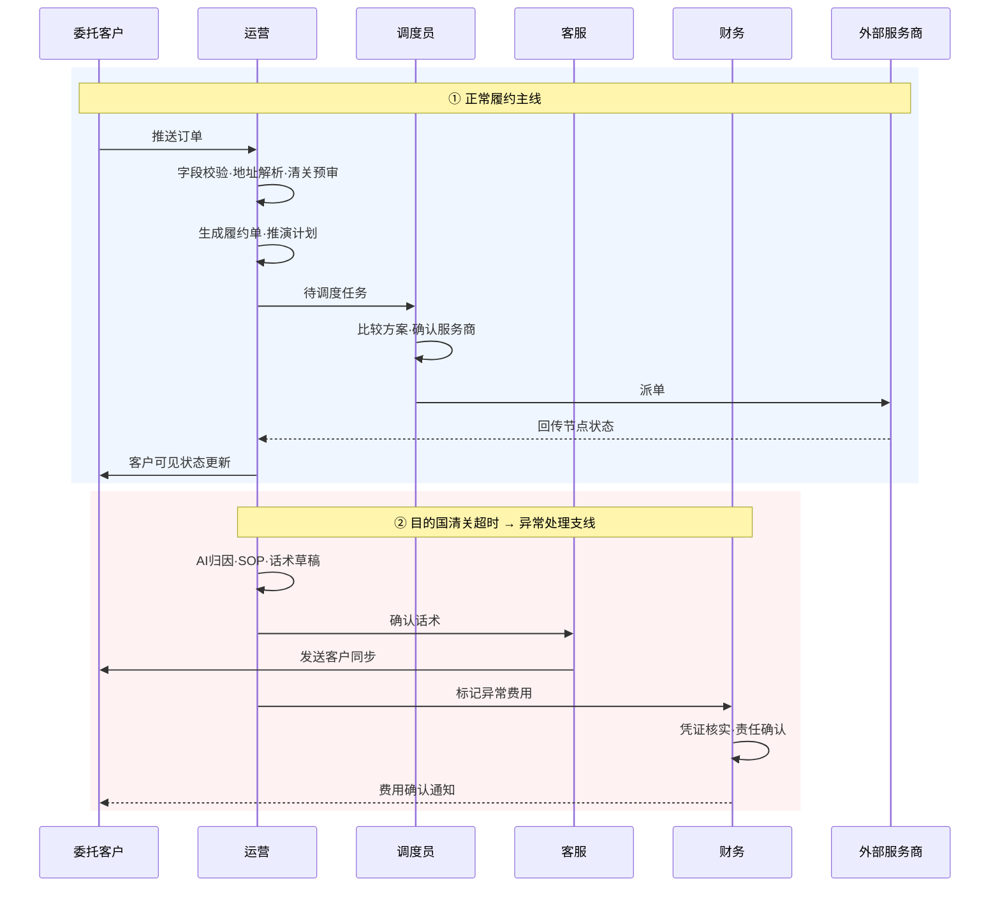
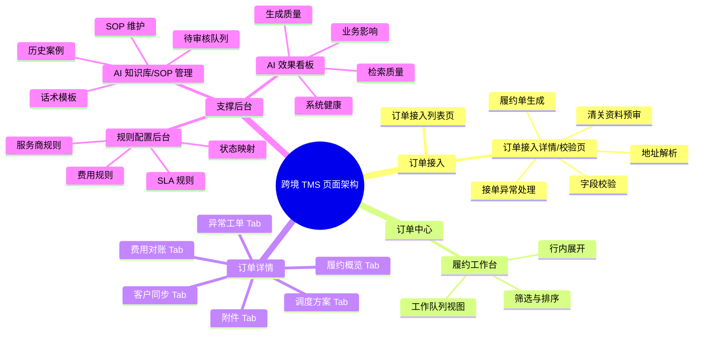
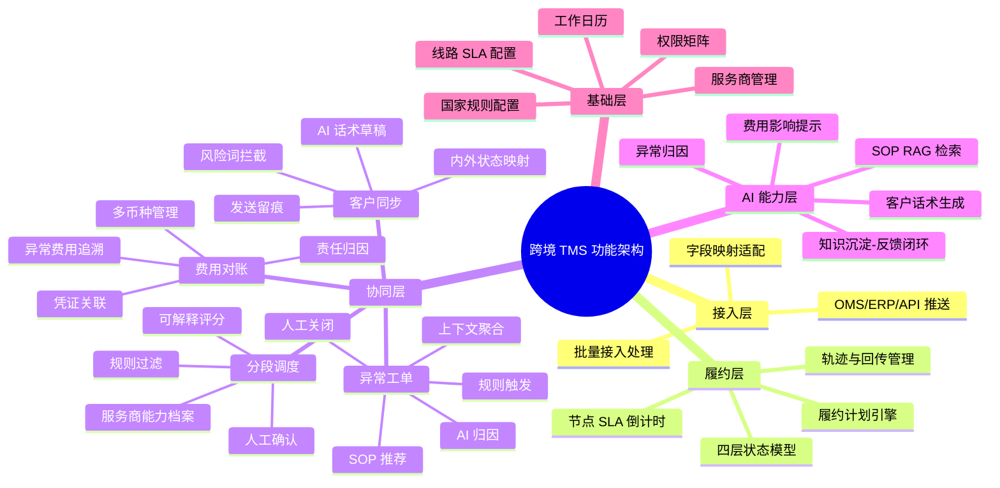
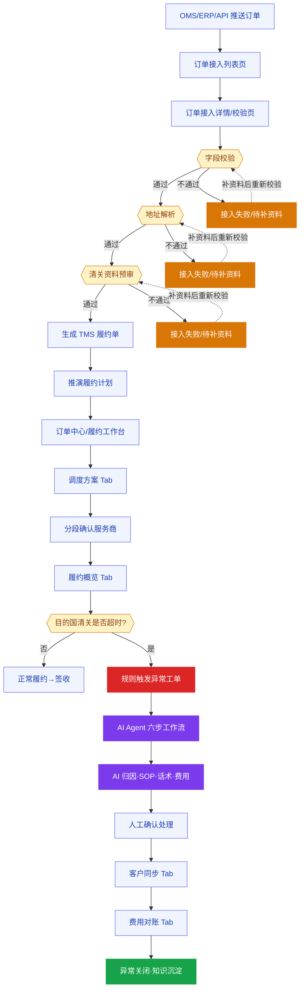
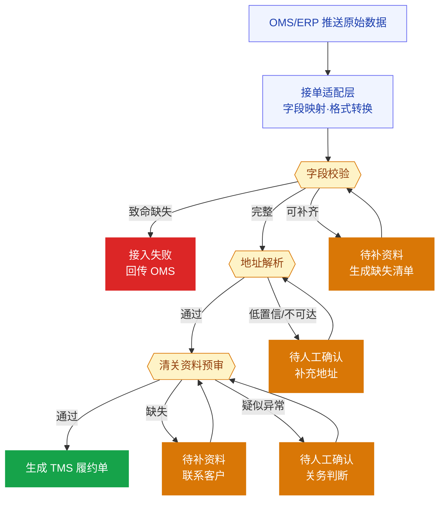
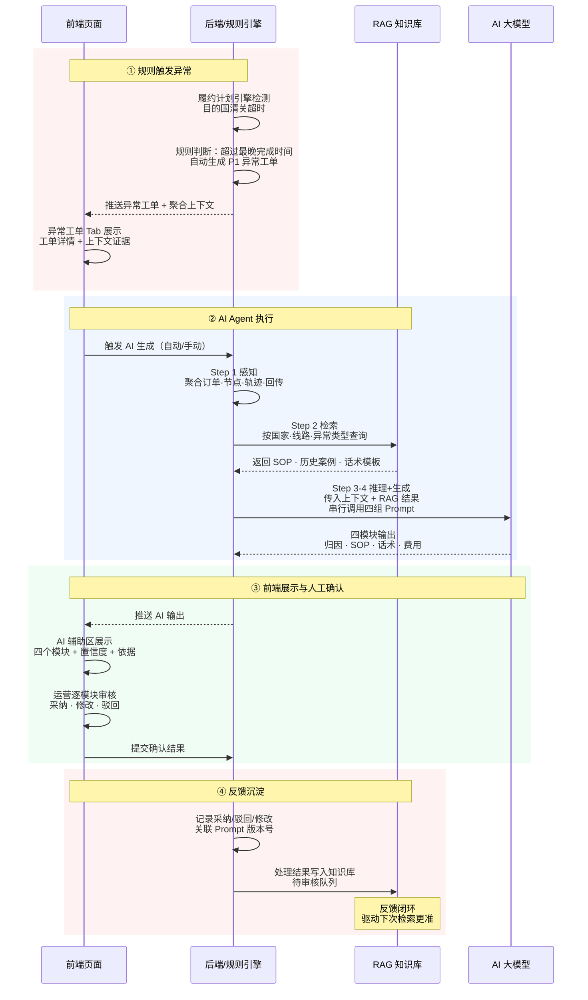

# 东南亚跨境 TMS MVP PRD：深圳至胡志明跨境履约闭环

版本：v5.0 | 2026年5月
用途：TMS / 跨境物流 / AI 供应链产品经理通用能力证明材料
核心场景：一票非COD的深圳至胡志明标准件，目的国清关超时，TMS如何完成履约→异常→客户同步→费用确认闭环

---

## 0. 写给面试官的导读

### 0.1 这份 PRD 是什么

这不是一份已上线系统的产品文档，也不是伪装成东南亚跨境老手写的方案。

这是一份**迁移型能力证明**：我没有直接负责过东南亚跨境业务，但在农牧 TMS、快运 GIS 中台、航空货代 TMS、港口 AI 验箱四个行业里，解决过跨境履约的底层问题——多节点状态管理、服务商协同、异常闭环、费用追溯、AI 人机协同。这份 PRD 的目标，是把这些经验迁移到跨境物流场景，并用一票深圳到胡志明的订单，证明迁移是有效的。

**我希望它回答三个问题：**
1. 我理解跨境履约的核心难点在哪里，不只是"环节多"这种表面描述
2. 我能把业务问题转化成可落地的产品设计，而不是功能堆叠
3. 我对 AI 在 TMS 中的落地边界有真实判断，不是概念展示

### 0.2 如何阅读这份 PRD

| 你有多少时间 | 建议读什么 | 重点看什么 |
|---|---|---|
| 5分钟 | 第0章 + 第3章核心页面（⭐标记） | 每个页面的"业务卡点"和"设计决策" |
| 20分钟 | 第0～3章 | 业务理解、设计原则、核心页面的完整逻辑 |
| 完整阅读 | 全文 | 第4章功能规格是面向开发的验收标准，按需展开 |

### 0.3 这份 PRD 的边界说明

**MVP 只做什么：** 验证一条线路（深圳→胡志明）、一类订单（非COD标准件）、一个典型异常（目的国清关超时）的完整处理闭环，以及其中 AI 辅助异常处理的人机协同设计——AI 做归因、SOP 匹配、话术草稿，但所有高风险动作（改派、赔付、客户通知、费用判责）必须人工确认后执行。

**MVP 不做什么：** 不覆盖全量国家、全量线路、COD资金流、逆向物流、海外仓、自动改派、自动判责、自动发送客户通知、端到端自动化 AI。

**为什么这样收敛：** 不是能力不够，而是"先把一票订单跑稳，才知道哪些规则和配置是真实需要的"。后台配置维度、权限矩阵和状态定义已经按可扩展方式设计，等一条线路稳定后可快速复制。同样，PRD 中有些细节（如调度评分权重、清关查验率分布）我用的是估算值而非真实运营数据——这不是疏忽，而是"先设计框架，这些参数在第一个月运营后数据驱动校准"。

### 0.5 我做产品的三条底层判断

三条判断对应**业务判断、架构判断、信任判断**三个维度，是我做产品决策时反复出现的底层逻辑。每条的具体落地证据见 1.3 节经验迁移路径。

**判断一：风险前置——问题的修复成本随链路后移而指数级放大。**
让问题在成本最低的阶段暴露。（壹米滴答 GIS 中台：地址校验从末端前移到接单环节，分单准确率 95%→97.5%）

**判断二：闭环优先于功能堆叠——先跑通一票订单，再谈规模化。**
产品方案的价值不是"能做多少事"，而是"能不能从头到尾做完一件事"。（智牧宝 TMS：规划十几个模块后第一个月发现一车饲料从出库到签收的结算闭环跑不通，再多模块也是孤岛；翔运 TMS：清关、运输、财务必须同一票订单串起来）

**判断三：可解释性优先于智能化——让使用者理解"为什么"，比算法精度更重要。**
可解释的 70 分方案比黑箱的 90 分方案更有用，因为人会用。（西井 AI 验箱：AI 说"没问题"比"我不确定"更危险，所有输出必须附置信度和依据来源；智牧宝调度：条件所限只做到规则引擎运力匹配，但规则透明让调度员能理解、信任并使用——反而验证了可解释比智能更重要）

---

## 1. 业务背景与问题定义

### 1.1 跨境履约的本质难题：不确定性在每一次交接中被放大

东南亚跨境履约区别于国内物流的核心，不是"距离更远"或"环节更多"，而是**每个节点的不确定性不会止于本节点——它会向后传导，并在每一次交接中被放大**：

- 接单阶段的地址模糊，到末端配送阶段变成派送失败和退件
- 清关资料的轻微缺失，到目的国清关阶段变成超时滞留和客户投诉
- 服务商状态回传的一次延迟，到客服侧变成十个重复催问电话
- 内部对责任方的不明确，到对账阶段变成数周的费用争议拉锯

这意味着**跨境 TMS 的核心价值不是"记录货物在哪里"，而是"把不确定性控制在尽量早的阶段，并在每个节点留下清晰的责任和依据"**。

一个具体的例子：目的国清关超时，表面原因可能是"清关服务商响应慢"，根本原因可能是接单时申报价值填报不规范。如果 TMS 没有接单前置风控，这个问题会在清关阶段才暴露，修复成本（补资料、重申报、客户赔付）远高于接单阶段拦截的成本。

### 1.2 本 MVP 聚焦的六个切口

完整的跨境物流难点很多——清关合规、税费成本、多服务商协同、状态可视化、时效不确定、末端配送、逆向退货、COD 回款、费用对账、客户沟通等。本 MVP 不试图覆盖全部，而是按六条标准主动收敛：

> 能体现过往经验迁移 × 是岗位高频痛点 × 能落到页面演示 × 体现跨境区别于普通物流的关键复杂度 × AI 可自然嵌入且边界清晰 × 范围可控

基于此，聚焦六个切口：

| 切口 | 核心业务代价 | 为什么进入 MVP 主线 |
|---|---|---|
| **接单前置风控**：字段、地址、清关资料预审 | 接单问题后移到清关阶段，修复成本5~10倍放大 | 迁移 GIS 地址解析和 AI 人机复核经验，接单页可直接演示 |
| **跨境履约计划与状态来源追踪** | 状态口径不统一，运营追状态靠聊天记录，责任方模糊 | TMS 基础能力，体现多节点、责任方、SLA 和状态来源设计 |
| **分段服务商协同与可解释调度** | 服务商选择依赖个人经验，难复盘、难优化、难扩展 | 迁移调度和承运商管理经验，展示可解释推荐逻辑 |
| **目的国清关异常闭环 + AI Agent** | 异常处理靠人工经验，SOP 散落在聊天记录，离职即断档 | 清关超时是高频异常，最适合展示 AI 归因、SOP 推荐和人机协同边界 |
| **客户可见状态与沟通风险控制** | 内部状态透传客户引发投诉，话术过度承诺带来法务风险 | 展示内外状态分离设计和客户沟通风控机制 |
| **异常费用、多币种与对账追溯** | 费用凭证缺失、责任方不清，对账拉锯数周 | 展示异常费用追溯、多币种汇率和责任归因的商业闭环 |

以下问题同样重要，但因为会显著扩大 MVP 范围，放入后续扩展：COD 全流程、逆向物流、海外仓库存、需求预测。

### 1.3 经验迁移路径：底层问题是一致的

迁移的有效性不在于"做过类似的"，而在于**底层问题是否一致**。以下每条迁移，都有一个可以讲清楚的逻辑。

**经验迁移全景图：**



**迁移明细表：**

| 跨境 TMS 的问题 | 底层问题本质 | 我做过的相似场景 | 迁移到本 MVP 的具体设计 |
|---|---|---|---|
| 多节点履约状态难统一，清关/干线/末端口径各说各话 | 多方协同下的状态建模：谁的状态、什么时候更新、可信度如何 | 翔运 TMS：清关完结状态节点与运输计划触发规则；智牧宝 TMS：GPS+IoT 多来源状态融合 | 四层状态模型（概览/任务/子节点/异常标记），每个节点记录状态来源和责任方，不同来源区别对待 |
| 服务商选择依赖经验，选择结果难解释、难复盘 | 多候选决策的可解释性：推荐逻辑不透明，调度员不信任系统 | 智牧宝智能调度：规则引擎运力匹配；翔运：多承运商报价和历史表现管理 | 先建服务商能力档案，再做可解释 Top 3 推荐（时效/成本/覆盖/响应/异常率），调度员确认并记录选择原因 |
| 地址质量差，末端派送失败率高 | 非标准地址的结构化和服务范围判定 | 壹米滴答 GIS 中台：2800万+快运地址解析，分单准确率从95%提升到97.5% | 接单阶段做国内+越南双轨地址解析，低置信地址不允许进入调度，偏远区域自动标记风险 |
| 异常处理靠人工经验，SOP 散落在聊天记录 | 经验沉淀和检索：知识在人脑里，离职即消失 | 智牧宝/翔运：运输异常预警、异常工单和处理闭环设计 | 异常工单关联节点、归因、SOP、话术、费用；AI 做检索和草稿，人工确认留痕，处理结果回写知识库 |
| 费用对账争议难追溯，多币种汇率口径不统一 | 费用责任归因：出了问题谁出钱，凭证在哪里 | 智牧宝结算周期14天→7天；翔运财务结算7天→3天；领承供应商对账标准化 | 异常费用关联履约节点、异常工单、凭证、原币种、汇率来源、承担方；AI 汇总依据，不自动判责 |
| AI 落地变成概念，没有实际业务价值 | AI 产品边界：AI 做什么、不做什么，如何建立业务信任 | 西井 AI 智能验箱：置信度分层，人工复核率从100%降至15%以下；漏检率从8%降至1.5% | AI 只在"可以错"的环节辅助（归因、SOP、话术草稿），不在"不能错"的环节（发送、判责、改账）自动执行 |

---

## 2. 产品设计总纲

### 2.1 系统设计原则：为什么这样而不是那样

这五条原则每一条背后都有一个真实的业务判断，不是通用的产品方法论套话。每条后面我也写了这个判断在哪个项目里验证过。

| 设计原则                  | 为什么这样而不是那样                                                                                    | 在本 MVP 中的落地方式                                        |
| --------------------- | --------------------------------------------------------------------------------------------- | ---------------------------------------------------- |
| **业务闭环优先，不是功能堆叠**     | 跨境 TMS 功能清单很容易堆成几十个模块，但如果一票订单从接入到费用确认跑不通，再多功能也是孤岛。先跑通闭环，才知道哪些配置和扩展是真实需要的。                     | 用深圳→胡志明一票非 COD 订单串起接入、履约、调度、异常、同步、费用全链路              |
| **风险前置，不是事后补救**       | 清关超时的根本原因，很大比例来自接单阶段的地址错误或资料缺失。问题到清关阶段才暴露，修复成本是接单阶段的5~10倍。设计应该把代价往前移。                         | 订单接入页设"门禁"：字段、地址解析、清关资料三关不通，不允许生成可调度履约单              |
| **状态透明、来源可追溯**        | 跨境履约的状态不只有"到哪了"，还有"这个状态谁告诉你的、什么时候告诉你的、可信度多高"。服务商口头回传和系统 API 回传，处理优先级应该不同。                     | 每个履约节点记录：计划时间、最晚完成时间、实际状态、状态来源（系统/服务商 API/手动/客户）、责任方 |
| **AI 辅助判断，人工负责高风险决策** | 在港口 AI 验箱项目中，AI"说错了"的成本远高于"没说"的成本——错误归因导致的客户回复或费用调整，会引发信任崩塌。TMS 中同理，一旦 AI 自动发出错误的客户通知，修复代价极高。 | AI 只做归因、SOP 推荐、话术草稿、费用提示；改派、发送通知、调整费用、关闭工单，全部人工确认后执行 |
| **先验证一条线路，再配置化复制**    | 如果一上来就做"多国家通用规则引擎"，往往发现抽象层设计过早，实际业务规则远比预期复杂。先把一条线路跑稳，才能知道哪些规则是真正可复用的，哪些必须按国家/线路定制。            | MVP 只验证深圳→胡志明；规则、状态、费用、SOP 后台预留国家/线路/客户维度，待闭环稳定后扩展   |

**补充说明：我当时考虑过但放弃的两个方案**

**关于 AI 是否做聊天窗口：** 最初的想法是在 TMS 旁边做一个独立的 AI 助手入口，运营可以随时问"这票订单为什么卡住了"。但想了一下发现这样做有两个问题：一，运营在处理异常工单时不会主动去开一个新对话框，使用门槛高；二，聊天式 AI 的输出结果不会自动关联到工单记录里，无法做采纳/驳回的反馈闭环。最终选择把 AI 嵌入业务 Tab，而不是做独立聊天入口。

**关于运单号是否沿用 OMS 订单号一路到底：** 最初的想法最简单——OMS 给一个单号，TMS 沿用到底，运营和客户都用一个号查全程。但翔运国际货代 TMS 的真实经验让我放弃了这个方案：国际航空货运一票货有一个航空主单号（MAWB），下面挂多个分单号（HAWB），每个分单由不同代理处理。实际履约中，国内揽收用顺丰单号、出口报关用报关单号、干线用航空主单号、目的国清关行用当地单号、末端配送用越南快递单号——五个服务商，五种单号体系。如果 TMS 只认 OMS 号，清关服务商回传"单号 XXX 清关完成"时系统根本匹配不上——因为 OMS 号对清关服务商毫无意义。最终选择 TMS 生成独立履约单号作为系统主键，每个履约段独立记录该段服务商的运单号，一个 TMS 单号关联 N 个外部单号，各服务商用自己体系的单号回传，互不干扰。

### 2.2 目标用户

#### 2.2.1 角色地图

| 角色层级 | 角色 | 核心诉求 | MVP 覆盖程度 |
|---|---|---|---|
| 委托客户侧 | 跨境卖家、品牌商、平台商家 | 推送订单、查看状态、接收异常说明、确认费用 | 重点覆盖 |
| 内部履约侧 | TMS 运营 | 查看履约计划、处理异常工单、推进清关和客户同步 | 重点覆盖 |
| 内部调度侧 | 调度员 | 比较线路或承运商方案，确认全链路或分段调度 | 重点覆盖 |
| 客户沟通侧 | 客服、客户成功、KA 销售 | 将内部异常转成客户可理解说明，处理重点客户升级 | 重点覆盖 |
| 财务结算侧 | 财务、对账人员 | 查看客户应收、供应商应付、异常费用和差异处理 | 重点覆盖 |
| 外部服务商侧 | 揽收方、清关服务商、干线承运商、末端配送商 | 回传节点状态、异常原因、恢复时间、费用影响 | 间接覆盖 |
| 后台配置侧 | 承运商管理员、线路/报价管理员、国家规则管理员 | 维护服务范围、报价、SLA、清关规则、通知策略 | PRD 必须覆盖 |
| AI 管理侧 | SOP 维护人、知识库管理员、AI 效果评估人 | 维护规则、SOP、历史案例、话术模板，评估 AI 建议质量 | PRD 必须覆盖 |
| 管理决策侧 | 运营主管、履约负责人、数据分析人员 | 查看异常效率、准时率、对账差异率、承运商表现 | 指标层覆盖 |

#### 2.2.2 各角色的当前代价与产品切入点

| 角色 | 现在付出的代价 | MVP 产品切入点 |
|---|---|---|
| 委托客户 | 看不到真实节点，只能反复催问客服；异常费用和责任说明不清 | 客户可见状态、下一次更新时间、异常费用凭证和确认记录 |
| TMS 运营 | 需要跨系统追状态、追服务商、追清关资料，异常处理靠经验 | 履约节点计划、异常工单、SOP 推荐、服务商回传记录 |
| 调度员 | 线路/服务商选择依赖经验，难解释为什么选这个方案 | 分段服务商方案、Top 3 推荐、风险提示和偏离原因 |
| 客服/客户成功 | 内部异常原因不能直接对外说，需要反复改话术和控风险 | 内外状态映射、AI 话术草稿、敏感词/承诺风险拦截 |
| 财务/对账 | 异常费用缺凭证、缺责任方、缺币种汇率依据，对账拉长 | 费用关联节点、工单、凭证、原币种、汇率和承担方 |
| 外部服务商 | 回传标准不统一，口头反馈难沉淀，责任和时效边界不清 | 服务商状态回传、SLA、联系人升级和历史表现记录 |

**角色协同泳道图：**



### 2.3 产品目标与非目标

#### 2.3.1 MVP 目标

- 支持 OMS/ERP/API 推送一票深圳至胡志明订单，TMS 完成字段校验、地址解析、清关资料预审、履约单生成和履约计划推演
- 支持运营、调度、客服、财务围绕同一票订单完成履约查看、调度确认、异常处理、客户同步和费用确认
- 支持按国内揽收、出口清关、跨境干线、目的国清关、末端配送拆解分段服务商方案，保留推荐理由和人工确认记录
- 支持目的国清关节点超过最晚完成时间后，由规则触发异常预警并生成异常工单
- 支持 AI Agent 基于订单、节点、轨迹、清关状态、服务商回传和历史案例完成上下文聚合，通过 SOP RAG 辅助异常归因、处理建议、客户话术草稿和费用影响提示
- 支持客户可见状态与内部履约状态分离，避免向客户暴露未确认的内部原因、责任归属或过度承诺
- 支持异常费用关联履约节点、异常工单、凭证、币种、汇率和责任方，进入费用确认或对账处理
- 支持 AI 建议的采纳、修改后采纳、驳回和标记无效反馈，为后续 SOP 和知识库迭代提供依据

#### 2.3.2 MVP 非目标

- 不覆盖消费者在销售平台的下单、支付、售后和退货全流程
- 不覆盖全量国家、全线路、全服务产品
- 不在主流程中覆盖 COD 收款、回款和拒收资金流（COD 仅作为 P2 扩展）
- 不实现自动改派、自动赔付、自动判责、自动承诺签收时间、自动发送客户通知、自动关闭异常工单
- 不要求 AI 独立做最终业务决策，AI 输出只作为运营/客服/调度的辅助依据
- 不在 MVP 中训练自有大模型，也不承诺端到端自动化 Agent
- 不在 MVP 中实现完整承运商评分算法，只展示可解释的 Top 3 推荐理由和基础履约表现字段

### 2.4 核心用户场景

| 场景 | 用户 | 场景描述 | 成功结果 |
|---|---|---|---|
| S1 | 委托客户 / 系统接口 | OMS/ERP 推送一票深圳至胡志明订单 | TMS 校验通过，生成履约单和履约计划 |
| S2 | 调度员 | 查看待调度订单，比较 Top 3 分段服务商方案 | 确认调度方案并记录选择原因 |
| S3 | 运营 | 在履约看板看到目的国清关节点超时预警 | 进入异常工单并确认处理动作 |
| S4 | 运营 / 客服 | 查看 Agent 聚合的上下文、AI 归因、SOP 命中、置信度和客户话术草稿 | 人工确认处理动作和客户话术后同步客户，保留同步记录 |
| S5 | 委托客户 | 查看清关异常后的外部状态和下一次更新时间 | 清楚知道当前状态、已采取动作和是否需要配合 |
| S6 | 财务 / 对账 | 查看清关异常是否产生补资料费、查验费等异常费用 | 费用关联履约节点和异常工单，进入确认或对账状态 |
| S7 | 运营主管 / 数据分析 | 查看异常处理效率和 AI 建议效果 | 能判断 MVP 是否改善履约协同和客户沟通 |
| S8 | SOP 维护人 / AI 管理员 | 查看低命中、低置信和被驳回的 AI 建议 | 补充或修订国家规则、清关 SOP、历史案例和话术模板 |

### 2.5 范围与优先级

| 优先级 | 范围 | 说明 |
|---|---|---|
| P0 | 接单前置风控、履约计划、状态来源追踪、分段调度确认、目的国清关超时异常工单、客户同步、费用确认 | 必须支持一票订单完整演示闭环 |
| P1 | 承运商能力档案、Top 3 推荐理由、AI 归因/SOP/话术、人机确认、多币种异常费用追溯 | 增强演示的产品深度和工程可信度 |
| P2 | COD、退件、赔付、多国家规则、多客户通知策略、承运商评分反向优化 | 后续版本展开，不进入主线 |

### 2.6 成功指标

| 指标类型 | 指标 | MVP 阶段口径 |
|---|---|---|
| 业务结果 | 清关超时率 | MVP 先记录清关超时触发和恢复时间，建立基线 |
| 业务结果 | 客户重复查询量 | 记录同一异常期间客户重复查询次数 |
| 业务结果 | 对账差异率 | 记录差异类型、币种、责任方和处理状态 |
| 流程效率 | 调度确认耗时 | 从订单进入待调度到调度员确认方案的时间 |
| 流程效率 | 异常发现提前量 | 系统触发异常时间相比客户催问时间的提前时长 |
| 流程效率 | 异常处理时长 | 异常工单生成到关闭的时长，按 P0/P1/P2 分类统计 |
| AI 效果 | AI 建议采纳率 | 采纳或修改后采纳次数 / AI 建议总次数 |
| AI 效果 | SOP 命中率 | 命中有效 SOP 的异常工单数 / 触发 AI 检索的工单数 |
| AI 效果 | 低置信转人工率 | AI 低置信建议转人工处理次数 / AI 建议总次数 |


---

## 3. 核心页面设计

### 3.0 演示主线与页面架构

**一句话演示主线：**

```
OMS/ERP 推送订单
  → TMS 校验字段、地址和清关资料（AI 辅助识别风险）
  → 生成履约单，推演关键节点计划和最晚完成时间
  → 调度员查看分段服务商方案并确认
  → 各节点按来源回传状态
  → 目的国清关超时，规则触发异常工单
  → AI 辅助归因、SOP 推荐、客户话术草稿
  → 人工确认后同步客户
  → 异常费用关联节点和工单，进入费用确认
  → 异常关闭，复盘沉淀
```

**页面架构总览：**



**功能架构总览：**



**演示主线全景流程图：**




**核心页面与 MVP 聚焦切口的对应关系：**

| ⭐ 核心页面 | 对应 MVP 切口 | 面试演示重点 |
|---|---|---|
| 订单接入详情 / 校验页 | 接单前置风控 | 字段门禁 + 地址解析三层设计 + 清关资料预审 |
| 履约概览 Tab | 履约计划与状态来源追踪 | 四层状态模型 + 状态回传来源 + 四问题框架 |
| 调度方案 Tab | 分段服务商协同与可解释调度 | 可解释 Top 3 + 人工确认记录原因 |
| 异常工单 Tab | 目的国清关异常闭环 + AI Agent | 分步可见的 AI 辅助 + 人机边界 |
| 客户同步 Tab | 客户可见状态与沟通风险控制 | 内外状态分离 + AI 话术草稿 + 风险词拦截 |
| 费用对账 Tab | 异常费用与多币种对账追溯 | 费用关联节点/工单/凭证/责任方 |


### 3.1 订单接入列表页

**页面目标**：展示所有 OMS/ERP/API 推送到 TMS 的订单接入记录，支持按来源、校验状态、客户、目的国筛选，定位单条订单后进入详情校验。

**主要角色**：接口/数据负责人、运营。

> 演示话术：这里不是直接进入某一票订单详情，而是先看到所有从 OMS/ERP/API 推送进来的接入记录。运营可以通过接入状态和校验状态找到这票深圳到胡志明订单，再点击进入接入详情页。

### 3.2 订单接入详情 / 校验页

**页面目标**：完成单条接入订单的字段校验、地址解析、清关资料预审、异常处理和履约单生成，确保起运地、目的地、收件信息、货品申报、清关资料和服务产品等关键数据完整、可识别、可调度、可追踪。

**主要角色**：接口/数据负责人、运营。

**业务卡点**：跨境订单不是接进系统就能履约。地址低置信、末端不可达、发票/箱单缺失、HS Code 缺失、申报价值异常或收货人税号缺失，都会把风险后移到清关和末端阶段，最终变成清关延误、客户催问和异常费用。

**产品设计思路**：订单接入详情页承担“接单门禁”的作用。订单可以先被 TMS 接收，但必须通过字段、地址、清关资料和异常确认后，才允许生成可调度的 TMS 履约单。

**接单适配说明：OMS/ERP 推送的三种非标情况**

以下三种情况在东南亚跨境场景中高频出现。MVP1 不做全自动处理，但需要在设计上预留扩展点。

**情况一：一单多件**

- **典型表现：** 同一卖家发 50 箱货，起运地和目的地相同。OMS 可能推成 1 条订单附多箱单，也可能推成 50 条独立订单。
- **MVP1 处理：** 不做自动聚合或拆分。一单多件逐条走校验；若 OMS 推成 50 条独立订单，运营可在订单中心手动标记“同批次”备注。
- **MVP2 扩展：** 规则引擎自动识别同起运地 + 同目的地 + 同客户 + 同批次的订单，聚合为统一履约批次。

**情况二：字段格式不统一**

- **典型表现：** 不同平台字段名各异——Shopee 叫 `order_id`，淘宝叫 `platform_order_no`，独立站一个字符串。地址格式也不统一，有的纯文本，有的拆省市区三行。
- **MVP1 处理：** 接单适配层做字段映射转换，将不同来源字段映射为 TMS 统一格式后进入校验流程。映射规则后台可配置，新增平台只需加一套映射模板。
- **MVP2 扩展：** AI 辅助识别未映射字段的业务含义并建议映射目标，但最终由人工确认。

**情况三：一址多任务**

- **典型表现：** 一批货 3 种 SKU 各 10 箱，目的地相同，但末端服务商可能要求按 SKU 分单派送。
- **MVP1 处理：** 不自动拆分。生成一张 TMS 履约单，SKU 明细通过行项目承载。如需拆单，运营在调度阶段手动拆分并记录原因。
- **MVP2 扩展：** 基于服务商能力（是否支持合单派送）和客户偏好，自动判断是否需拆单并生成候选方案。

**关键设计点：** 接单适配层只负责“把多来源的非标数据转成 TMS 能处理的统一格式”，不替代 OMS 的业务逻辑，也不做智能决策。适配层出问题时（字段无法映射、必填缺失），订单进入接单异常待人工处理，而不是悄悄填充默认值。

**接单门禁分流流程：**




#### 3.2.1 字段校验

字段校验解决的是“这张订单能不能被系统识别”的问题，核心是规则校验，不需要强行引入 AI。

校验覆盖五个维度：客户信息、线路信息、收件信息、货品信息、订单来源。每个维度校验完成后不单纯报错，而是按以下四类分流结果归类，让运营一眼知道下一步该找谁、补什么、能不能推进：

**字段校验分流规则：**

| 分流结果      | 含义                 | 系统动作                                 | 示例                               |
| --------- | ------------------ | ------------------------------------ | -------------------------------- |
| **可继续处理** | 关键字段完整，客户和服务产品匹配   | 自动进入地址解析模块                           | 字段齐全、客户已建档                       |
| **待补资料**  | 非致命字段缺失，补齐后可继续     | 生成缺失字段清单，标注责任方（客户补/运营补/接口补），进入待补资料队列 | 收件人电话缺失、HS Code 待补充              |
| **待人工确认** | 字段存在但疑似异常，不确定是否可放行 | 标黄高亮，提示异常点和判断依据，等待运营确认后分流            | 申报价值 $45 明显高于品类均值 $5-15、重量与件数不匹配 |
| **接入失败**  | 致命字段缺失或不满足服务条件     | 阻止生成履约单，回传失败原因和缺失字段清单给 OMS/ERP       | 目的国不在服务范围、客户 ID 无法匹配、必填字段完全空白    |

#### 3.2.2 地址解析

地址解析解决的是“这票货能不能被揽收、能不能被末端配送”的问题。国内深圳地址相对标准，越南胡志明地址更容易出现多语言、缩写、地标和非标准描述。

| 维度   | 国内卖家地址               | 国外买家地址                             |
| ---- | -------------------- | ---------------------------------- |
| 用途   | 国内揽收调度               | 末端配送规划                             |
| 语言   | 中文                   | 越南语、英文、拼音、缩写混排                     |
| 规范性  | 省市区街道体系成熟            | 地标描述、门牌缺失、多语言混排常见                  |
| 技术路径 | 国内地图 API、行政区划库、历史地址库 | 多语言规则引擎、Unicode 识别、关键词库、历史地址、AI 辅助 |
| 输出结果 | 标准化地址、经纬度、揽收覆盖结果     | 候选地址、候选坐标、置信度、末端覆盖、偏远标记            |

| 地址解析状态  | 页面动作              | 是否允许生成履约单       |
| ------- | ----------------- | --------------- |
| 解析成功    | 展示标准化地址、坐标和服务范围   | 是               |
| 多候选待确认  | 展示候选地址和依据，运营选择或补录 | 否               |
| 低置信待确认  | 展示低置信原因、依据和补充建议   | 否               |
| 服务范围不覆盖 | 提示不可服务或需切换末端方案    | 否               |
| 偏远区域已标记 | 展示偏远、加收或时效风险      | 是，但风险传递给调度和费用模块 |
| 解析失败    | 进入接单异常或等待客户补充     | 否               |

**AI 嵌入点**：AI 不替代地址解析规则，只辅助识别多语言混排、地标/缩写、低置信候选和疑似缺失信息，并给出补充建议；地址最终确认仍由运营完成。这样设计的理由：规则+AI辅助+人工确认三层，比"AI独立判断"更稳定——AI 对越南语地址的理解能力参差不齐，直接采信 AI 输出，低置信情况下反而会引入噪音。

**迁移依据**：地址解析的底层问题——"把非标准描述映射到可服务的坐标和服务范围"——在国内快运场景和东南亚跨境场景是一致的。GIS 中台实战经验：覆盖 2800 万+快运地址和 8500 万+快递地址，将自动分单准确率从 95% 提升至 97.5%。核心方法论"非标准地址 → 结构化字段 → 经纬度坐标 → 服务范围匹配"可直接迁移，只需替换底层 API 和地址库。

#### 3.2.3 清关资料预审

清关资料预审解决的是“这票货到目的国后会不会因为资料问题卡住”的问题。系统不自动清关，只把资料风险前置到接单阶段。

| 预审对象    | 关键字段 / 附件       | 页面输出        | 分流规则               |
| ------- | --------------- | ----------- | ------------------ |
| 商业发票    | 发票号、抬头、币种、金额、品名 | 缺失项、金额一致性提示 | 缺失时阻止生成履约单         |
| 装箱单     | 件数、重量、体积、包装信息   | 与订单货品信息比对结果 | 明显不一致时进入人工确认       |
| HS Code | HS Code、品类、监管要求 | 缺失或疑似不匹配提示  | 缺失时待补资料，疑似不匹配时人工确认 |
| 申报价值    | 申报币种、申报金额、货品价值  | 异常低价或异常高价提示 | 风险项传递给关务/运营确认      |
| 收货人资料   | 收货人名称、电话、税号/识别号 | 缺失项和格式提示    | 关键字段缺失时待补资料        |

**AI 嵌入点**：AI 辅助识别品名模糊、申报价值异常、HS Code 疑似不匹配、发票和装箱单描述不一致等风险；AI 只给风险提示和依据，不决定资料是否放行。

#### 3.2.4 接单异常处理

接单异常处理解决的是“订单不能继续往下走时，系统如何把问题讲清楚并推动补齐”的问题。

| 异常类型  | 触发条件                      | 处理动作                  | 结果             |
| ----- | ------------------------- | --------------------- | -------------- |
| 字段缺失  | 客户、线路、收件人、货品等关键字段缺失       | 生成缺失字段清单，通知接口负责人或运营补录 | 补齐后重新校验        |
| 地址低置信 | 目的地地址多候选、置信度低或服务范围不覆盖     | 运营选择候选、补录地址或联系客户确认    | 确认后回写标准化地址     |
| 资料不完整 | 发票、箱单、HS Code、收货人税号缺失     | 生成待补资料清单              | 补齐后重新预审        |
| 风险待确认 | 申报价值异常、品名模糊、HS Code 疑似不匹配 | 运营/关务确认是否放行           | 确认记录进入履约单附件和日志 |

**AI 嵌入点**：AI 可以辅助生成补资料说明或风险说明草稿，但不能自动向客户发送，不能自动放行，也不能自动驳回订单。

#### 3.2.5 履约单生成

履约单生成解决的是“订单什么时候真正进入 TMS 履约流程”的问题。只有字段、地址、服务范围和清关资料通过门禁后，系统才允许生成可调度履约单。

| 生成前置条件   | 通过标准                 | 生成后输出         |
| -------- | -------------------- | ------------- |
| 字段校验通过   | 关键字段完整，客户和服务产品匹配     | TMS 履约单号      |
| 地址解析通过   | 起运地和目的地均可识别，末端服务范围明确 | 标准化地址、坐标、服务范围 |
| 清关资料预审通过 | 关键附件和申报字段满足最低要求      | 清关资料状态、风险标记   |
| 人工确认完成   | 低置信地址和清关风险已有人确认      | 确认人、确认时间、确认原因 |

**关键设计点**：履约单生成不是简单复制 OMS 订单，而是把订单转化为后续履约计划、调度、状态追踪、异常处理、客户同步和费用追溯共同使用的业务对象。

#### 3.2.6 本页方案说明

本页重点体现接单前置风控：先用规则把确定性问题拦住，再让 AI 辅助识别低置信地址和清关资料风险，最后由运营或关务人工确认。这样做不是为了让系统自动完成跨境履约，而是把“原本会在目的国清关或末端配送阶段爆发的问题”提前暴露出来。

> 演示话术：这里模拟客户 OMS/ERP 推送一票深圳到胡志明订单。TMS 收到后先校验客户、线路、收件信息和货品字段，再对深圳起运地和胡志明目的地做地址解析，同时预审发票、箱单、HS Code、申报价值和收货人资料。只有字段、地址、服务范围和清关资料通过门禁后，系统才生成 TMS 履约单并进入后续履约计划。

### 3.3 订单中心 / 履约工作台

**页面目标**：订单中心不是普通订单列表，而是 TMS 履约运营的工作队列入口。它帮助运营、调度、客服和财务先选择自己要处理的订单范围，再通过筛选、排序、关联处置项和推荐动作进入正确的处理页面。

**主要角色**：运营、调度、客服、财务、运营主管。

**业务卡点**：跨境履约链路长，一票订单可能卡在接单资料、调度确认、目的国清关、客户同步或费用确认等不同环节。如果订单中心只是展示订单状态，用户仍然要逐票点开才能判断下一步动作，列表页就没有降低处理成本。

**产品设计思路**：订单中心采用“工作队列 + 筛选条件 + 订单表格 + 行内展开 + 推荐动作”的结构。列表页一行代表一票履约单，不代表一条履约任务；履约节点说明货物处在哪个业务阶段，关联处置项说明这票订单有哪些人要处理的问题，推荐动作说明系统建议当前先处理什么。

#### 3.3.1 页面结构线框图

```text
┌──────────────────────────────────────────────────────────────────────────────┐
│ 订单中心 / 履约工作台                                                        │
├──────────────────────────────────────────────────────────────────────────────┤
│ 工作队列： [全部] [待接入处理] [待调度] [履约风险] [异常处理中] [待客户同步] [待费用确认] │
├──────────────────────────────────────────────────────────────────────────────┤
│ 筛选区                                                                       │
│ 客户 [全部客户 v]  当前履约节点 [目的国清关 v]  风险等级 [P0/P1/P2 v]          │
│ 责任方 [全部 v]    SLA [已超时/即将超时 v]     服务商 [全部 v]    [搜索] [重置] │
├──────────────────────────────────────────────────────────────────────────────┤
│ 订单列表                                                                      │
│ ┌────────────┬──────────┬────────────┬────────────┬────────────┬──────────┐ │
│ │ 履约单号    │ 客户/等级 │ 当前履约节点 │ 风险摘要     │ 关联处置项   │ 推荐动作 │ │
│ ├────────────┼──────────┼────────────┼────────────┼────────────┼──────────┤ │
│ │ TMS-10238  │ A客户/KA  │ 目的国清关  │ 清关超时 P1  │ 3项          │ 处理异常 │ │
│ │ 深圳→胡志明 │          │ 已超 6h     │ 来源:清关商   │ 异常/同步/费用│ 更多 ▾   │ │
│ └────────────┴──────────┴────────────┴────────────┴────────────┴──────────┘ │
└──────────────────────────────────────────────────────────────────────────────┘

点击“3项”后，在当前行下方展开关联处置项：

┌──────────────────────────────────────────────────────────────┐
│ 关联处置项                                                     │
├──────────────┬──────┬────────┬──────────────┬──────────────┤
│ 处置项        │ 等级 │ 责任方  │ 状态          │ 入口          │
├──────────────┼──────┼────────┼──────────────┼──────────────┤
│ 清关异常处理   │ P1   │ 运营    │ 待处理        │ 进入异常工单    │
│ 客户同步       │ P1   │ 客服    │ 待确认话术     │ 进入客户同步    │
│ 异常费用确认   │ P2   │ 财务    │ 待补凭证       │ 进入费用对账    │
└──────────────┴──────┴────────┴──────────────┴──────────────┘
```

#### 3.3.2 工作队列视图

顶部不做无行动指向的泛统计，而是提供面向处理场景的工作队列入口。工作队列本质上是一组快捷筛选，点击不同队列，下方订单列表刷新为对应范围的数据。

| 工作队列 | 含义 | 默认筛选 | 主要处理人 | 默认进入位置 |
|---|---|---|---|---|
| 待接入处理 | 字段、地址或清关资料未通过门禁 | 接单异常、待补资料、待人工确认 | 运营 / 接口负责人 | 订单接入详情 / 校验页 |
| 待调度 | 已生成履约单，但未确认分段服务商方案 | 待调度订单 | 调度员 | 调度方案 Tab |
| 履约风险 | 节点接近最晚完成时间或状态回传异常 | 预警中订单 | 运营 | 履约概览 Tab |
| 异常处理中 | 已生成异常工单，尚未关闭 | P0/P1/P2 异常订单 | 运营 | 异常工单 Tab |
| 待客户同步 | 异常处理后需要客户通知或客户确认 | 待发送、发送失败、待客户回复 | 客服 / 客户成功 | 客户同步 Tab |
| 待费用确认 | 有异常费用、汇率差异或供应商账单待确认 | 待确认、对账差异中 | 财务 / 对账 | 费用对账 Tab |
| 全部订单 | 查看完整订单池 | 全部状态 | 多角色 | 订单详情默认 Tab |

**关键设计点**：

- 用户先选择工作队列，再看对应订单。
- 工作队列是快捷筛选，不是履约节点任务。
- 列表页只负责分流，不在列表中完成复杂异常、话术或费用判断。

#### 3.3.3 筛选与排序

工作队列确定“看哪类订单”，筛选条件用于进一步缩小范围。

| 筛选维度 | 选项示例 | 用途 |
|---|---|
| 客户 / 客户等级 | KA、普通客户、试点客户 | 判断处理优先级和通知策略 |
| 当前履约节点 | 接单、出口清关、跨境干线、目的国清关、末端配送 | 定位订单卡在哪个阶段 |
| 风险类型 | 资料缺失、地址低置信、清关超时、状态回传超时、费用差异、客户催问 | 快速定位问题原因 |
| 责任方 | 运营、调度、客服、财务、服务商、客户 | 判断下一步由谁处理 |
| SLA 状态 | 正常、接近超时、已超时 | 支持优先处理即将违约订单 |
| 服务商 | 揽收、清关、干线、末端服务商 | 排查服务商集中风险 |
| 时间范围 | 接单时间、预计完成时间、异常触发时间 | 支持运营复盘和日常筛选 |

默认排序按异常等级、超时风险、客户等级和客户催问情况综合排序。

#### 3.3.4 订单列表关键字段

订单列表不展示所有字段，只展示判断当前状态和下一步动作所需信息。

| 字段 | 说明 |
|---|---|
| TMS 履约单号 | 点击进入订单详情页 |
| 客户 / 客户等级 | 判断处理优先级 |
| 线路 | 深圳 -> 胡志明 |
| 当前履约节点 | 表示货物处在哪个业务阶段，如接单、出口清关、目的国清关、末端配送 |
| 节点 SLA | 计划完成时间、最晚完成时间、剩余时间或超时时长 |
| 状态来源 | 系统、承运商 API、清关服务商、运营手动、客户补充 |
| 风险摘要 | 展示最高优先级风险，如清关超时 P1、地址低置信 P2 |
| 关联处置项 | 展示这票订单待处理的问题数量和类型，如 3 项：异常、同步、费用 |
| 当前责任方 | 展示最高优先级处置项的责任方，如运营、调度、客服、财务 |
| 推荐动作 | 系统建议当前先处理的动作，如处理清关异常、确认调度、同步客户、确认费用 |

#### 3.3.5 推荐动作与处置项入口

每行订单根据最高优先级处置项展示一个推荐动作，点击后进入对应详情页或处理页。一票订单如果同时存在多个问题，不拆成多行，也不只暴露一个单一入口，而是通过“关联处置项”行内展开展示完整待处理事项。

| 列表场景 | 推荐动作 | 其他处置项入口 | 默认跳转位置 |
|---|---|---|---|
| 字段、地址或清关资料未通过门禁 | 去校验 / 补资料 | 地址确认、资料补充、风险确认 | 订单接入详情 / 校验页 |
| 已生成履约单但未确认调度 | 确认调度方案 | 查看履约、查看附件 | 订单详情页 - 调度方案 Tab |
| 节点接近超时或状态回传异常 | 查看履约节点 | 生成异常、联系服务商、查看来源 | 订单详情页 - 履约概览 Tab |
| 已有未关闭异常工单 | 处理清关异常 | 客户同步、费用确认、查看履约 | 订单详情页 - 异常工单 Tab |
| 异常处理后需要客户通知 | 确认客户话术 | 查看异常工单、查看客户历史同步 | 订单详情页 - 客户同步 Tab |
| 有异常费用或对账差异 | 确认费用 / 查看凭证 | 查看异常工单、查看附件 | 订单详情页 - 费用对账 Tab |

**一票多问题示例：**

| 当前履约节点 | 风险摘要 | 关联处置项 | 当前责任方 | 推荐动作 | 更多操作 |
|---|---|---|---|---|---|
| 目的国清关 | 清关超时 P1 | 3 项：异常处理、客户同步、费用确认 | 运营 | 处理清关异常 | 客户同步 / 费用确认 / 查看详情 |

**推荐动作排序规则：**

1. 优先处理 P0 / P1 异常。
2. 优先处理已超时或即将超时的处置项。
3. 优先处理会阻塞后续流程的处置项，如清关资料缺失、清关异常未处理。
4. 优先处理当前登录角色负责的处置项。
5. 同优先级时，按触发时间从早到晚排序。

**关键设计点**：

- 订单中心的价值不是“展示订单”，而是把用户带到正确处理页。
- 一行代表一票履约单，不代表一个履约节点任务。
- 当前履约节点表示货物卡在哪个业务阶段，关联处置项表示这票订单有哪些待处理问题。
- 推荐动作代表系统建议当前先处理的最高优先级处置项，其他处置项通过行内展开或更多操作进入。
- 用户从哪个工作队列或推荐动作进入，详情页就默认打开对应 Tab。
- 列表页不承载复杂异常处理、客户话术确认和费用判责，避免页面变成重型操作台。

> 方案说明：订单中心负责“找订单、识别风险、提示推荐动作、跳转处理页”。真正的履约处理、调度确认、异常闭环、客户同步和费用确认，都在订单详情页对应 Tab 中完成。

### 3.4 订单详情页

**页面目标**：订单详情页是单票 TMS 履约单的处理容器。它承接订单中心的任务跳转，让用户围绕同一票深圳到胡志明订单查看共同事实，并在对应 Tab 中完成履约、调度、异常、客户同步、费用和附件处理。

**主要角色**：运营、调度、客服/客户成功、财务/对账、运营主管。

**业务卡点**：跨境订单的问题往往跨节点、跨角色、跨系统。目的国清关超时会影响客户同步、费用确认、服务商表现和后续复盘。如果订单详情页只是静态字段展示，角色之间仍然需要靠聊天记录和人工口头同步。

**产品设计思路**：订单详情页采用“订单摘要 + Tab 工作区”的轻量结构。订单中心已经负责任务分流，因此详情页不再重复展示任务队列，只保留共同事实和具体处理入口。

#### 3.4.1 页面结构

```text
┌──────────────────────────────────────────────────────────────────────────────┐
│ 订单详情页：TMS-10238                                                        │
├──────────────────────────────────────────────────────────────────────────────┤
│ 订单摘要区                                                                    │
│ 客户：A客户/KA     线路：深圳 -> 胡志明     服务产品：标准专线     非 COD      │
│ 当前履约节点：目的国清关   异常标记：异常处理中   客户可见状态：清关处理中      │
│ 当前责任方：运营           节点 SLA：已超 6h       状态来源：清关服务商回传      │
├──────────────────────────────────────────────────────────────────────────────┤
│ Tab 工作区                                                                    │
│ [履约概览] [调度方案] [异常工单] [客户同步] [费用对账] [附件]                  │
├──────────────────────────────────────────────────────────────────────────────┤
│ 当前 Tab 内容区                                                                │
│                                                                              │
│ 以“异常工单 Tab”为例：                                                        │
│ ┌──────────────────────────────┬───────────────────────────────────────────┐ │
│ │ 异常工单信息                  │ AI 辅助区                                  │ │
│ │ 异常：目的国清关超时 P1        │ 可能原因排序 / SOP 推荐 / 话术草稿 / 费用提示 │ │
│ │ 责任方：运营                  │ 置信度 / 依据来源 / 风险提示                 │ │
│ ├──────────────────────────────┴───────────────────────────────────────────┤ │
│ │ 人工处理区：确认原因、填写动作、是否客户同步、是否产生费用、保存处理记录        │ │
│ └──────────────────────────────────────────────────────────────────────────┘ │
└──────────────────────────────────────────────────────────────────────────────┘
```

| 区域 | 作用 | 内容 |
|---|---|---|
| 订单摘要区 | 统一单票订单的基本事实 | 履约单号、客户、线路、当前节点、异常标记、客户可见状态、当前责任方、节点 SLA |
| Tab 工作区 | 承载具体处理动作 | 履约概览、调度方案、异常工单、客户同步、费用对账、附件 |

#### 3.4.2 订单摘要区

订单摘要区固定在详情页顶部，帮助所有角色在进入具体 Tab 前先统一认知。

| 字段 | 说明 |
|---|---|
| TMS 履约单号 | 单票履约的主 ID |
| 平台订单号 / OMS 订单号 | 用于和上游订单系统关联 |
| 委托客户 / 客户等级 | 判断服务优先级和通知策略 |
| 起运地 / 目的地 | 深圳 -> 胡志明 |
| 服务产品 | 标准专线 / 时效优先 / 成本优先等 |
| 是否 COD | MVP 主线默认为非 COD |
| 当前履约节点 | 接单、国内揽收、出口清关、跨境干线、目的国清关、末端配送、签收 |
| 异常标记 | 无异常、预警中、异常处理中、已恢复 |
| 客户可见状态 | 清关处理中、运输途中、派送处理中等 |
| 当前责任方 | 运营、调度、客服、财务、服务商、客户 |
| 节点 SLA | 计划完成时间、最晚完成时间、剩余时间或超时时长 |

**关键设计点**：

- 顶部摘要只展示所有角色都需要先知道的共同事实。
- 当前履约节点、异常标记、客户可见状态并列展示，避免把不同状态维度混成一个字段。
- 详细字段不堆在顶部，避免把页面变成大表单。

#### 3.4.3 Tab 工作区

订单详情页内的 Tab 承载具体处理动作。每个 Tab 对应一个 MVP 聚焦难点。

| Tab | 功能定位 | 处理重点 |
|---|---|---|
| 履约概览 | 履约状态与节点追踪 | 节点计划、最晚完成时间、状态来源、异常标记 |
| 调度方案 | 单票订单分段服务商决策 | 揽收、出口清关、干线、目的国清关、末端配送方案 |
| 异常工单 | 订单异常处理闭环 | 目的国清关超时、AI 归因、SOP、人工确认 |
| 客户同步 | 客户可见状态与沟通留痕 | 内外状态映射、AI 话术草稿、人工发送 |
| 费用对账 | 单票费用确认与追溯 | 异常费用、多币种、汇率、凭证、责任方 |
| 附件 | 订单附件集中查看与凭证追溯 | 清关资料、运输凭证、异常附件、费用凭证、签收凭证 |

**关键设计点**：

- Tab 不是信息分类而已，而是业务处理边界。
- 每个 Tab 都围绕同一票订单共享订单 ID、履约节点、异常工单和费用凭证。
- 用户从订单中心进入详情页后，应根据工作队列或推荐动作默认定位到对应 Tab。

#### 3.4.4 默认落点与联动规则

| 订单中心入口 | 默认进入位置 | 联动逻辑 |
|---|---|---|
| 待调度 | 调度方案 Tab | 调度确认后回写履约概览 |
| 履约风险 | 履约概览 Tab | 查看节点来源，如已超时可生成或进入异常工单 |
| 异常处理中 | 异常工单 Tab | 确认处理动作后可跳转客户同步或费用对账 |
| 待客户同步 | 客户同步 Tab | 发送后回写客户同步记录，并更新异常工单状态 |
| 待费用确认 | 费用对账 Tab | 确认费用后回写异常费用状态 |
| 附件入口 | 附件 Tab | 附件可反向关联异常工单或费用对账 |

**关键设计点**：

- 订单详情页承接订单中心的任务路由，不重复展示任务队列。
- Tab 之间可以跳转，但不能绕过人工确认。
- 异常处理、客户同步和费用对账虽然联动，但责任人和节奏不同，因此保持独立 Tab。

> 方案说明：订单详情页的重点不是把所有订单字段放在一个长页面里，而是让不同角色围绕同一票履约单形成共同事实。运营看履约节点和异常，调度看服务商方案，客服看客户可见状态，财务看费用和凭证。所有角色看到的是同一票订单，但各自进入不同的处理 Tab。

### 3.5 履约概览 Tab

**页面目标**：履约概览不是异常处理页，而是单票订单的**履约健康首页**。

它回答四个问题：
1. **订单走到哪了？** 当前节点和是否在 SLA 范围内
2. **这个状态可信吗？** 最新状态是谁回传的、什么时候更新的
3. **客户知道什么？** 客户可见状态和内部状态是否一致
4. **下一步该谁处理？** 是否需要进入异常工单、客户同步或费用对账

这四个问题不是从"系统功能"角度推导出来的，而是跨境履约现场运营的真实日常问题。设计这个页面的目标，是让运营开会时不需要"临时去系统找信息"，而是这个页面本身就是会议上的共同底稿。

#### 3.5.1 页面结构线框图

```text
┌──────────────────────────────────────────────────────────────────────────────┐
│ 履约概览 Tab                                                                 │
├──────────────────────────────────────────────────────────────────────────────┤
│ 履约健康摘要                                                                  │
│ 当前节点：目的国清关   健康状态：异常处理中 P1   SLA：已超 6h                 │
│ 客户可见状态：清关处理中   最新回传：清关服务商 14:20   预计下次更新：4小时后   │
├──────────────────────────────┬───────────────────────────────────────────────┤
│ 分段履约进度                  │ 地图 / 轨迹辅助区                              │
│ 国内揽收 ✓                    │ 深圳 → 凭祥/口岸 → 胡志明                       │
│ 出口清关 ✓                    │ 当前定位：胡志明口岸 / 目的国清关节点             │
│ 跨境干线 ✓                    │ 最新轨迹：清关服务商 14:20 回传                  │
│ 目的国清关 !                  │ 标记：已完成段、当前阻塞段、未开始段              │
│ 末端配送 -                    │ 地图仅作位置辅助，不作为唯一状态依据              │
├──────────────────────────────┴───────────────────────────────────────────────┤
│ 异常提示条                                                                    │
│ 目的国清关已超 6h，已生成 P1 异常工单。最新回传：资料复核中。                  │
│ 推荐进入：异常工单 Tab                                                        │
├──────────────────────────────────────────────────────────────────────────────┤
│ 最近事件                                                                      │
│ 14:20 清关服务商回传：资料复核中                                               │
│ 11:50 系统触发：目的国清关接近超时                                             │
│ 09:30 货物到达胡志明口岸                                                       │
├──────────────────────────────────────────────────────────────────────────────┤
│ 关联处置项 + 推荐动作                                                         │
│ 异常工单：目的国清关超时 P1   客户同步：待确认话术   费用：可能产生查验费       │
│ 推荐动作：进入异常工单处理清关超时                                             │
└──────────────────────────────────────────────────────────────────────────────┘
```

> 演示话术：运营或客服进入订单详情后，先看履约概览 Tab。这里不是处理异常的地方，而是先判断这票订单现在走到哪一段、是否超时、最近一次有效回传是谁给的、客户侧能看到什么状态，以及是否需要进入异常工单、客户同步或费用对账继续处理。比如目的国清关超时后，当前履约节点仍然是"目的国清关"，同时额外标记"异常处理中 P1"，客户侧看到的是更稳定的"清关处理中"。

#### 3.5.2 页面信息分层

| 模块 | 作用 | 边界 |
|---|---|---|
| 履约健康摘要 | 让运营/客服 5 秒内判断订单是否正常、是否超时、客户侧看到什么 | 不解释详细异常原因 |
| 分段履约进度 | 展示订单经过哪些履约段，哪几段完成，当前卡在哪一段 | 不承载异常处理动作 |
| 地图 / 轨迹辅助区 | 辅助理解货物大致位置、当前阻塞段和最新轨迹来源 | 不作为唯一状态依据 |
| 异常提示条 | 提醒当前存在异常，并引导进入异常工单 Tab | 不做 AI 归因、SOP 推荐、处理动作 |
| 最近事件 | 展示最近 3 条真实发生或真实回传的事件 | 完整事件可下钻查看 |
| 关联处置项 + 推荐动作 | 告诉用户还有哪些后续处理入口 | 具体处理在对应 Tab 完成 |

#### 3.5.3 分段履约进度

分段履约进度采用两层结构：第一层是履约段，回答“货物当前处在哪个业务阶段”；第二层是子节点，回答“这个阶段内部哪些动作已完成、哪些动作阻塞、由谁完成、何时完成、状态从哪里来”。页面默认展示第一层履约段，点击某个履约段后，通过右侧抽屉或行内展开查看该段子节点明细。

| 履约段   | 当前状态  | 子节点数量 | 已完成 | 当前子节点       | 状态来源      | 操作    |
| ----- | ----- | ----: | --: | ----------- | --------- | ----- |
| 国内揽收  | 已完成   |     5 |   5 | 已交仓         | 承运商 API   | 查看子节点 |
| 出口清关  | 已完成   |     5 |   5 | 已放行         | 报关服务商回传   | 查看子节点 |
| 跨境干线  | 已完成   |     4 |   4 | 到达目的国       | 承运商 API   | 查看子节点 |
| 目的国清关 | 异常处理中 |     6 |   3 | 海关查验 / 资料复核 | 清关服务商人工回传 | 查看子节点 |
| 末端配送  | 未开始   |     5 |   0 | 待派送         | 系统计划      | 查看子节点 |

**各履约段子节点明细：**

**国内揽收：**

| 子节点     | 状态  | 计划时间  | 实际 / 回传时间 | 责任方       | 状态来源   | 说明          |
| -------- | --- | ----- | --------- | --------- | ------ | ----------- |
| 已预约     | 已完成 | 08:00 | 08:00     | 深圳揽收车队 A  | 承运商 API | 揽收预约已确认     |
| 司机前往揽收  | 已完成 | 09:00 | 09:05     | 深圳揽收车队 A  | 承运商 API | 司机已出发       |
| 已揽收     | 已完成 | 10:00 | 10:15     | 深圳揽收车队 A  | 承运商 API | 货物已揽收       |
| 已交仓     | 已完成 | 12:00 | 11:50     | 深圳揽收车队 A  | 承运商 API | 货物已交付集货仓    |
| 交仓异常    | 未触发 | -    | -         | -         | -      | 本次无异常       |

**出口清关：**

| 子节点   | 状态  | 计划时间  | 实际 / 回传时间 | 责任方      | 状态来源  | 说明               |
| ------ | --- | ----- | --------- | ------- | ----- | ---------------- |
| 资料预审中 | 已完成 | 12:30 | 12:35     | 出口报关行 B  | 服务商回传 | 发票、箱单、HS Code 已预审 |
| 申报中   | 已完成 | 13:00 | 13:10     | 出口报关行 B  | 服务商回传 | 出口申报已提交          |
| 查验中   | 未触发 | -    | -         | 海关      | -     | 本次未被查验           |
| 已放行   | 已完成 | 14:00 | 14:05     | 海关      | 服务商回传 | 出口放行             |
| 待补资料  | 未触发 | -    | -         | -       | -     | 本次资料齐备           |

**跨境干线：**

| 子节点      | 状态  | 计划时间   | 实际 / 回传时间 | 责任方        | 状态来源   | 说明         |
| --------- | --- | ------ | --------- | --------- | ------ | ---------- |
| 待装车/装舱   | 已完成 | 15:00  | 15:10     | 中越专线承运商 C  | 承运商 API | 货物已装车      |
| 运输中      | 已完成 | 15:30  | -         | 中越专线承运商 C  | 承运商 API | 跨境运输中      |
| 轨迹断点     | 未触发 | -     | -         | -         | -      | 本次轨迹正常     |
| 到达目的国    | 已完成 | 次日 09:30 | 09:30     | 中越专线承运商 C  | 承运商 API | 到达胡志明口岸    |

**目的国清关：**

| 子节点         | 状态  | 计划时间  | 实际 / 回传时间 | 责任方        | 状态来源    | 说明                |
| ----------- | --- | ----- | --------- | ---------- | ------- | ----------------- |
| 到达目的国口岸     | 已完成 | 09:30 | 09:30     | 干线承运商      | 承运商 API | 货物到达胡志明口岸         |
| 清关资料接收      | 已完成 | 09:45 | 09:48     | 清关服务商      | 服务商回传   | 发票、箱单、HS Code 已接收 |
| 进口申报提交      | 已完成 | 10:00 | 10:10     | 清关服务商      | 服务商回传   | 已提交进口申报           |
| 海关查验 / 资料复核 | 处理中 | 11:00 | 14:20     | 清关服务商 / 海关 | 人工回传    | 资料复核中，可能需补收货人税号   |
| 税费确认        | 未开始 | 待触发   | -         | 清关服务商 / 客户 | 系统计划    | 依赖资料复核结果          |
| 清关放行        | 未开始 | 待触发   | -         | 海关 / 清关服务商 | 系统计划    | 依赖税费确认或查验结果       |

**设计边界**：子节点明细用于说明履约段内部进度，不用于承载异常处理动作。异常原因、AI 归因、SOP 推荐和处理动作仍然进入异常工单 Tab。

#### 3.5.4 地图 / 轨迹辅助区

| 地图信息 | 示例 | 作用 |
|---|---|---|
| 起点 | 深圳 | 展示订单起运地 |
| 关键口岸 / 中转点 | 凭祥口岸 / 越南口岸 | 展示跨境段关键位置 |
| 目的地 | 胡志明 | 展示最终目的城市 |
| 当前定位 | 胡志明口岸 / 目的国清关节点 | 帮助理解当前卡点发生位置 |
| 最新轨迹时间 | 5月29日 14:20 | 避免地图看起来很新但轨迹实际很旧 |
| 轨迹来源 | 清关服务商人工回传 | 判断轨迹可信度和追问对象 |

**设计边界**：地图只做位置和履约段辅助，不作为唯一状态依据。跨境 TMS 的轨迹可能来自承运商 API、清关服务商回传或人工更新，最终状态仍以节点状态、状态来源和人工确认记录为准。

#### 3.5.5 异常提示条

| 字段 | 示例 |
|---|---|
| 异常摘要 | 目的国清关已超 6h，已生成 P1 异常工单 |
| 最新回传 | 清关服务商 14:20 回传：资料复核中 |
| 推荐入口 | 异常工单 Tab |
| 不在本页处理 | 不做 AI 归因、不展示 SOP、不填写处理动作 |

#### 3.5.6 最近事件

| 时间 | 来源 | 事件 | 是否客户可见 |
|---|---|---|---|
| 14:20 | 清关服务商人工回传 | 资料复核中，预计需补充收货人税号 | 否，需运营确认 |
| 11:50 | 系统规则 | 目的国清关接近超时，触发预警 | 否 |
| 09:30 | 干线承运商 API | 货物到达胡志明口岸 | 是，可映射为清关处理中 |

#### 3.5.7 关联处置项与推荐动作

| 处置项 | 等级 | 责任方 | 状态 | 入口 |
|---|---|---|---|---|
| 目的国清关超时异常工单 | P1 | 运营 | 待处理 | 进入异常工单 Tab |
| 客户同步 | P1 | 客服 | 待确认话术 | 进入客户同步 Tab |
| 异常费用确认 | P2 | 财务 | 待补凭证 | 进入费用对账 Tab |

**推荐动作**：优先进入异常工单 Tab 处理目的国清关超时；客户同步和费用确认作为后续处置项，不在履约概览中展开处理。

**关键设计点：**

- 履约概览负责“发现问题和导航”，不负责“分析问题和处理问题”。
- 异常原因、AI 归因、SOP 推荐、处理动作放在异常工单 Tab。
- 客户话术放在客户同步 Tab。
- 费用责任和凭证确认放在费用对账 Tab。
- 履约段默认展示，子节点通过抽屉或行内展开查看，避免概览页信息爆炸。
- 地图只辅助理解位置和阻塞段，不作为唯一状态依据。
- 客户可见状态和内部履约状态并列展示，避免把内部复杂状态直接透传给客户。

**业务卡点**：运营和客服进入详情页后，最需要先判断订单是否健康、卡在哪个履约段、最近是否有新回传、客户侧能看到什么状态，以及是否需要进入其他 Tab 继续处理。

**产品设计**：履约概览页用“健康摘要 + 分段进度 + 子节点下钻 + 地图轨迹 + 异常提示条 + 最近事件 + 关联处置项”组织信息。它是单票订单的履约健康首页，而不是异常处理页。

**AI 嵌入点**：履约概览页不直接展示 AI 归因。AI 只可用于辅助识别状态回传异常、服务商响应变慢等风险提示；详细归因、SOP、话术和费用影响统一进入异常工单、客户同步和费用对账页面处理。

**迁移依据**：节点状态、轨迹回传和异常预警迁移自翔运 TMS 和智牧宝 TMS 的运输追踪经验；地图/地址能力迁移自 GIS 中台的地址解析与服务范围判断经验。

### 3.6 调度方案 Tab

**页面目标**：调度方案 Tab 不是一开始就做 AI 自动调度，也不是一次性选择一条线路后结束，而是帮助调度员基于规则、评分和人工判断完成多段服务商调度。MVP 阶段重点验证“调度前置校验 -> 全链路调度计划 -> 分段派单 / 确认 / 回传 -> 可解释评分 -> 人工确认 -> 服务商响应监控”的闭环。

跨境履约不是一辆车从深圳跑到胡志明，而是多个服务商共同完成。系统应先生成全链路履约计划，再按国内揽收、出口清关、跨境干线、目的国清关、末端配送分段派单、确认、接单和回传。每个履约段都需要独立记录调度状态、执行状态、服务商、SLA、回传方式和改派入口。

#### 3.6.1 页面结构线框图

```text
┌──────────────────────────────────────────────────────────────────────────────┐
│ 调度方案 Tab                                                                 │
├──────────────────────────────────────────────────────────────────────────────┤
│ 调度要求摘要 + 前置校验                                                        │
│ 线路：深圳 -> 胡志明   服务产品：标准专线   时效要求：5-7天   成本优先级：中    │
│ 地址已确认 ✓   清关资料预审通过 ✓   偏远区域：否   禁运/申报风险：无           │
├──────────────────────────────────────────────────────────────────────────────┤
│ 全链路调度总览                                                                │
│ 国内揽收 已确认/已完成 -> 出口清关 已确认/已完成 -> 跨境干线 已接单/执行中       │
│ -> 目的国清关 已派单/异常中 -> 末端配送 已预选/未开始                          │
├──────────────────────────────────────────────────────────────────────────────┤
│ 分段调度卡片                                                                  │
│ 每段展示：调度状态、执行状态、选定服务商、SLA、回传状态、当前操作                │
├──────────────────────────────────────────────────────────────────────────────┤
│ 当前选中履约段详情                                                            │
│ 候选服务商对比、规则过滤、评分排序、AI 辅助解释、派单 / 改派 / 联系服务商        │
├──────────────────────────────────────────────────────────────────────────────┤
│ 人工确认与服务商响应区                                                        │
│ 采纳 / 修改后采纳 / 不采纳原因、服务商接单状态、超时提醒、回写履约概览           │
└──────────────────────────────────────────────────────────────────────────────┘
```

#### 3.6.2 调度场景与系统能力

| 场景         | 调度员要解决的问题        | 系统应提供什么                          |
| ---------- | ---------------- | -------------------------------- |
| 调度前判断      | 这票订单能不能调度，缺不缺资料  | 调度前置条件检查：地址、清关资料、服务产品、时效要求       |
| 分段方案生成     | 每一段由谁承接          | 国内揽收、出口清关、跨境干线、目的国清关、末端配送分段服务商方案 |
| 候选方案对比     | 选哪个方案最合适         | Top 3 方案对比：时效、费用、风险、覆盖、状态回传能力    |
| 服务商能力校验    | 服务商是否覆盖、是否可用     | 覆盖范围、可接单状态、历史准时率、异常率、回传稳定性       |
| 调度确认       | 每一段最终选哪个服务商，为什么选 | 段级人工确认、偏离推荐原因、确认人、确认时间           |
| 服务商接单 / 回传 | 每段服务商有没有响应       | 接单状态、回传方式、联系人、超时提醒               |
| 调度后监控      | 方案执行有没有偏离        | 节点 SLA、状态回传、异常触发、重新调度入口          |

#### 3.6.3 调度前置校验

调度前置校验决定这票订单是否具备进入调度的条件。如果地址、清关资料或服务产品不满足最低要求，系统不应直接给出服务商方案。

| 校验项       | 通过条件                           | 未通过处理              |
| --------- | ------------------------------ | ------------------ |
| 地址确认      | 起运地和目的地均已标准化，末端服务范围明确          | 回到订单接入详情 / 校验页补充地址 |
| 清关资料预审    | 发票、箱单、HS Code、申报价值、收货人资料通过最低门禁 | 进入待补资料或关务人工确认      |
| 服务产品匹配    | 订单服务产品支持深圳 -> 胡志明线路            | 切换服务产品或标记无法承接      |
| 偏远区域判断    | 目的地可配送，偏远加收和 SLA 风险已标记         | 传递给调度方案和费用对账       |
| 禁运 / 申报风险 | 货品不命中禁运规则，申报风险已确认              | 阻止调度或要求人工确认        |

#### 3.6.4 多段调度模式

跨境调度不是一次性把整条链路全部派死，而是“一次生成全链路履约计划，多次完成分段调度 / 派单 / 确认 / 回传”。不同业务成熟度下可以采用三种调度模式：

| 调度模式      | 适用情况                    | 系统表现                  |
| --------- | ----------------------- | --------------------- |
| 全链路预调度    | 固定专线、固定服务商组合、SLA 稳定     | 下单后一次性预选或确认全段服务商      |
| 分段触发调度    | 后续段依赖前一段结果，例如末端配送依赖清关放行 | 当前段达到触发条件后，再生成下一段调度待办 |
| 预选 + 临近确认 | 有推荐服务商，但需临近节点确认能力       | 先锁定候选服务商，节点前再确认接单能力   |

本 MVP 建议采用“全链路计划 + 分段调度确认”的方式：订单生成履约单后，系统先拆出完整履约段和依赖关系；核心履约段可以预选服务商，但每个履约段保留独立调度状态、服务商接单状态和改派入口。

#### 3.6.5 全链路调度总览与分段调度状态

调度方案 Tab 首先展示全链路调度总览。每个履约段只有一个状态——这个状态本身就包含了调度和执行的完整生命周期。

| 履约段   | 状态     | 选定服务商        | SLA 状态 | 回传状态     | 操作           |
| ----- | ------ | ------------ | ------ | -------- | ------------ |
| 国内揽收  | 已完成    | 深圳揽收车队 A     | 正常     | API 回传正常  | 查看详情         |
| 出口清关  | 已完成    | 出口报关行 B      | 正常     | 服务商回传正常  | 查看详情         |
| 跨境干线  | 执行中    | 中越专线承运商 C    | 正常     | API 回传正常  | 查看详情         |
| 目的国清关 | 异常中    | 胡志明清关服务商 D   | 已超时    | 人工回传      | 处理异常 / 改派     |
| 末端配送  | 已预选    | 越南末端服务商 E    | 待触发    | 未要求回传     | 确认派单 / 更换方案  |

**履约段状态定义：**

| 状态 | 含义 | 此状态下调度员能做什么 |
|---|---|---|
| 待调度 | 已具备调度条件，尚未选择服务商 | 查看候选服务商对比，选择方案并确认 |
| 已预选 | 已有候选服务商，但还未正式派单 | 确认派单或更换候选方案 |
| 已派单 | 已向服务商发起任务，等待对方接单 | 查看派单详情，超时未响应可改派 |
| 已接单 | 服务商确认承接，即将或正在执行 | 监控回传和 SLA，联系服务商 |
| 执行中 | 服务商正在处理 | 监控进度，异常时生成工单或改派 |
| 拒单 | 服务商拒绝承接 | 立即选择备选方案重新派单 |
| 超时未响应 | 服务商超过接单时限未响应 | 联系服务商确认或直接改派 |
| 异常中 | 执行过程中出现异常 | 查看异常详情，进入异常工单或改派 |
| 已完成 | 该段正常结束 | 查看执行记录和节点明细 |

#### 3.6.6 当前选中履约段详情

点击任意分段调度卡片后，页面展示该履约段的调度详情。**不同状态展示的内容不同：**

**状态为"待调度"或"已预选"时（以末端配送为例）：**

核心任务是**选服务商**。页面展示三块：

- **候选服务商对比：** 覆盖范围、费用、末端响应、回传稳定性、历史签收率，Top 3 排序
- **推荐说明：** 规则过滤结果、评分排序理由、风险提示
- **操作区：** 确认派单 / 更换候选方案

候选服务商对比示例：

| 服务商 | 覆盖范围 | 费用 | 末端响应 | 回传稳定性 | 建议 |
|---|---|---|---|---|---|
| 越南末端服务商 E | 胡志明全覆盖 | 中 | 快 | 中 | 综合最优 |
| 越南末端服务商 G | 胡志明市中心 | 低 | 中 | 低 | 费用低，但覆盖不全 |

**状态为"已派单"或"已接单"时（以目的国清关为例，假设已接单）：**

核心任务是**确认和等待**。页面展示：

- **当前服务商信息：** 名称、联系人、接单时间、回传方式
- **SLA 倒计时：** 计划完成时间、剩余时间或已超时时长
- **最近回传：** 最近一次状态回传的内容和时间
- **操作区：** 联系服务商 / 改派

**状态为"执行中"时（以跨境干线为例）：**

核心任务是**监控进度**。页面展示：

- **当前服务商信息** 和 **SLA 倒计时**
- **最近回传记录：** 按时间线展示近期轨迹
- **操作区：** 联系服务商 / 改派

**状态为"已完成"时（以国内揽收为例）：**

核心任务是**回顾**。页面展示：

- **执行记录：** 服务商、计划时间 vs 实际时间、各子节点完成明细
- **状态来源：** 每个子节点的回传方式和时间
- **操作区：** 查看详情（只读）

**关键设计点：** 调度详情页不是固定模板，而是根据履约段当前状态动态渲染。状态决定了页面的主任务——选服务商、监控还是回顾。已完成的段不展示候选服务商对比，待调度的段只展示选服务商相关内容。

#### 3.6.7 分段服务商方案

| 履约段   | 候选责任方            | 关键判断             |
| ----- | ---------------- | ---------------- |
| 国内揽收  | 深圳本地揽收车队 / 仓配服务商 | 揽收覆盖、截单时间、交仓时效   |
| 出口清关  | 出口报关服务商          | 资料预审能力、申报时效、异常反馈 |
| 跨境干线  | 陆运/空运/专线承运商      | 时效、成本、轨迹回传、异常率   |
| 目的国清关 | 胡志明清关服务商         | 清关响应、税费确认、查验处理能力 |
| 末端配送  | 越南本地末端服务商        | 覆盖范围、偏远附加费、签收回传  |

#### 3.6.8 规则、评分与 AI 的演进路径

本 MVP 不将 AI 调度作为第一阶段能力。调度推荐遵循“规则先行、评分过渡、AI 辅助解释”的路径：第一阶段基于服务商覆盖、线路 SLA、报价、清关能力和末端覆盖等硬规则过滤不可用方案；第二阶段在积累准时率、异常率、回传及时率、清关响应时长和费用偏差后，做可解释评分排序；第三阶段在评分规则稳定、历史调度样本和反馈数据足够后，再由 AI 基于评分结果、历史案例和当前约束生成推荐理由、风险提示和偏离影响说明。AI 只辅助解释和提示风险，不自动确认调度或改派服务商。

| 阶段           | 能做什么                                  | 依赖条件                                | 不做什么               |
| ------------ | ------------------------------------- | ----------------------------------- | ------------------ |
| 阶段 1：规则可用    | 用硬规则排除不可用方案，生成可选服务商列表                 | 服务商覆盖范围、线路、报价、服务产品、禁运规则、清关能力、末端覆盖   | 不做 AI 推荐，不自动选择最优方案 |
| 阶段 2：评分可解释   | 对可选方案做结构化评分和排序                        | 准时率、异常率、回传及时率、费用、清关响应时长、客户等级、历史履约表现 | 不做黑箱算法，不自动确认调度     |
| 阶段 3：AI 辅助解释 | AI 基于评分结果、历史案例和当前约束生成推荐理由、风险提示、偏离影响说明 | 稳定历史数据、规则版本、服务商表现、异常案例、调度反馈、知识库     | 不自动调度、不自动改派、不承诺时效  |

#### 3.6.9 各阶段能力门槛

**规则调度需要具备：**

- 服务商基础档案：服务范围、服务类型、可用状态。
- 线路规则：深圳 -> 胡志明，标准时效、关键节点 SLA。
- 报价规则：按线路、重量、体积、服务产品报价。
- 约束规则：禁运品、偏远区域、清关资料要求。
- 服务商能力标签：是否支持出口清关、干线、目的国清关、末端配送。
- 状态回传方式：API、人工回传、邮件、表格。

**评分调度需要具备：**

- 服务商历史准时率、节点超时率、异常率。
- 状态回传及时率、清关响应时长。
- 客户投诉 / 催问记录。
- 实际费用与报价偏差。
- 调度员采纳 / 不采纳原因。

**AI 辅助调度需要具备：**

- 评分规则稳定运行一段时间。
- 足够历史调度样本和调度员反馈数据。
- 异常案例和服务商表现沉淀。
- 可检索的线路 SOP、客户规则、服务商规则。
- AI 输出具备置信度、依据来源和人工反馈机制。

#### 3.6.10 人工确认与服务商响应

| 环节 | 页面能力 | 说明 |
|---|---|---|
| 人工确认 | 采纳、修改后采纳、不采纳 | 记录调度员、确认时间和选择原因 |
| 偏离原因 | 必填偏离推荐原因 | 用于后续优化评分规则 |
| 派单 | 向对应服务商发起任务 | 按履约段分段派单，不要求所有服务商同一方式接入 |
| 接单状态 | 待接单、已接单、拒单、超时未响应 | 接单超时可提醒调度员切换备选服务商 |
| 回写履约 | 确认后的方案进入履约概览 | 作为后续节点 SLA、状态回传和费用对账依据 |

> 演示话术：调度员在"调度方案"Tab 先看到这票订单是否具备调度条件，再看全链路调度总览，判断国内揽收、出口清关、跨境干线、目的国清关、末端配送每一段是否已经安排好。MVP 第一阶段不做 AI 自动调度，而是先用硬规则过滤不可用方案，再用可解释评分对候选服务商排序。等历史履约数据、服务商表现和调度反馈积累稳定后，AI 才用于生成推荐解释、风险提示和偏离影响说明。最终调度确认、派单、改派和服务商选择仍然由调度员人工完成。

**关键设计点：** 调度推荐不能一上来写成 AI 黑箱决策。早期更可信的做法是规则过滤不可用方案，评分排序可用方案，再用 AI 做解释和风险提示。调度员需要理解系统为什么推荐、为什么不推荐、偏离推荐会有什么影响。

**业务卡点：** 分段服务商协同会让成本、时效和责任边界变复杂。某一段费用低但回传慢，可能放大后续清关和客户沟通压力；服务商是否接单、是否稳定回传，也会影响履约概览和异常触发。因此调度不是一个动作，而是一组跨节点、跨服务商、可回写状态的执行链路。

**产品设计：** 调度方案页把调度前置校验、全链路调度总览、分段调度卡片、候选服务商对比、评分排序、人工确认和服务商响应放在同一个页面里。确认后的段级调度方案回写履约概览，并作为后续状态追踪、异常处理和费用对账的基础。

**AI 嵌入点：** AI 只在具备足够历史数据和反馈闭环后，辅助解释推荐理由、提示风险和说明偏离影响；不自动确认调度、不自动改派服务商、不承诺时效、不决定费用责任。

**迁移依据：** 智牧宝智能调度中“车辆/订单/约束匹配”的经验迁移为跨境分段服务商匹配；翔运承运商管理经验迁移为服务范围、报价、响应和对账能力的综合评估。

### 3.7 异常工单 Tab

**页面目标**：异常工单 Tab 是整个 MVP 中 AI 能力最密集的页面。一票订单可能同时存在多条异常——目的国清关超时、服务商状态回传异常、费用差异等——这个 Tab 需要支持多条异常的切换处理，而非只展示一条。

它要解决的核心矛盾是：**异常处理依赖经验，但经验在人脑里，人员流动后就断档。** 解决方案不是"让 AI 替代经验"，而是"让 AI 把散落的经验（SOP、历史案例、归因模式）检索出来、结构化展示给人，由人确认后执行"。每一步都是人工触发、人工确认，AI 不能跳过任何一步自动执行。

#### 3.7.1 页面结构线框图

```text
┌──────────────────────────────────────────────────────────────────────────────┐
│ 异常工单 Tab                                                                 │
├──────────────────────────────────────────────────────────────────────────────┤
│ 异常标签栏                                                                    │
│ [目的国清关超时 P1 ●AI输出完毕] [状态回传超时 P2 ●人工处理中] [费用差异 P2 ✓已关闭]│
├──────────────────────────────────────────────────────────────────────────────┤
│ 工单摘要行（单行紧排）                                                          │
│ 目的国清关超时 | P1 | WO-0042 | 触发 05-31 16:10 | 超时 6h10min | 节点:目的国清关 │
│ 责任方:运营/清关服务商 | 影响SLA:是                              工单状态:AI输出完毕│
├──────────────────────────────────────────────────────────────────────────────┤
│ 上下文证据区（全宽，两列网格）                          Agent Step 1 感知        │
│  订单: KA客户, T+6, 已超6h      │  服务商回传: "资料复核中"                      │
│  节点: 目的国清关, 最晚11:00     │  历史案例: 命中3个, 查看详情 →                  │
│  轨迹: 最近回传 14:20           │  费用: 仓储免费期1天, 剩余2天                    │
├──────────────────────────────────────────────────────────────────────────────┤
│ AI 辅助区（全宽，四个模块 2×2 网格，可折叠）                                     │
│ ┌─ 归因 ──────────────────┐   ┌─ SOP推荐 ───────────────┐                      │
│ │ 置信度72%·清关补税号     │   │ 命中越南清关SOP v2.1     │                      │
│ │              [采纳][驳回]│   │              [采纳][驳回]│                      │
│ └─────────────────────────┘   └─────────────────────────┘                      │
│ ┌─ 话术草稿 ───────────────┐   ┌─ 费用影响 ───────────────┐                     │
│ │ 未含风险词·可发送         │   │ 可能:补资料费·仓储费      │                     │
│ │              [采纳][驳回]│   │              [采纳][驳回]│                      │
│ └─────────────────────────┘   └─────────────────────────┘                      │
│ 关闭前置校验: □归因/SOP已确认 □客户同步已完成 □节点已恢复 □费用已标记              │
│ [关闭工单（前置校验未通过）]                                                     │
├──────────────────────────────────────────────────────────────────────────────┤
│ 人工处理区                                                                    │
│ 确认原因 [____] 处理动作 [____] 预计恢复 [____]                                │
│ □需要客户同步  □已产生费用  [保存] [关闭工单]                                   │
└──────────────────────────────────────────────────────────────────────────────┘
```

**页面设计要点：**

- **异常标签栏：** 支持多条异常横向排列，每条带等级和工单状态徽标。点击切换后，下方详情区、上下文区和 AI 辅助区全部跟随切换。已关闭的异常可查看但不可操作。
- **状态徽标：** 徽标内容来自 3.7.5 工单状态机——AI 生成中、AI 输出完毕、人工处理中、待客户同步、AI 降级、已关闭。运营一眼能判断每条异常的处理进度。
- **上下文证据区：** 以结构化要点列表替代长段落描述，每条数据带来源和更新时间。运营扫一眼就能判断"现在知道什么、还缺什么信息"。
- **AI 辅助区采用可折叠面板：** 四个模块（归因/SOP/话术/费用）默认展开，运营可以同时扫读四行摘要形成推理链路的全局判断；不需要的模块点击标题栏折叠，卡片框整体缩成一行，减少视觉干扰。每条摘要行包含：模块名 + 核心结论 + 置信度或命中状态 + 操作按钮。
- **信息隔离在折叠层内保证：** 归因模块展开展示完整归因结论和依据来源，但话术模块的输入不包含归因原文——隔离在数据结构层挡死，不依赖运营自觉。
- **人工处理区沉底：** 运营审完上下文和 AI 建议后，在底部统一填写处理动作。归因和 SOP 模块必须已确认（采纳或驳回均可）后才能关闭工单。

#### 3.7.2 本 MVP 的异常处理取舍

页面按可演进终态设计，但 MVP1 只实现与"目的国清关超时"闭环相关的最小功能。这样既能体现异常管理体系的完整思考，又不会把一条深圳到胡志明线路扩成全量异常平台。

| 模块     | MVP1 本期实现              | MVP2 扩展       | MVP3 / AI 增强   |
| ------ | ---------------------- | ------------- | -------------- |
| 异常列表区  | 目的国清关超时为主，UI 支持多异常标签切换 | 多异常类型扩展       | 异常自动聚类 / 优先级推荐 |
| 异常详情区  | 关联订单、节点、责任方            | 关联子节点、附件、客户影响 | 自动生成影响摘要       |
| 上下文证据区 | 节点状态、服务商回传             | 附件、轨迹、沟通记录    | 相似案例检索         |
| AI 辅助区 | 归因 / SOP / 话术草稿设计说明    | RAG 命中 SOP    | 自动复盘摘要         |
| 人工处理区  | 确认原因、动作、预计恢复           | 协同任务、升级处理     | 推荐最佳处理路径       |
| 联动入口区  | 客户同步、费用对账              | 调度改派、附件补充     | 跨单异常分析         |
| 关闭复盘区  | 最终原因、关闭记录              | 复盘标签、知识库沉淀    | 异常趋势洞察         |

#### 3.7.3 为什么 AI 辅助区要"分步可见"而不是"一键处理"

有一种做法是：AI 直接生成"建议处理方案"，运营一键确认。这看起来更高效，但有两个根本问题：

第一，运营不知道 AI 的依据是什么——信任无法建立，AI 建议会被当成黑箱输出，要么全盘接受（风险），要么根本不用（浪费）。

第二，AI 依据的知识库如果有误，运营没有纠错机会——错误的归因导致错误的客户回复或费用调整，会引发客户投诉或内部责任争议。

我在港口 AI 验箱项目中的核心经验是：**"AI 说错了"的成本，远高于"AI 没说"的成本**。基于这个判断，AI 辅助区的设计选择是分步可见——先展示"感知了哪些上下文"，再展示"检索到什么 SOP 和案例"，再展示"基于什么推理给出归因"，最后才是"生成的建议和草稿"。每一步对运营可见，每一步可以被质疑和修正。

#### 3.7.4 AI 在异常处理中的作用边界

AI 在异常工单中适合做"整理上下文、辅助归因、匹配 SOP、生成草稿、沉淀复盘"，不适合做"自动判责、自动赔付、自动关闭、自动承诺恢复时间"。

| AI 能力  | 系统功能设计                           | 人工确认点           |
| ------ | -------------------------------- | --------------- |
| 异常摘要   | 聚合订单、节点、清关资料、服务商回传和历史记录，生成当前异常摘要 | 运营确认摘要是否可作为处理依据 |
| 原因排序   | 输出 TOP3 可能原因、置信度和依据来源            | 运营确认最终原因        |
| SOP 推荐 | 检索适用国家、线路、节点和异常类型的 SOP           | 运营确认是否采纳 SOP    |
| 处理建议   | 生成下一步动作建议，如联系服务商、补资料、升级主管        | 运营选择动作并填写预计恢复时间 |
| 客户话术草稿 | 生成客户可见说明和下次更新时间建议                | 客服/运营修改后发送      |
| 复盘沉淀   | 异常关闭后总结最终原因、处理动作和 AI 是否被采纳       | 运营审核后进入知识库待沉淀   |

**异常处理逻辑：**

| 层级         | 作用                         | 示例                               |
| ---------- | -------------------------- | -------------------------------- |
| 规则触发       | 对确定性异常进行稳定识别               | 目的国清关超过最晚完成时间后触发异常工单             |
| 上下文聚合      | 聚合订单、节点、轨迹、清关状态、服务商回传、历史案例 | 当前节点、超时时长、最近回传、客户 SLA、同线路历史异常    |
| AI 辅助归因    | 对可能原因排序并给出置信度和依据           | 清关资料需补充 72%、查验滞留 54%、服务商响应延迟 46% |
| RAG/SOP 推荐 | 从知识库检索处理流程和相似案例            | 越南目的国清关资料补充 SOP、清关服务商升级联系人       |
| 人工确认       | 运营确认最终原因、处理动作、责任方和预计恢复时间   | 联系清关服务商、向客户补资料、升级主管              |
| 闭环沉淀       | 记录 AI 是否被采纳、最终原因、处理结果、是否复盘 | AI 建议采纳率、误判原因、沉淀新 SOP            |

**AI Agent 工作流编排：**

```text
感知（聚合订单、节点、轨迹、清关状态、服务商回传）
  → 检索（RAG 查询 SOP、历史案例、客户规则）
  → 推理（可能原因排序 + 置信度评估 + 风险提示）
  → 生成（处理建议 + 客户话术草稿 + 费用影响提示）
  → 等待人工确认（采纳/修改/驳回/标记无效）
  → 记录反馈（AI采纳结果、最终异常原因 → 沉淀回知识库）
```

> 演示话术：系统通过规则发现目的国清关节点超过最晚完成时间，自动生成异常工单。运营进入"异常工单"Tab 后，系统聚合订单、节点、轨迹、清关状态、服务商回传、历史案例和 SOP，由 AI 给出可能原因、置信度和依据来源。AI 同时推荐对应 SOP 和处理动作，但不会自动判责、自动同步客户或自动关闭工单。运营确认处理动作后，如需客户同步则跳转客户同步 Tab，如产生异常费用则跳转费用对账 Tab。异常关闭后系统记录 AI 建议采纳情况和最终原因，用于后续优化。

**关键设计点：** AI 分步执行而非一次性输出——每一步都可独立审核、独立修改、独立驳回。AI 使用边界清晰：可以做归因推荐、SOP 匹配、话术草稿，不可以判责、自动发送、自动关闭、承诺时效赔付。

**业务卡点：** 清关超时发生后，运营要同时确认清关资料、服务商回传、客户 SLA、历史案例和费用影响。没有工单闭环时，异常会散落在聊天记录和人工记忆里，客户、客服、财务各自追问。

**产品设计：** 异常工单把“发现异常、聚合上下文、推荐 SOP、确认动作、客户同步、费用标记、关闭复盘”串成闭环。工单不只记录异常，还记录谁确认了原因、采取了什么动作、客户是否已同步、费用是否待确认。

**AI 嵌入点：** AI 负责归因排序、SOP 命中、话术草稿和费用影响提示；运营负责确认最终原因、处理动作、责任方和预计恢复时间。AI 低置信或 RAG 未命中时，只能提示人工主导判断。

**迁移依据：** 异常发现和处理闭环迁移自智牧宝异常预警与翔运运输异常；Agent 工作流和知识库检索迁移自 Dify TMS 异常处理 Agent 实操。

**AI 输出结构要求：**

| 输出模块   | 必须包含                          | 不允许包含              |
| ------ | ----------------------------- | ------------------ |
| 可能原因   | TOP3 可能原因、置信度、依据来源、缺失信息       | 最终责任方判定、无依据结论      |
| SOP 推荐 | 命中的 SOP 名称、版本、生效状态、适用条件、下一步动作 | 未命中时编造 SOP、跳过人工确认  |
| 客户话术草稿 | 客户可见状态、已采取动作、预计下次更新时间、是否需客户配合 | 明确签收时间、赔付承诺、责任归属   |
| 费用影响提示 | 可能费用类型、关联节点/工单、需要补充的凭证        | 自动决定费用责任、自动改账、自动扣费 |

当 RAG 未命中有效 SOP 或相似案例时，页面只展示"未命中有效 SOP/历史案例，建议人工主导判断"，不得输出强处理建议；运营可在关闭异常后补充新案例，进入知识库待审核状态。

#### 3.7.5 异常工单 Tab 页面状态机

开发需要明确：这个 Tab 在不同状态下，页面结构、可操作按钮、AI 辅助区的表现是不同的。

| 工单状态    | 触发条件                   | AI 辅助区表现                                 | 可执行操作                      | 不可执行操作                   |
| ------- | ---------------------- | ---------------------------------------- | -------------------------- | ------------------------ |
| AI 生成中  | 异常工单刚触发，Agent 六步工作流执行中 | 显示"分析中..."加载态，分步展示已完成步骤（感知✓→检索✓→推理中...）  | 查看已完成步骤结果；紧急时可跳过 AI 直接手动填写 | 采纳/驳回按钮不可点；关闭工单按钮置灰      |
| AI 输出完毕 | 四个模块全部生成完成             | 展示归因（TOP3+置信度）、SOP 推荐、话术草稿、费用提示，各模块独立审核  | 逐模块采纳/修改后采纳/驳回/标记无效；填写处理动作 | 不可跳过填写处理动作直接关闭工单         |
| 人工处理中   | 运营已开始填写处理动作            | AI 辅助区保持展示，可随时回看，但不再重新生成                 | 修改处理动作、预计恢复时间、客户同步意见、费用标记  | 不可在人工处理中再次触发 AI 重新生成     |
| 待客户同步   | 运营确认需要客户同步，已跳转客户同步 Tab | AI 辅助区保留，异常工单状态标记为"待客户同步"                | 返回异常工单查看；客户同步完成后此状态自动更新    | 不可关闭工单（客户同步未完成阻止关闭）      |
| AI 降级模式 | LLM 超时/RAG 超时/执行失败     | AI 辅助区变灰，顶部提示"AI 暂时不可用"，展示近 3 条相似历史案例供参考 | 全部人工操作正常可用；手动填写原因、动作、话术    | AI 相关按钮不可用，但工单处理流程不受影响   |
| 已关闭     | 运营确认关闭工单（需通过关闭前置校验）    | AI 辅助区展示最终采纳情况和关闭记录，只读                   | 查看关闭记录；标记进入复盘              | 不可再次修改处理动作；不可重新打开工单（需新建） |

**关闭前置校验（关闭工单的必填项）：**
- 处理动作：必填（文字说明采取了什么措施）
- 客户同步：必须标记"已同步"或"无需同步"
- 节点恢复：必须标记"已恢复"或"已放弃恢复"
- 费用标记：必须标记"无异常费用"或"已进入费用确认流程"
- 以上任一未填写，关闭按钮置灰并给出提示说明缺失项

**AI 降级时的前端表现细则：**

| 故障类型                 | 前端展示                          | 工单是否可继续操作                 |
| -------------------- | ----------------------------- | ------------------------- |
| RAG 检索超时（>10s）       | 黄色提示框"知识库暂时响应慢，以下为历史相似案例"     | 是，全部人工操作正常                |
| LLM 调用失败（>15s 或返回错误） | AI 辅助区整体变灰，顶部橙色提示"AI 暂时不可用"   | 是，全部人工操作正常                |
| 某模块生成失败（其余模块成功）      | 失败模块区域显示"生成失败，可手动填写"，其余模块正常展示 | 是，失败模块手动填写，其余模块正常操作       |
| 服务商回传数据格式异常          | 上下文区标注橙色"服务商回传数据异常，归因置信度已降级"  | 是，但 AI 归因置信度自动打折，提示人工主导判断 |


> **延伸阅读：** Agent 工作流的完整架构（六步工作流、架构选型决策）、四组 Prompt 设计（归因/SOP/话术/费用）、RAG 知识库策略和人机协同边界，详见《跨境 TMS AI 产品专项方案：异常处理 Agent 与知识闭环设计》。

### 3.8 客户同步 Tab

**页面目标**：客户同步要解决的不是"怎么发消息给客户"，而是一个更难的问题——**内部状态和外部状态天然是两套语言，中间的翻译层充满风险。**

运营知道"目的国清关超时，原因可能是查验，也可能是资料，目前服务商还没给明确答复"。但这句话不能直接发给客户。因为"可能"会被理解为不确定，"服务商没给答复"会被理解为没在处理，"资料问题"可能涉及责任归属。

为什么会这样？在智牧宝 TMS 项目中，我们曾讨论过"把内部运输状态直接透传给客户"这个方案，最终否决了。农牧运输中途的内部状态（如"车辆等待装车"、"在途温度异常预警"、"检疫站停留检查"）如果不加翻译直接推给客户，会引发大量追问——"为什么还在装车？温度有问题吗？检疫站是什么问题？"——客服接到的催问反而暴增。跨境 TMS 场景同理，而且风险更高。

这个 Tab 的价值就是：**建立一个受控的翻译层**——内部状态映射成客户可见状态，AI 生成话术草稿但人工确认后才能发送，每次同步都留痕。

**业务卡点：** 客户需要的是可理解、可追踪、不过度承诺的说明，不是内部系统里的复杂原因。内部判责、赔付、明确签收时间一旦被错误透传，会带来信任和法务风险。

**迁移依据：** 内外状态分离的设计迁移自智牧宝 TMS 的客户沟通经验；AI 话术人工确认迁移自西井 AI 智能验箱的"AI 先筛、人工复核"机制。
#### 3.8.1 页面结构线框图

```text
┌──────────────────────────────────────────────────────────────────────────────┐
│ 客户同步 Tab                                                                 │
├──────────────────────────────────────────────────────────────────────────────┤
│ 客户同步摘要                                                                  │
│ 客户：A客户/KA   当前内部状态：目的国清关超时   客户可见状态：清关处理中        │
│ 通知策略：P1异常需人工确认   推荐渠道：企业微信/邮件   下次更新时间：4小时后      │
├──────────────────────────────────────────────────────────────────────────────┤
│ 内外状态映射区                                                                │
│ 内部状态 / 工单判断  ->  客户可见状态  ->  是否允许自动同步                      │
├──────────────────────────────┬───────────────────────────────────────────────┤
│ AI 话术草稿区                 │ 风险控制区                                    │
│ 当前状态、已采取动作、          │ 赔付承诺、明确签收时间、责任归属、              │
│ 下一步动作、是否需客户配合      │ 内部原因透传等风险词提示                       │
├──────────────────────────────┴───────────────────────────────────────────────┤
│ 人工确认与发送记录区                                                          │
│ 修改话术、选择渠道、确认发送、发送结果、客户回复、后续跟进记录                  │
└──────────────────────────────────────────────────────────────────────────────┘
```

#### 3.8.2 设计原则：内外状态分离

内外状态分离是客户同步 Tab 最核心的设计决策，背后有三条逻辑：

1. **内部状态口径不稳定，客户看不懂。** 内部状态保留原始精度（如"目的国清关-服务商响应延迟"），服务于运营判断和责任追踪；客户侧只看到翻译后的稳定表述（如"清关处理中"），服务于期望管理。
2. **未确认的内部判断暴露会引发信任和法务风险。** 比如 AI 归因"服务商响应延迟"如果透传给客户，客户会追问责任归属，而 AI 的归因可能是错的。
3. **不同客户等级需要不同同步粒度。** KA 客户需要更详细的同步和更短的更新间隔，普通客户标准通知即可。

**内部状态到客户可见状态映射示例：**

| 内部状态 / 工单判断 | 客户可见状态 | 是否允许自动同步 |
|---|---|---|
| 目的国清关-待补资料 | 清关资料待确认 | 否，需人工确认 |
| 目的国清关-查验滞留 | 清关处理中 | 否，需人工确认 |
| 目的国清关-服务商响应延迟 | 清关处理中 | 否，需人工确认 |
| 目的国清关-已放行 | 清关完成，准备派送 | 可按规则同步 |

#### 3.8.3 能力分层：规则做确定性，AI 做生成

客户同步 Tab 的智能辅助不等于全交给 AI。本方案拆为两层——规则层处理确定性的映射和检测，AI 层只做需要理解和生成的事。

**规则层（不需要 AI）：**

| 能力 | 规则逻辑 | 示例 |
|---|---|---|
| 内外状态映射 | 配置表：内部状态 → 客户可见状态 | "目的国清关-查验滞留" → 客户侧显示"清关处理中" |
| 风险词检测 | 关键词库匹配：赔付/责任方/保证/最晚送达等，命中即标红 | 话术含"预计明日到达" → 标红提示，发送按钮置灰 |
| 下次更新时间计算 | 基于 SOP 标准处理时长 + 当前时间，自动推算 | SOP 写"补资料预计 48h" → 系统算"预计 06-02 18:00 更新" |
| 发送渠道选择 | 按客户等级配置的默认渠道 | KA 客户默认企业微信 + 邮件双通道 |

**AI 层（需要理解和生成的能力）：**

| AI 能力 | 可以做 | 不能做 |
|---|---|---|
| 话术草稿生成 | 基于异常上下文、SOP 动作、客户等级和沟通历史，生成自然、得体的同步话术 | 不能自动发送，不能暴露内部归因原文，不能承诺赔付或签收时间 |
| 客户回复理解 | 识别客户回复的意图（补资料/追问/投诉/确认），建议下一步动作 | 不能自动执行后续动作 |

**风险控制补充：** 以下内容在话术中触发后，页面强制拦截——

| 风险内容      | 页面处理                   |
| --------- | ---------------------- |
| 明确承诺签收时间  | 标红提示，要求人工修改为"预计下次更新时间" |
| 承诺赔付或减免   | 阻止发送，要求升级财务或主管确认       |
| 判断责任方     | 提示"内部排查结论不可直接对外发送"     |
| 暴露未确认内部原因 | 展示替代表达，如"正在核实处理要求"     |

#### 3.8.4 同步记录与后续跟踪

客户同步一旦发送，就应成为可追踪记录，而非散落在聊天窗口里。

| 记录项 | 作用 |
|---|---|
| 同步触发原因 | 区分正常节点、异常、客户查询、费用确认等来源 |
| 同步内容 | 记录发给客户的最终文本，而非 AI 草稿 |
| 同步渠道 | 客户门户、邮件、短信、企业微信、站内信等 |
| 同步对象 | 客户联系人、客户等级、内部负责人 |
| 发送状态 | 待发送、已发送、发送失败、已读、客户已回复 |
| 操作人 | 记录谁确认发送，避免 AI 或系统动作不可追溯 |
| 关联对象 | 订单、履约节点、异常工单、费用项、附件 |
| 后续跟进 | 是否需要客户补资料、是否需要客服跟进、下次更新时间 |

客户回复后，系统应允许客服把回复转成后续处理项，例如"客户已补税号"回写异常工单，"客户要求费用说明"回写费用对账，"客户要求附件"跳转附件 Tab。

#### 3.8.5 页面状态机

| 同步状态      | 触发条件               | AI 话术区表现             | 发送按钮      | 可执行操作          |
| --------- | ------------------ | -------------------- | --------- | -------------- |
| 草稿生成中     | 异常工单跳转过来，AI 正在生成话术 | 显示"生成中..."，风险词检测同步进行 | 置灰        | 可切换渠道；可暂不发送    |
| 待发送（有风险词） | AI 生成完毕，检测到风险词     | 风险词高亮标红，显示替代表达建议     | 置灰，须消除风险词 | 修改话术；驳回；暂不同步   |
| 待发送（无风险）  | 话术已审核，无风险词         | 展示最终话术，渠道可操作         | 可点击，需二次确认 | 选择渠道；确认发送；暂不发送 |
| 已发送       | 发送成功               | 展示发送内容（只读）、时间、渠道、操作人 | 不显示       | 查看记录；跟进回复      |
| 发送失败      | 渠道失败               | 展示原话术，提示重试或切换渠道      | 重新发送      | 重试；切换渠道        |
| 已关闭（无需同步） | 运营标记"本次无需同步"       | 展示关闭原因（只读）           | 不显示       | 查看记录；可重新发起     |

> 演示话术：内部系统识别到"目的国清关超时"，异常工单中可能包含查验、补资料、服务商响应延迟等内部判断。但客户侧不应直接看到未确认责任方和内部归因。客服进入"客户同步"Tab 后，系统先用规则把内部状态映射为客户可见状态（如"清关处理中"），再由 AI 基于异常工单、SOP 和历史话术生成客户同步话术草稿。页面同时跑规则层的关键词检测，如有风险词则标红拦截。客服可以采纳、修改后发送，或暂不发送并填写原因。每次同步留痕，形成完整的客户沟通记录。


### 3.9 费用对账 Tab

**页面目标**：展示单票订单的客户应收、供应商应付、异常费用、费用差异和对账状态，支持财务/对账人员基于履约节点、异常工单和费用依据完成费用确认。

**为什么费用必须独立于异常工单：** 三个原因——①处理角色不同，运营关异常、财务对账，不应用同一个页面互相阻塞；②时间节奏不同，异常工单以小时计，费用确认以天甚至周计；③费用和异常不是一一对应，一笔费用可能关联多个异常，一个异常也可能产生多笔费用。

**业务卡点：** 跨境费用不仅是运费，还可能包含查验费、补资料费、仓储/滞港费、偏远附加费、汇率差异。缺少节点、工单和凭证关联时，财务无法解释费用来源，客户也难以确认承担责任。

**迁移依据：** 费用链路设计迁移自智牧宝结算周期 14天→7天、翔运财务结算 7天→3天的经验；多币种字段设计迁移自充电桩供应链平台的供应商对账标准化。

#### 3.9.1 页面结构线框图

```text
┌──────────────────────────────────────────────────────────────────────────────┐
│ 费用对账 Tab                                                                 │
├──────────────────────────────────────────────────────────────────────────────┤
│ 费用摘要区                                                                    │
│ 客户应收：CNY 1,280   供应商应付：VND 4,200,000   预计毛利：CNY 160            │
│ 对账状态：待确认      异常费用：查验费/补资料费      汇率状态：待锁定           │
├──────────────────────────────────────────────────────────────────────────────┤
│ 费用明细区                                                                    │
│ 基础运费、清关费、末端费、异常费、偏远附加费、汇率差异                         │
├──────────────────────────────────────────────────────────────────────────────┤
│ 费用依据区                                                                    │
│ 履约节点 → 异常工单 → 服务商回传 → 凭证 → 账单                                │
│ 每条费用追溯至具体环节和原始凭证                                               │
├──────────────────────────────────────────────────────────────────────────────┤
│ 人工确认区                                                                    │
│ 确认费用状态、责任方、承担方、汇率来源、补充凭证、进入对账关闭                  │
└──────────────────────────────────────────────────────────────────────────────┘
```

#### 3.9.2 费用数据结构：三向关联 + 多币种

费用不是孤立记账，而是通过"履约节点 + 异常工单 + 责任方"三向关联。财务对账争议时能直接追溯到具体环节和原始凭证。

| 字段      | 说明                         |
| ------- | -------------------------- |
| 客户报价币种  | CNY / USD 等客户合同或报价币种       |
| 服务商应付币种 | VND / USD / CNY 等供应商结算币种   |
| 原始费用金额  | 服务商回传或凭证上的原币种金额            |
| 汇率来源    | 合同约定汇率 / 财务系统汇率 / 当日结算汇率   |
| 汇率锁定时间  | 报价时 / 费用发生时 / 账单确认时        |
| 汇兑差异    | 原币种与折算币种之间的差额              |
| 关联履约节点  | 该笔费用产生在哪个履约段               |
| 关联异常工单  | 该笔费用由哪个异常触发                |
| 费用凭证    | 查验通知、仓储/滞港费凭证、补资料费依据、服务商账单 |
| 责任方/承担方 | 谁来付、谁来确认                   |

#### 3.9.3 能力分层与分期路线

**核心判断：MVP1 不做任何 AI。** 费用对账的本质是数据准确性——金额、币种、汇率、凭证——这些需要的是规则和人工核对，不是 AI 的理解和生成。AI 的价值要到 MVP3 的 OCR 和批量处理场景才体现。

**规则层（MVP1 本期实现）：**

| 能力 | 规则逻辑 | 说明 |
|---|---|---|
| 费用关联 | 费用项通过履约节点 ID + 异常工单 ID 关联 | 保证每笔费用可追溯到具体环节 |
| 多币种展示 | 原币种、折算币种、汇率来源、汇兑差异并列 | 对账时不需要翻合同查汇率 |
| 凭证必填校验 | 异常费用必须有凭证附件才能进入"已确认" | 防止无凭证费用通过 |
| 费用状态流转 | 待预估 → 已预估 → 待确认 → 客户确认中 / 供应商确认中 → 对账差异中 → 已关闭 | 状态机驱动，不依赖 AI |

**MVP2 扩展（规则增强，仍不需要 AI）：**

| 能力     | 说明                           |
| ------ | ---------------------------- |
| 报价规则匹配 | 根据线路、重量、体积、服务产品自动匹配报价，计算预估费用 |
| 账单差异检测 | 对比报价 vs 实际账单，金额偏差 > 阈值自动标黄提示 |
| 费用模板   | 按线路/服务产品预设费用模板，减少手工录入        |

**MVP3 扩展（AI 介入）：**

| AI 能力 | 做什么 | 不做什么 |
|---|---|---|
| 发票/账单 OCR | 从扫描件/照片中提取费用类型、金额、币种、日期 | 识别结果需财务确认，不自动入账 |
| 费用异常检测 | 对比同线路历史费用，标记异常波动（如清关费突增 3 倍） | 不自动判定是否合理，只提示供财务判断 |
| 对账说明草稿 | 自动生成客户或供应商对账差异说明文本 | 不自动发送，人工确认后通过客户同步 Tab 发出 |

**无论哪个阶段，AI 永远不做：** 自动判断费用责任、自动修改应收/应付金额、自动生成扣费或赔付结论、自动关闭对账。

> 演示话术：如果目的国清关异常产生补资料费、查验费或滞留费，费用不会只作为一条孤立附加费存在。系统把这笔异常费用关联到"目的国清关"履约节点和"目的国清关超时"异常工单。财务进入"费用对账"Tab 后，可以看到客户应收、供应商应付、异常费用、原币种、折算币种、汇率来源和凭证。MVP1 阶段全部人工确认——最终费用状态、责任方和承担方由财务判断。MVP2 上规则自动匹配报价和检测差异，MVP3 上 AI OCR 和异常检测。


### 3.10 附件 Tab

**页面目标**：集中展示单票 TMS 履约单关联的全部附件——覆盖清关、运输、异常、费用、签收、合同、图片等多类凭证——按履约节点分组呈现，支持运营、客服、财务快速定位对应环节的原始凭证，减少跨系统查找和反复追问。

**主要角色**：运营、调度、客服、财务。

#### 3.10.1 页面结构线框图

```text
┌──────────────────────────────────────────────────────────────────────────────┐
│ 附件 Tab                                                                     │
├──────────────────────────────────────────────────────────────────────────────┤
│ 筛选区                                                                        │
│ 附件类型 [清关/运输/异常/费用/签收/合同]  来源 [系统/外部/人工]  节点 [全部]    │
├──────────────────┬───────────────────────────────────────────────────────────┤
│ 履约节点导航      │ 附件卡片列表                                              │
│ 接单              │ ┌──────────────┐ ┌──────────────┐ ┌──────────────┐       │
│ 国内揽收          │ │ 商业发票      │ │ 装箱单        │ │ 查验通知      │       │
│ 出口清关          │ │ 清关类/外部   │ │ 清关类/客户   │ │ 异常类/服务商 │       │
│ 跨境干线          │ │ 目的国清关    │ │ 目的国清关    │ │ 目的国清关    │       │
│ 目的国清关 ← 当前 │ └──────────────┘ └──────────────┘ └──────────────┘       │
│ 末端配送          │                                                           │
│ 签收              │                                                           │
├──────────────────┴───────────────────────────────────────────────────────────┤
│ 附件详情 / 关联信息                                                           │
│ 文件名、类型、来源、上传人、上传时间、关联节点、关联异常工单、关联费用项        │
└──────────────────────────────────────────────────────────────────────────────┘
```


#### 3.10.2 本 MVP 的附件管理取舍

MVP1 不做完整文档中心，而是做"单票履约凭证中心"：围绕深圳到胡志明这一票订单，把清关资料、异常证据、费用凭证和签收资料按履约节点组织，并与异常工单、费用对账互相引用。

| 阶段   | 做什么                                      |
| ---- | ---------------------------------------- |
| MVP1 | 按履约节点展示附件；支持类型/来源筛选；附件关联异常工单和费用项；人工上传与查看 |
| MVP2 | 增加客户门户共享、服务商上传、必需附件清单、版本管理、审批状态          |
| MVP3 | 增加 AI OCR 分类、字段抽取、资料完整性检查、订单/费用/附件一致性校验  |

#### 3.10.3 AI 在附件管理中的作用边界

| AI 能力  | 系统功能设计                           | 人工确认点       |
| ------ | -------------------------------- | ----------- |
| 文件分类   | 根据文件内容识别商业发票、装箱单、运单、发票、POD 等类型   | 运营确认分类是否正确  |
| 字段抽取   | 抽取 HS Code、申报价值、收货人税号、费用金额、币种等字段 | 运营/财务确认抽取结果 |
| 缺失检查   | 对照线路/节点规则提示缺少必需附件                | 运营决定是否补资料   |
| 一致性校验  | 比对订单字段、清关资料、费用凭证是否冲突             | 人工确认冲突原因    |
| 附件归档建议 | 建议关联到某个履约节点、异常工单或费用项             | 人工确认后生效     |

AI 不自动判定清关资料最终合规、不自动替代报关审核、不自动向客户共享敏感附件。

**附件分类：**

| 类型 | 典型附件 | 关联节点 |
|---|---|---|
| 清关类 | 商业发票、装箱单、申报要素、原产地证、进出口许可证 | 出口清关、目的国清关 |
| 运输类 | 提单/运单、承运商交接单、装载清单、到货通知 | 国内揽收、跨境干线、末端配送 |
| 异常类 | 查验通知、服务商回传凭证、补资料清单、异常工单关联截图 | 任意超时/异常节点 |
| 费用类 | 报价单、发票、付款凭证、对账单 | 费用对账关联 |
| 签收类 | POD 签收单、签收照片 | 末端配送、签收 |
| 合同/协议类 | 客户合同、服务协议、SLA 条款 | 订单级（不绑定节点） |
| 图片/现场类 | 货物照片、破损照片、包装照片 | 国内揽收、末端配送 |

**主视图：按履约节点分组。** 左侧复用履约概览 Tab 的节点时间轴结构（接单→国内揽收→出口清关→跨境干线→目的国清关→末端配送→签收），右侧展示当前选中节点下的附件卡片列表；节点无附件时显示"暂无附件"。与具体履约节点不强绑定的附件（合同/SLA 等）置顶展示，不随节点切换隐藏。

**辅助筛选器：** 顶部支持按附件类型（清关/运输/异常/费用/签收/合同/图片）和来源（系统生成/外部回传/人工上传）快速筛选，支持跨节点查看同类型或同来源附件。

**附件卡片信息：** 每张附件卡片展示文件名、类型标签、来源标签、关联节点、上传时间、上传人，支持缩略图预览（图片类）和点击查看/下载。

**关键设计点：**

- **溯源可查**：每份附件标注来源（系统生成/外部回传/人工上传）和关联节点，财务对账或异常追溯时可直接定位原始凭证。
- **节点关联但不强制绑定**：大部分附件绑定履约节点（清关发票→出口清关），少量合同级附件挂在订单级，避免"找不到该放哪"的附件被随意归类或遗漏。
- **与异常工单、费用对账联动**：异常工单中产生的附件（如查验通知、服务商回传凭证）同时出现在异常工单 Tab 和附件 Tab，两端可互相引用跳转；费用类附件从费用对账 Tab 可直接定位到附件 Tab 中的对应凭证。
- **上传入口预留**：Demo 阶段展示上传按钮和来源标签筛选能力即可，不实现真实上传和系统标注的完整功能。

> 演示话术：跨境物流一票订单涉及的附件非常多——清关环节有商业发票、装箱单和申报单，异常处理时有查验通知和补资料清单，签收时有 POD 和签收照片。如果这些附件散落在不同系统或聊天记录里，财务对账时找不到发票、运营处理异常时翻不到查验通知。附件 Tab 按履约节点把同一环节的凭证集中在一起，运营在清关节点下就能直接看到所有清关相关文件，不需要跨系统翻找。同时每份附件标了来源和关联节点，追溯有据可查。

### 3.11 规则配置

**页面目标**：集中维护 TMS 履约闭环所需的全部规则和主数据——让 Demo 中每一个页面动作都有可追溯的配置来源，而非写死在代码里。

本 PRD 中涉及的规则分布在六个业务模块中。以下按功能分类，逐条说明每条规则是什么、在哪个页面生效、MVP1 做到什么程度。

#### 3.11.1 配置项设计

以下按业务模块拆解每条规则的可配置字段。MVP1 只维护深圳→胡志明一条线路的配置，但字段结构按"新增线路只需加一行数据"设计。

**① 线路 SLA 配置**

每条线路按服务产品定义履约段、节点时效和超时触发规则。

| 配置项     | 字段类型             | 示例值                                        | 说明                   |
| ------- | ---------------- | ------------------------------------------ | -------------------- |
| 线路      | 下拉（起运国→目的国）      | 中国深圳 → 越南胡志明                               | 线路主键                 |
| 服务产品    | 下拉               | 标准专线 / 时效优先 / 成本优先                         | 同一线路可有多个产品           |
| 履约段     | 预置枚举             | 国内揽收 / 出口清关 / 跨境干线 / 目的国清关 / 末端配送          | 每段独立配置               |
| 子节点     | 文本列表             | 到达口岸、资料接收、进口申报、海关查验、税费确认、清关放行              | 每段下的子节点序列            |
| 标准时效（h） | 数字               | 2（国内揽收） / 4（出口清关） / 18（干线） / 8（清关） / 4（末端） | 接单时间 + 时效累加 = 计划完成时间 |
| 缓冲时间（h） | 数字               | 4（清关段）                                     | 计划完成时间 + 缓冲 = 最晚完成时间 |
| 超时触发等级  | 下拉（P0/P1/P2/不触发） | P1（清关段）                                    | 超过最晚完成时间后触发什么等级的异常工单 |
| 工作日历    | 下拉（国家工作日历）       | 越南工作日历                                     | SLA 计算时跳过非工作日        |

生效页面：履约概览 Tab（履约计划推演）、异常工单 Tab（超时触发）

**② 状态映射配置**

两层映射：服务商回传 → TMS 内部状态 → 客户可见状态。

| 配置项 | 字段类型 | 示例值 | 说明 |
|---|---|---|---|
| 服务商 | 下拉 | 胡志明清关服务商 D | 关联服务商档案 |
| 服务商状态码 | 文本 | "资料复核中" | 服务商回传的原始状态描述 |
| TMS 内部状态 | 下拉（预置状态枚举） | 目的国清关-查验滞留 | 映射后的统一内部状态 |
| 客户可见状态 | 下拉（预置状态枚举） | 清关处理中 | 二次映射到客户侧展示 |
| 是否允许自动同步 | 是/否 | 否 | 否 = 必须人工确认后才同步 |
| 回传超时阈值（h） | 数字 | 4 | 服务商超过此时长未更新 → 标记回传异常 |

生效页面：履约概览 Tab（状态展示）、客户同步 Tab（状态映射）

**③ 接单校验配置**

定义订单接入时哪些字段必填、哪些需要阈值判断。

| 配置项     | 字段类型              | 示例值                      | 说明                  |
| ------- | ----------------- | ------------------------ | ------------------- |
| 校验对象    | 下拉（客户信息/线路/收件/货品） | 货品信息                     | 分组管理                |
| 字段名     | 文本                | 申报价值                     | 校验的字段               |
| 校验类型    | 下拉（必填/范围/格式/存在性）  | 范围                       | 什么类型的校验             |
| 校验规则    | 表达式或枚举            | 申报价值 ＞ 品类均值 × 3          | 触发阈值                |
| 不通过动作   | 下拉（拦截/标黄确认/仅记录）   | 标黄确认                     | 致命字段 = 拦截，疑似异常 = 标黄 |
| 适用条件    | 表达式（可空）           | 目的国 = 越南                 | 哪些场景才适用此规则          |
| 地址置信度阈值 | 百分比               | 80%                      | 低于阈值 → 待人工确认        |
| 清关资料必填项 | 多选                | 发票、箱单、HS Code、申报价值、收货人税号 | 按目的国配置不同必填项         |

生效页面：订单接入校验页

**④ 服务商能力配置**

定义每个服务商的服务范围、能力和约束，供调度过滤使用。

| 配置项 | 字段类型 | 示例值 | 说明 |
|---|---|---|---|
| 服务商名称 | 文本 | 胡志明清关服务商 D | 主键 |
| 服务类型 | 下拉 | 清关服务商 | 揽收/报关/干线/清关/末端 |
| 覆盖国家/城市 | 多选 | 越南-胡志明 | 不在覆盖范围 → 过滤 |
| 可用状态 | 下拉（可用/暂停/禁用） | 可用 | 暂停/禁用 → 不进入候选 |
| 接单方式 | 下拉（API/邮件/电话） | API | 决定派单方式 |
| 回传方式 | 下拉（API/人工/邮件） | 人工回传 | 影响回传稳定性和监控策略 |
| 联系人/升级路径 | 文本 | 张三 090-xxx → 李四 091-xxx | 异常时联系用 |
| 禁运品类 | 多选 | 无 | 货品命中 → 不可选 |
| 偏远区域列表 | 文本 | 胡志明市外环以外 | 命中 → 标记偏远风险 |

生效页面：调度方案 Tab（服务商过滤+候选）

**⑤ 通知策略配置**

定义不同客户等级和异常场景下的同步策略。

| 配置项 | 字段类型 | 示例值 | 说明 |
|---|---|---|---|
| 客户等级 | 下拉 | KA / 普通 | 按等级差异化 |
| 默认渠道 | 多选 | 企业微信 + 邮件 | KA 可双渠道 |
| 异常等级 → 同步策略 | 映射表 | P0/P1: 人工确认 / P2: 可规则同步 | MVP1 全部人工确认 |
| 下次更新间隔（h） | 数字 | 4 | 提醒客服"距离上次同步已过 X 小时" |
| 风险词库 | 文本列表 | 赔付、责任方、保证、最晚送达 | 命中 → 标红拦截 |

生效页面：客户同步 Tab

**⑥ 费用规则配置**

定义报价匹配逻辑和异常费用类型。

| 配置项 | 字段类型 | 示例值 | 说明 |
|---|---|---|---|
| 线路 + 服务产品 | 下拉 | 深圳→胡志明 / 标准专线 | 费率主键 |
| 计费方式 | 下拉（按重量/体积/件数） | 按重量 | 影响费用计算公式 |
| 客户报价（原币种） | 数字 + 币种下拉 | 980 CNY | 基础运费报价 |
| 服务商结算价（原币种） | 数字 + 币种下拉 | 2,800,000 VND | 供应商应付 |
| 汇率来源 | 下拉（合同/系统/当日） | 合同汇率 | MVP1 手动选择 |
| 异常费用类型 | 预置枚举 | 补资料费 / 查验费 / 仓储费 / 滞港费 | 每类费用关联凭证要求 |
| 仓储免费期（天） | 数字 | 3 | 超免费期后计费 |
| 仓储超期费率（/天） | 数字 + 币种 | 30 CNY | 滞港费率 |

生效页面：费用对账 Tab

#### 3.11.2 分期路线

| 阶段   | 规则范围           | 关键能力                                                           |
| ---- | -------------- | -------------------------------------------------------------- |
| MVP1 | 深圳→胡志明单线路最小规则集 | 每条规则写清楚来源和取值逻辑，保证 Demo 可追溯；规则手动维护，不做自动化                        |
| MVP2 | 扩展多线路/多国家规则    | 规则模板化：新增线路只需配置参数，不改代码；通知策略支持按客户差异化；增加规则版本和回滚                   |
| MVP3 | 规则效果分析与 AI 辅助  | 规则命中率统计（如"清关超时触发规则是否全部命中真实异常"）；AI 辅助发现规则冲突和过期规则；基于历史数据建议规则阈值调整 |

#### 3.11.3 AI 与规则的配合

规则和 AI 的分工在本 PRD 中始终是一条原则：**规则做确定性判断，AI 做不确定性判断。** 规则配置后台是这条原则的基础设施。

| 场景   | 规则做什么                    | AI 做什么（MVP3）                        |
| ---- | ------------------------ | ----------------------------------- |
| 异常触发 | 节点超时 → 规则判断触发 P1         | AI 不改变规则，但可基于历史数据建议阈值调整             |
| 状态映射 | 配置表：服务商码 → TMS 状态 → 客户状态 | AI 辅助发现映射冲突（如两个服务商码映射到同一个客户状态但含义不同） |
| 接单校验 | 必填字段、地址置信度、清关资料门禁        | AI 辅助识别模糊品名和异常申报价值（已在 3.2 实现）       |
| 调度过滤 | 覆盖范围、禁运、偏远区域硬过滤          | AI 辅助解释推荐理由和风险（已在 3.6.8 设计）         |
| 客户同步 | 风险词检测、渠道选择、发送权限          | AI 生成话术草稿（已在 3.8.3 设计）              |
| 费用对账 | 报价匹配、凭证必填、汇率取值           | AI OCR 提取发票字段（已在 3.9.3 设计）          |

**关键设计点：** AI 永远不能自动修改生效规则。规则变更必须经过人工审核、版本记录和回滚机制。AI 的角色是"观察者 + 建议者"，不是"决策者"。这条底线即使在 MVP3 阶段也不放开。

> 演示话术：Demo 中每个页面的行为都来自规则——节点最晚完成时间来自线路 SLA 配置，服务商回传的状态码经过映射表转为 TMS 内部状态，再映射为客户可见状态，触发异常工单的阈值在规则后台可调整。MVP1 阶段所有规则手动维护，一条深圳到胡志明线路的配置量足够小。等线路扩展时，规则模板化可以快速复制，AI 辅助发现冲突和优化阈值。

### 3.12 AI 知识库 / SOP 管理页

**页面目标**：集中维护 AI 辅助能力所依赖的知识来源——SOP、历史案例、话术模板、国家规则、费用规则。这个页面的职责是"知识维护与审核"，不是"效果评估"（效果评估见 3.13 AI 效果看板）。

**设计理念**：跨境物流最值钱的知识不在系统里，在老员工的脑子里。知识库的核心不是「把 SOP 文档电子化」，而是建一个持续运转的闭环——每处理一个异常，处理结果就沉淀为新知识，驱动下次检索更准。完整闭环设计见「AI 异常处理 Agent 专项方案」第 5 章。

#### 3.12.1 页面结构线框图

```text
┌──────────────────────────────────────────────────────────────────────────────┐
│ AI 知识库 / SOP 管理页                                                       │
├──────────────────────────────────────────────────────────────────────────────┤
│ 筛选区                                                                        │
│ 国家 [越南 v]  线路 [深圳->胡志明 v]  知识类型 [全部 v]  生效状态 [生效 v]    │
├──────────────────┬───────────────────────────────────────────────────────────┤
│ 知识列表          │ 知识详情区                                                │
│ 越南清关超时 SOP  │ 标题 / 适用国家 / 适用线路 / 异常类型 / 版本              │
│ 补资料客户话术    │ 生效状态 / 维护人 / 更新时间 / 来源                       │
│ 查验费处理案例    │ 处理步骤 / 适用条件 / 禁用措辞                            │
│ 清关服务商升级规则│ [ 编辑 ] [ 废弃 ] [ 查看引用记录 ]                        │
├──────────────────┴───────────────────────────────────────────────────────────┤
│ 待审核队列                                                                    │
│ 来源：运营驳回补充 / AI处理结果回写 / 人工新增   待审核数：3条                │
│ [ 逐条审核 → 通过入库 / 退回修改 / 废弃 ]                                    │
└──────────────────────────────────────────────────────────────────────────────┘
```

#### 3.12.2 知识类型与元数据

| 知识类型   | 示例                    | 用途            | 必填元数据               |
| ------ | --------------------- | ------------- | ------------------- |
| 清关 SOP | 目的国清关超时处理流程、补资料流程     | 给运营推荐下一步动作    | 异常类型、适用节点、版本、维护人    |
| 历史案例   | 同线路、同异常类型的处理记录（脱敏后）   | 提供相似案例依据      | 订单类型、异常原因、处理动作、最终结果 |
| 客户话术模板 | KA / 普通客户、不同异常场景的同步模板 | 生成客户同步草稿      | 客户等级、异常等级、禁用措辞、渠道   |
| 费用处理知识 | 补资料费、查验费、仓储费、滞港费的处理经验 | 提示费用影响        | 费用类型、依据要求、责任确认规则    |

每条知识入库时必须填写元数据，不填完整不能提交。RAG 检索不是全文搜索——异常工单标记「越南·胡志明·目的国清关·超时」，RAG 按元数据标签匹配，只召回适配当前场景的知识条目，而非把所有跟清关沾边的都捞出来。

#### 3.12.3 检索策略：四层匹配

RAG 检索按元数据分层匹配，从粗到细逐层收敛：

| 检索层 | 匹配维度 | 作用 |
|---|---|---|
| 第一层 | 国家 + 线路 + 异常类型 | 锁定场景范围，过滤不相关国家的规则 |
| 第二层 | 客户等级 + 服务产品 + 服务商 | 按 KA/普通差异化匹配 SOP 和话术 |
| 第三层 | 历史相似案例 + 最近处理结果 + 客户反馈 | 找到最接近的过往处理经验 |
| 第四层 | 费用规则 + 客户话术模板 | 补充费用影响和沟通策略 |

如果全部四层均未命中有效知识，AI 必须明确输出「未命中有效 SOP/历史案例，建议人工主导判断」，不得编造流程或结论。

#### 3.12.4 待审核队列：知识质量的守门人

AI 建议被采纳、修改后采纳、运营驳回补充的内容——不直接入库。统一进入待审核队列，由 SOP 维护人逐条审核后才正式生效。

| 入库来源 | 审核动作 | 防止的问题 |
|---|---|---|
| 运营修改后采纳 | 对比 AI 原文和修改后内容，判断增量经验是否可复用 | 单次巧合被当作通用规则 |
| 运营驳回补充 | 审核补充内容是否准确、是否与其他 SOP 冲突 | 错误认知固化进知识库 |
| 人工新增 | 检查元数据完整性、内容准确性 | 无效或重复知识 |

#### 3.12.5 数据权限与脱敏

不同角色看到的知识内容不同——这是防止 AI 归因信息泄露到客户侧的架构级保障。

| 数据类型 | 运营 | 客服 | 财务 | SOP 维护人 |
|---|---|---|---|---|
| AI 归因结论（含置信度和依据） | ✅ 完整可见 | ❌ 不可见 | ❌ 不可见 | ✅ |
| 客户话术草稿 | ✅ | ✅ | ❌ | ✅ |
| 费用影响提示 | ✅ 摘要 | ❌ | ✅ 完整可见 | ✅ |
| 服务商回传原文 | ✅ | ❌ | ❌ | ✅ |
| 历史案例 | ✅ 脱敏后 | ✅ 脱敏后 | ✅ 脱敏后 | ✅ 原始 |

**设计理由**：归因结论不给客服看，是因为"AI 认为是服务商延误"这类信息一旦被客服引用，会引发客户追责——而 AI 的归因可能是错的。客服只需要看话术草稿，不需要看推理过程。

**脱敏规则**：历史案例入知识库时自动脱敏——客户公司名 →「客户 A（KA 级）」、收货人姓名电话 → 完全隐去、具体合同金额 →「合同价格区间：中等」。脱敏在写入时执行，不可逆。

#### 3.12.6 冷启动策略

真实落地时，知识库不会一开始就完整。我的思路不是等知识齐全再上线，而是先跑最小闭环，用数据推动扩展。

| 冷启动内容      | 数量   | 来源                 |
| ---------- | ---- | ------------------ |
| 清关超时处理 SOP | 5 条  | 运营主管口述 + 历史异常工单    |
| 典型清关异常案例   | 10 条 | 历史工单脱敏 + 运营经验提炼    |
| 客户同步话术模板   | 5 条  | 客服历史话术 + KA 客户沟通要求 |
| 费用处理规则     | 4 条  | 财务对账经验 + 报价规则      |

冷启动期间 AI 的行为：RAG 未命中时，不编造建议，明确输出「未命中有效知识，建议人工主导判断」。先用"AI 有潜力但不够好"的状态让运营建立认知，再用采纳率数据说服运营主管投入更多时间补充知识——用数据推动，而非靠说服。

#### 3.12.7 分期路线

| 阶段   | 做什么                                                         |
| ---- | ----------------------------------------------------------- |
| MVP1 | 最小知识集（5 SOP + 10 案例 + 5 话术 + 3~5 费用规则）；待审核队列；基础版本管理；冷启动运行   |
| MVP2 | 扩展更多异常类型、客户等级、线路；知识缺口自动提示（哪类场景 RAG 命中率持续低）；Prompt 版本与知识版本联动 |
| MVP3 | AI 自动案例摘要与聚合；知识质量评分；冷启动加速（基于少量样本自动生成初版 SOP 供人工审核）           |

### 3.13 AI 效果看板页 ⭐

**页面目标**：AI 效果看板回答四个逐层递进的问题——AI 在跑吗（系统健康）→ 检索到有用的东西了吗（知识质量）→ 运营用了吗（输出质量）→ 业务真的变好了吗（业务影响）。这页是 AI 产品可观测性的核心入口。

这四个问题的重要性不同：输出质量层是**面试时最值得展开讲的**——因为它直接反映"AI 建议是否被运营接受"，是 AI 产品价值的最直接证据。系统健康层和知识质量层是保障手段，业务影响层是最终目标。

#### 3.13.1 页面结构

```text
┌──────────────────────────────────────────────────────────────────────────┐
│ AI 效果看板                      时间范围 [近7日 v]  线路 [深圳→胡志明 v]  │
├──────────────────────────────┬───────────────────────────────────────────┤
│ 系统健康（实时）               │ 输出质量（核心关注）                      │
│ 成功率 98% ✅  响应 11s        │ 归因 采纳68% 驳回15%  │ SOP 采纳61% 驳回22%│
│ 降级 0次 ✅   告警 无 ✅        │ 话术 采纳74% 修改35%  │ 费用 采纳55% 驳回30%│
├──────────────────────────────┤ 驳回 top3：归因错误 / SOP不适用 / 风格不符  │
│ 知识质量（日）                 ├───────────────────────────────────────────┤
│ RAG 命中 72%                  │ 业务影响（周，与基线对比）                  │
│ 归因81% SOP65% 话术69% 费用70%│ 处理时长 3.2h (基线5.1h)  │ 客户催问 -23%   │
│ 未命中 top3 →                 │ 话术一次通过 74%         │ 费用争议 8%      │
├──────────────────────────────┴───────────────────────────────────────────┤
│ 告警记录 · Prompt 版本对比 · [查看详情]                                   │
│ 🔴 5/28 SOP驳回率 48% ▸    🟡 5/27 RAG命中率连续<35% ▸                   │
└──────────────────────────────────────────────────────────────────────────┘
```

#### 3.13.2 Demo 态说明

MVP1 阶段没有真实运营数据，AI 效果看板展示的是**设计意图**而非实际数值。Demo 中看板标注"数据采集需上线后启动"，展示指标结构和层级关系，但数字均标注「演示用估算值」。

面试时主动说明："这个看板的指标框架是真实可用的，但数字是估算的。AI 产品上线后第一周的指标我预期会很难看——SOP 命中率可能只有 20-30%，采纳率更低。关键是看第二周、第三周能不能往上走。这个看板的设计价值，就是让'在变好还是在变差'这件事第一时间可见。"

#### 3.13.3 四层指标设计

**第一层：系统健康（当日实时）**

回答：AI 系统本身跑得稳不稳。

| 指标          | 说明                | 告警阈值      |
| ----------- | ----------------- | --------- |
| Agent 执行成功率 | 当日完整走完六步的比例       | < 95%     |
| 平均响应时长      | 触发异常到四模块输出完毕      | > 20s     |
| 今日降级次数      | RAG超时/LLM不可用触发的降级 | > 3次/日    |
| 各步骤失败分布     | Step 1-6 分别的失败次数  | 任一步骤 > 5% |


**第二层：知识质量（日维度）**

回答：RAG 检索到了有用的知识吗。

| 指标         | 说明                | 优化触发          |
| ---------- | ----------------- | ------------- |
| RAG 总命中率   | 有效命中至少一条知识的工单比例   | 连续3日 < 50%    |
| 各模块命中率     | 归因/SOP/话术/费用各自命中率 | 某模块连续3日 < 40% |
| 未命中场景 top5 | 按异常类型/线路的未命中分布    | 直接指向知识库缺口     |
| 检索平均耗时     | Step 2 耗时         | > 5s          |

**第三层：输出质量（日维度，核心关注）**

回答：AI 建议被运营接受了吗。四个模块独立统计，不合并。

| 指标        | 说明                    | 优化触发             |
| --------- | --------------------- | ---------------- |
| 各模块采纳率    | 运营直接采纳的比例             | < 50% 且连续下降      |
| 各模块驳回率    | 明确驳回的比例               | 单日 > 上周均值×2      |
| 修改率       | 修改后采纳 / 总采纳           | 话术模块 > 40%       |
| 驳回原因 top5 | 归因错误/SOP不适用/风格不符/费用不准 | 直接指向 Prompt 优化   |
| 低置信占比     | 置信度 < 50% 的工单比例       | > 30%            |
| 标记无效比例    | 场景不匹配的比例              | 高 → 检查 RAG 检索精准度 |

**第四层：业务影响（周维度，与基线对比）**

回答：AI 有没有真正改善业务结果。最关键的一层，也是最容易被忽视的。

| 指标       | 说明                 | 基线口径        |
| -------- | ------------------ | ----------- |
| 异常处理时长   | 工单生成到关闭的平均时长       | AI 上线前同线路均值 |
| 客户重复查询量  | 同一异常期间客户催问次数       | AI 上线前均值    |
| 话术一次通过率  | 客服不修改直接发送的比例       | AI 上线前 0%   |
| 费用争议率    | 产生费用争议的异常占比        | AI 上线前均值    |
| AI 使用覆盖率 | 触发 AI 的工单 / 全部异常工单 | 上线初期 > 80%  |

#### 3.13.4 分期路线

| 阶段   | 做什么                                                                       |
| ---- | ------------------------------------------------------------------------- |
| MVP1 | 系统健康层（成功率/耗时/降级）+ 输出质量层（四模块采纳率/驳回率/驳回原因）+ 基础告警。**Demo 中展示指标框架，数据标注为估算值。** |
| MVP2 | 知识质量层（各模块命中率/未命中 top5）+ 业务影响层（处理时长/客户催问量）+ Prompt 版本对比                    |
| MVP3 | 趋势预测 + 自动优化建议（"归因驳回率高且原因集中→建议补充 XX 类知识"）                                  |

> **延伸阅读：** 告警触发规则、Prompt 版本回滚机制、试点验证方案详见《跨境 TMS AI 产品专项方案》第 7 章。

### 3.14 页面间跳转关系

**主流程：**

```text
订单接入列表页
  -> 点击某条接入记录
  -> 订单接入详情 / 校验页
  -> 字段校验、GIS 地址解析与清关资料预审通过
  -> 生成 TMS 履约单
  -> 进入订单详情页
  -> 履约概览 Tab 查看履约计划
  -> 调度方案 Tab 确认调度
  -> 返回订单中心 / 履约工作台
  -> 在"履约中"或"异常处理中"找到该订单
  -> 进入订单详情页
  -> 异常工单 Tab 处理目的国清关超时
  -> 客户同步 Tab 确认并发送客户话术
  -> 费用对账 Tab 确认异常费用
  -> 异常工单 Tab 关闭异常
```

**日常运营入口：** 订单中心/履约工作台 → 全部订单/待调度/履约中/异常处理中/待费用确认 → 点击某一票订单 → 订单详情页 → 根据任务进入对应 Tab。

**异常处理流程：** 订单中心/履约工作台 → 异常处理中 Tab → 点击异常订单 → 订单详情页 → 异常工单 Tab → 查看 AI 归因、SOP → 填写处理动作。

**客户同步流程：** 异常工单 Tab 确认需要客户同步 → 客户同步 Tab → 查看内外状态映射和 AI 话术 → 修改确认 → 选择渠道 → 发送并留痕。

**费用确认流程：** 异常工单 Tab 标记可能产生异常费用 → 费用对账 Tab → 查看异常费用和 AI 差异分析 → 关联节点和工单 → 确认责任方和费用状态。

**附件查看流程：** 从订单详情页 → 附件 Tab → 按节点浏览或按类型/来源筛选 → 预览或查看附件详情 → 从附件可跳转至关联的异常工单或费用对账。

### 3.15 页面原型验收标准

| # | 核心验收项 | 标准 |
|---|---|---|
| 1 | 订单接入 → 履约单生成 | 从接入列表到校验详情到生成履约单，流程通畅；地址和清关资料未通过门禁时不得进入可调度状态 |
| 2 | 履约概览 | 能展示订单概览状态、履约段状态、子节点状态、异常/处置项标记、节点时间轴和状态回传来源 |
| 3 | 调度方案 | 能展示 Top 3 分段服务商推荐、分段责任方和推荐理由，人工确认后记录选择原因 |
| 4 | 异常工单 | 能展示 AI 归因、SOP、依据来源、置信度和人工处理动作；RAG 未命中时明确提示，不自动判责或自动关闭 |
| 5 | 客户同步 | 能展示内外状态映射、AI 话术和敏感提示；涉及承诺时效、赔付、责任方的内容必须人工修改后发送 |
| 6 | 费用对账 | 异常费用能关联履约节点、异常工单、币种、汇率和凭证；AI 只提示可能费用和缺失依据，不自动决定责任或修改账单 |
| 7 | 附件 | 能按履约节点分组展示附件，支持按类型和来源筛选，附件关联节点并可跳转至异常工单或费用对账 |
| 8 | 后台支撑 | 规则配置和 AI 知识库能解释页面中的 SLA、状态映射、SOP 和 AI 建议来源 |

---

## 4. 功能规格

本章把第 4 章的页面设计收敛成可落地的功能规格。核心口径保持一致：MVP1 只验证深圳到胡志明、非 COD、目的国清关超时闭环；后续能力通过规则、主数据、知识库和数据反馈逐步扩展。

### 4.1 MVP1 范围边界

| 模块   | MVP1 必做                                                                  | 暂不做                    |
| ---- | ------------------------------------------------------------------------ | ---------------------- |
| 订单接入 | 字段校验、地址解析、清关资料预审、生成 TMS 履约单                                              | 多平台复杂接入、自动报关、全品类合规判断   |
| 履约概览 | 展示履约段、子节点、状态来源、地图轨迹、异常提示                                                 | 全线路预测 ETA、全量可视化控制塔     |
| 调度方案 | 分段服务商方案、规则过滤、评分排序、人工确认                                                   | AI 自动调度、自动改派、动态运力竞价    |
| 异常工单 | 多异常标签切换、上下文聚合、AI 归因/SOP/话术/费用四模块、人工确认关闭                                  | 全异常类型平台、自动判责、自动赔付      |
| 客户同步 | 内外状态映射、风险词拦截（规则层）、AI 话术草稿生成、人工确认发送、发送留痕                                  | 全自动通知策略、多语言话术          |
| 费用对账 | 三向关联（节点+工单+凭证）、多币种展示、全程人工确认（MVP1 不做 AI）                                  | 报价规则匹配、账单差异检测、AI OCR   |
| 附件单证 | 按履约节点展示清关、异常、费用、签收附件                                                     | 完整文档中心、客户门户批量共享、自动单证审核 |
| 后台支撑 | 六类规则配置（SLA/状态映射/接单校验/服务商/通知/费用）+ AI 知识库冷启动（5 SOP+10 案例+5 话术+待审核队列+脱敏+权限） | 多国家规则模板化、自动知识生产        |

### 4.2 功能需求

#### 4.2.1 订单接入与履约单生成

| 编号     | 优先级 | 需求                                                        |
| ------ | --- | --------------------------------------------------------- |
| FR-001 | P0  | 系统应支持通过 OMS/ERP/API 接收订单，并生成 TMS 履约单。                     |
| FR-002 | P0  | 系统应校验委托客户、起运地、目的地、收件信息、货品信息、重量体积、服务等级、客户要求送达时间、申报信息等必填字段。 |
| FR-003 | P0  | 字段缺失、地址低置信、清关资料缺失时，系统应阻止履约单进入可调度状态，并生成接单异常或待补资料处置项。       |
| FR-004 | P0  | 系统应将平台订单号、OMS/ERP 订单号、TMS 履约单号、运单号建立关联。                   |
| FR-005 | P0  | 系统应在履约单生成前校验商业发票、装箱单、HS Code、申报价值、收货人税号、品名描述等清关资料。        |
| FR-006 | P1  | AI 可辅助识别品名模糊、申报价值异常、HS Code 疑似不匹配等风险，但预审放行必须由运营或关务人工确认。   |
| FR-007 | P1  | 系统应记录订单是否 COD；MVP 主流程默认为非 COD。                            |

| FR-008 | P1 | 接单适配层应将不同来源的字段映射为 TMS 统一格式后进入校验，支持一单多件、字段不统一、一址多任务三种非标情况。 |
| FR-009 | P1 | 字段校验结果应按四类分流：可继续处理、待补资料、待人工确认、接入失败，每类有不同系统动作和运营提示。 |
#### 4.2.2 履约计划、状态与轨迹

| 编号 | 优先级 | 需求 |
|---|---|---|
| FR-008 | P0 | 系统应基于线路 SLA、服务产品和客户要求送达时间生成履约计划。 |
| FR-009 | P0 | 履约计划应包含国内揽收、出口清关、跨境干线、目的国清关、末端配送等履约段。 |
| FR-010 | P0 | 每个履约段应展示当前状态、子节点数量、当前子节点、计划完成时间、最晚完成时间、实际完成时间、责任方和状态来源。 |
| FR-011 | P0 | 点击履约段后，应展示子节点明细，包括子节点状态、计划时间、回传时间、责任方、状态来源和说明。 |
| FR-012 | P0 | 异常标记不得覆盖订单概览状态；目的国清关超时时，订单概览状态仍应显示为"目的国清关"。 |
| FR-013 | P1 | 地图/轨迹区应展示当前定位、关键轨迹点、最近更新时间和轨迹来源；轨迹缺失时提示来源缺失，不伪造位置。 |

#### 4.2.3 订单中心与工作队列

| 编号 | 优先级 | 需求 |
|---|---|---|
| FR-014 | P0 | 订单中心应以"一票履约单"为列表主对象，不把同一票订单拆成多行任务。 |
| FR-015 | P0 | 工作队列应支持按待接入处理、待调度、履约中、异常处理中、待客户同步、待费用确认、已完成等视角筛选。 |
| FR-016 | P0 | 列表应展示当前履约节点、节点 SLA、状态来源、风险摘要、关联处置项数量、当前责任方和推荐动作。 |
| FR-017 | P1 | 一票订单存在多个问题时，应通过行内展开展示全部关联处置项，不只暴露一个单一入口。 |

#### 4.2.4 调度方案

| 编号 | 优先级 | 需求 |
|---|---|---|
| FR-018 | P0 | 调度方案应支持按履约段分别确认服务商，至少覆盖国内揽收、出口清关、跨境干线、目的国清关、末端配送。 |
| FR-019 | P0 | 每个履约段应展示调度状态：待调度、候选已生成、已确认、已派单、服务商已接单、拒单、超时未响应。 |
| FR-020 | P0 | 调度确认后，系统应记录服务商、线路、预计时效、预计费用、责任方、确认人、确认时间和选择原因。 |
| FR-021 | P1 | 系统应基于规则过滤不可用服务商，再按时效、费用、覆盖、风险、状态回传能力进行评分排序。 |
| FR-022 | P1 | 当调度员选择非推荐方案时，系统应要求填写偏离原因。 |
| FR-023 | P1 | AI 只在数据积累后用于解释推荐理由、提示风险和说明偏离影响，不自动确认调度或改派服务商。 |

#### 4.2.5 异常工单

| 编号 | 优先级 | 需求 |
|---|---|---|
| FR-024 | P0 | 当目的国清关节点超过最晚完成时间且未完成时，系统应自动触发异常预警并生成异常工单。 |
| FR-025 | P0 | 异常工单应关联订单、履约段、子节点、责任方、触发时间、影响客户 SLA 标记和相关附件。 |
| FR-026 | P0 | 运营应能确认异常原因、处理动作、处理责任人、预计恢复时间、是否客户同步、是否产生异常费用。 |
| FR-027 | P0 | 异常关闭前，系统应校验处理动作、客户同步状态、节点恢复状态、费用标记或关闭原因是否已填写。 |
| FR-028 | P1 | 异常工单应记录 AI 建议采纳情况、最终原因、处理结果和是否进入复盘。 |
| FR-029 | P1 | 异常工单 Tab 应支持多条异常标签横向切换，每条异常带等级和工单状态徽标，点击后上下文区和 AI 辅助区跟随切换。 |
| FR-030 | P1 | AI 辅助区四个模块（归因/SOP/话术/费用）应采用可折叠面板，默认展开，折叠时卡片框整体缩为一行。 |

#### 4.2.6 客户同步

| 编号 | 优先级 | 需求 |
|---|---|---|
| FR-029 | P0 | 系统应将内部履约状态、异常状态和处置进展映射为客户可见状态。 |
| FR-030 | P0 | 目的国清关超时场景下，客户可见状态建议显示为"清关处理中"，不得直接透传未确认责任方。 |
| FR-031 | P0 | 客户同步内容应包含当前状态、简明说明、已采取动作、下一步动作、预计下次更新时间、是否需要客户配合。 |
| FR-032 | P0 | P1/P0 异常、费用、责任、赔付相关内容必须由客服或运营确认后发送。 |
| FR-033 | P0 | 每次客户同步应记录触发原因、最终内容、渠道、对象、发送状态、操作人、关联对象和后续跟进。 |
| FR-034 | P1 | 客户回复后，系统应支持将回复转成补资料、费用确认、附件共享或客服跟进处置项。 |
| FR-035 | P1 | AI 可以生成话术草稿和风险词提示，但不能自动发送、不能承诺赔付、不能承诺明确签收时间。 |

#### 4.2.7 费用对账

| 编号 | 优先级 | 需求 |
|---|---|---|
| FR-036 | P0 | 系统应展示客户应收、供应商应付、异常费用、费用差异、预计毛利和对账状态。 |
| FR-037 | P0 | 异常费用应关联履约节点、异常工单、责任方、承担方、币种、汇率和原始凭证。 |
| FR-038 | P0 | 费用应支持待预估、已预估、待确认、客户确认中、供应商确认中、对账差异中、已关闭等状态。 |
| FR-039 | P1 | 系统应记录原币种、折算币种、汇率来源、汇率锁定时间和汇兑差异。 |
| FR-040 | P3 | AI OCR 可辅助识别发票/账单中的费用类型、金额、币种和日期，但识别结果需财务确认，不自动入账。 |
| FR-041 | P2 | 系统应基于报价规则自动匹配预估费用，对比实际账单标记差异。 |
| FR-042 | P0 | 异常费用须上传凭证后才能进入已确认状态。 |

#### 4.2.8 附件与单证

| 编号 | 优先级 | 需求 |
|---|---|---|
| FR-041 | P0 | 系统应按履约节点展示清关、运输、异常、费用、签收、合同/协议、图片/现场类附件。 |
| FR-042 | P0 | 每份附件应记录文件名、类型、来源、上传人、上传时间、关联节点、关联异常工单和关联费用项。 |
| FR-043 | P0 | 附件应支持按节点、类型、来源筛选，并能从异常工单和费用对账跳转查看。 |
| FR-044 | P1 | AI 可辅助文件分类、字段抽取、缺失检查和一致性校验，但不能自动判定清关资料最终合规。 |

#### 4.2.9 规则配置与 AI 知识库

| 编号 | 优先级 | 需求 |
|---|---|---|
| FR-045 | P0 | 系统应支持维护深圳 -> 胡志明线路 SLA、履约段节点、最晚完成时间和超时触发规则。 |
| FR-046 | P0 | 系统应支持维护内部状态、服务商状态码和客户可见状态之间的映射关系。 |
| FR-047 | P0 | 系统应支持维护服务商能力档案，包括服务范围、服务段、接单方式、回传方式、联系人和可用状态。 |
| FR-048 | P1 | 系统应支持维护费用规则、汇率取值规则、异常费用凭证要求和客户通知策略。 |
| FR-049 | P0 | 系统应维护接单校验规则：必填字段、地址置信度阈值、清关资料门禁、申报价值异常判断、服务范围校验。 |
| FR-050 | P0 | 系统应维护通知策略规则：客户等级到通知渠道、异常等级到同步策略、风险词库。 |
| FR-051 | P1 | AI 知识库应维护清关 SOP、历史案例、客户话术模板和费用处理知识四类。 |
| FR-052 | P1 | 知识内容应记录适用国家、适用线路、适用节点、异常类型、版本、生效状态、维护人、更新时间和来源；入库时自动脱敏。 |
| FR-053 | P1 | 待审核队列：AI 回写和运营补充的知识须经 SOP 维护人审核后才生效，防止错误知识污染后续 AI 建议。 |
| FR-054 | P1 | AI 执行应记录使用的知识版本、RAG 命中情况、置信度、采纳/修改/驳回反馈和最终处理结果。 |

### 4.2.10 关键数据字段补充说明（开发对齐用）

本节补充开发实现时需要明确的三类字段定义，避免开发和产品对齐时反复确认。

#### 订单主键体系

| ID 类型       | 说明                                     | 生成方          | 主键/外键   | 展示场景                     |
| ----------- | -------------------------------------- | ------------ | ------- | ------------------------ |
| 平台订单号       | 来自 Shopee/Lazada/独立站等销售平台的原始订单 ID      | 销售平台         | 外键（透传）  | 对接 OMS/ERP 时使用，TMS 不对外暴露 |
| OMS/ERP 订单号 | 委托客户内部系统的订单 ID，API 推送时携带               | 委托客户 OMS/ERP | 外键（关联）  | 对账时与客户核对使用               |
| TMS 履约单号    | TMS 系统生成的主业务 ID，格式如 TMS-YYYYMMDD-XXXXX | TMS 系统       | **主键**  | 所有 TMS 页面和对外沟通均使用此 ID    |
| 运单号         | 各段服务商生成的运输单号，一票订单可能有多个运单               | 各段服务商        | 外键（多对一） | 轨迹查询、服务商对账时使用            |

**关联规则**：TMS 履约单号是系统内主键，其他 ID 均作为外键关联。一票 TMS 履约单号对应：1个OMS订单号、1个平台订单号（可空）、N个运单号（每个履约段一个）。

#### 时间字段定义与时区规范

| 时间字段     | 含义                               | 时区口径                    | 计算规则                                     |
| -------- | -------------------------------- | ----------------------- | ---------------------------------------- |
| 接单时间     | OMS/ERP 推送订单到 TMS 的时间            | UTC+8（北京时间）             | 系统接收时间戳                                  |
| 客户要求送达时间 | 委托客户在订单中约定的最晚签收时间                | UTC+7（越南时间）转换为 UTC+8 存储 | 由客户在订单中填写，TMS 不自动推算                      |
| 节点计划完成时间 | 基于接单时间 + 线路 SLA 推算的每段预计完成时间      | UTC+8 存储，展示时按所在国家时区转换   | 接单时间 + 各段标准时效之和，非工作日按国家工作日规则跳过           |
| 节点最晚完成时间 | 不触发 P1 异常的最晚允许时间 = 节点计划完成时间 + 缓冲 | UTC+8 存储                | = 计划完成时间 + 该节点 SLA 缓冲（在规则后台配置，如清关段缓冲 4h） |
| 实际完成时间   | 服务商回传或系统记录的该节点实际完成时间             | 按回传来源时区转换为 UTC+8 存储     | 服务商 API 回传时间或运营手动录入时间                    |
| 超时时长     | 展示用字段，非存储字段                      | 不涉及时区                   | = 当前时间 - 最晚完成时间（实时计算）                    |
| 状态回传时间   | 服务商回传该状态的时间                      | 按回传来源时区转换为 UTC+8 存储     | 服务商回传时的时间戳，用于判断回传延迟                      |

**时区说明**：所有时间统一以 UTC+8 存储，前端展示时按"当前操作用户所在国家时区"或"该履约段对应国家时区"转换展示。越南时间为 UTC+7，展示目的国清关节点时应转换为 UTC+7 展示给越南侧服务商。

#### AI 输出数据结构定义

开发需要按以下结构接收 AI 模块输出并渲染到前端，四个模块独立字段，不合并。

**归因模块输出结构（JSON）：**

```json
{
  "module": "attribution",
  "confidence_overall": 72,
  "results": [
    {
      "rank": 1,
      "reason": "清关资料待补充——收货人税号可能缺失或格式不符",
      "confidence": 72,
      "evidence": ["节点回传原文: 资料复核中", "历史案例: 2024-03-越南清关资料补充"],
      "missing_info": ["收货人税号具体错误格式", "海关具体要求"]
    }
  ],
  "low_confidence_flag": false,
  "human_decision_required": false,
  "rag_hit": true,
  "rag_sources": ["越南清关SOP-v2.1", "历史案例-20240318"]
}
```

**话术模块输出结构（JSON）：**

```json
{
  "module": "customer_message",
  "draft_text": "您好，您的订单目前正在越南清关处理中，我们已联系清关服务商跟进...",
  "risk_flags": [
    {"type": "时效承诺", "text": "预计明日到达", "suggestion": "改为：将在确认后同步预计到达时间"}
  ],
  "can_send": false,
  "block_reason": "存在未消除风险词：时效承诺"
}
```

**采纳/驳回操作回写字段（前端操作触发）：**

| 用户操作 | 回写字段 | 必填说明 |
|---|---|---|
| 采纳 | `action: "adopted"` | 无需填写原因 |
| 修改后采纳 | `action: "modified_adopted"`, `modified_content: "..."` | 必须记录修改后内容 |
| 驳回 | `action: "rejected"`, `reject_reason: "..."` | 必须选择或填写驳回原因（归因错误/SOP不适用/话术风格不符/其他） |
| 标记无效 | `action: "invalid"`, `invalid_reason: "..."` | 说明为何场景不匹配 |

### 4.2.11 系统交互流程：前端 · 后端 · AI 的协作关系

从规则触发异常到 AI 辅助完成，前端、后端和 AI 的交互遵循以下时序。图中三列分别代表三层职责——前端负责展示和人工交互，后端负责规则判断和数据流转，AI 负责检索和生成。



**关键设计点：**

- **规则在前，AI 在后。** 异常是否触发、等级是 P1 还是 P2，由规则引擎在后端判断。AI 不参与建单决策。
- **AI 是后端的增强层，不是独立系统。** Agent 的六步工作流由后端编排调用——感知读后端数据，检索查 RAG，推理和生成调用 LLM，结果经后端返回前端。
- **前端只管展示和确认。** AI 输出通过后端推送到前端渲染，运营在前端确认后回写后端。前端不做 AI 调用，不做知识库直连。
- **反馈闭环经后端回写 RAG。** 运营的采纳/驳回记录通过后端写入知识库的待审核队列，审核通过后更新 RAG 索引，完成闭环。

### 4.3 权限矩阵

| 功能 / 数据 | 运营 | 调度 | 客服/客户成功 | 财务/对账 | 委托客户 | 外部服务商 | 后台管理员 | 主管/分析 |
|---|---|---|---|---|---|---|---|---|
| 订单详情 | 可看/可处理运营项 | 可看调度相关 | 可看客户可见信息 | 可看费用相关 | 仅客户可见字段 | 仅相关履约段 | 可看 | 可看 |
| 履约计划 | 可生成/调整 | 可看 | 可看 | 可看 | 不可改 | 可回传相关节点 | 可配置规则 | 可看 |
| 分段调度 | 可看/协同 | 可确认/派单 | 不可操作 | 可看费用影响 | 不可见 | 可接单/回传 | 可维护服务商 | 可看 |
| 异常工单 | 可处理/关闭 | 可协同调度类异常 | 可协同客户同步 | 可看费用异常 | 仅看外部说明 | 可回传进展 | 可配置规则 | 可看 |
| 客户同步 | 可确认/发送 | 不可操作 | 可确认/发送 | 不可操作 | 接收/回复 | 不可见 | 可配置策略 | 可看 |
| 费用对账 | 可协同 | 可看调度费用 | 不可确认 | 可确认/关闭 | 可确认客户侧费用 | 可确认供应商侧费用 | 可配置规则 | 可看 |
| 附件单证 | 可上传/查看 | 可查看运输附件 | 可查看客户可见附件 | 可查看费用凭证 | 仅可见共享附件 | 可上传相关凭证 | 可配置类型 | 可看 |
| AI 建议反馈 | 可采纳/驳回 | 可反馈调度建议 | 可反馈话术建议 | 可反馈费用提示 | 不可见 | 不可见 | 可维护知识库 | 可看指标 |
| 后台规则 | 不可操作 | 不可操作 | 不可操作 | 不可操作 | 不可操作 | 不可操作 | 可操作 | 可审核 |

### 4.4 数据状态定义

#### 4.4.1 订单概览状态

| 状态 | 含义 |
|---|---|
| 接单 | TMS 已接收订单，正在校验字段、地址和清关资料 |
| 待调度 | 履约单已生成，等待分段服务商方案确认 |
| 国内揽收 | 货物处于国内揽收或交仓准备阶段 |
| 出口清关 | 货物和资料进入出口申报、查验、放行相关阶段 |
| 跨境干线 | 货物已交接干线，处于跨境运输途中 |
| 目的国清关 | 货物到达目的国口岸，进入进口清关阶段 |
| 末端配送 | 货物已交接目的国末端服务商，进入派送阶段 |
| 签收 / 完成 | 订单完成签收或进入签收后关闭流程 |

#### 4.4.2 履约段状态

| 状态 | 含义 |
|---|---|
| 未开始 | 履约段尚未启动 |
| 待处理 | 已具备启动条件，等待责任方处理 |
| 处理中 | 履约段正在执行 |
| 待外部回传 | 已请求外部服务商处理，等待状态回传 |
| 异常处理中 | 该履约段存在异常工单或阻塞处置项 |
| 已完成 | 履约段完成并记录完成时间 |
| 已取消 | 因订单取消或流程调整不再执行 |

#### 4.4.3 子节点状态示例

| 履约段 | 子节点示例 |
|---|---|
| 国内揽收 | 已预约、司机前往揽收、已揽收、已交仓、交仓异常 |
| 出口清关 | 资料预审中、申报中、查验中、已放行、待补资料 |
| 跨境干线 | 待装车/装舱、运输中、轨迹断点、到达目的国 |
| 目的国清关 | 到港确认、资料接收、进口申报、海关查验、税费确认、清关放行 |
| 末端配送 | 待派送、派送中、收件人失联、派送失败、已签收 |

#### 4.4.4 处置项状态

| 状态 | 含义 |
|---|---|
| 待处理 | 系统或人工已识别问题，等待责任人处理 |
| 处理中 | 责任人正在处理 |
| 待客户反馈 | 需要客户补资料、确认费用或回复信息 |
| 待服务商反馈 | 需要承运商/清关服务商/末端服务商回传 |
| 待财务确认 | 涉及费用、汇率、账单或承担方确认 |
| 已解决 | 问题已处理完成，可关闭或等待复盘 |
| 已关闭 | 已保留关闭原因和处理记录 |

#### 4.4.5 调度状态

| 状态 | 含义 |
|---|---|
| 待调度 | 尚未生成或确认服务商方案 |
| 候选已生成 | 已基于规则和评分生成候选方案 |
| 已确认 | 调度员已确认服务商和方案 |
| 已派单 | 已向服务商发起任务 |
| 已接单 | 服务商已确认承接 |
| 拒单 | 服务商拒绝承接，需要改派 |
| 超时未响应 | 服务商未在规定时间内接单或回传 |

#### 4.4.6 异常工单状态

| 状态 | 含义 |
|---|---|
| 预警中 | 可能影响履约，尚未生成正式异常或待人工确认 |
| 已生成 | 已生成异常工单并关联订单、节点和责任方 |
| 处理中 | 已进入人工处理或服务商协同处理 |
| 待客户同步 | 需要对客户同步异常进展或补资料要求 |
| 待费用确认 | 异常可能产生费用，等待财务/运营确认 |
| 已恢复 | 节点恢复推进，但工单尚未完全关闭 |
| 已关闭 | 异常处理完成，保留最终原因和关闭记录 |

#### 4.4.7 客户同步状态

| 状态 | 含义 |
|---|---|
| 不需要同步 | 当前变化不需要对客户同步 |
| 待确认 | 系统建议同步，但需要客服/运营确认内容 |
| 待发送 | 内容已确认，等待发送 |
| 已发送 | 已通过指定渠道发送 |
| 发送失败 | 渠道失败，需要重试或切换渠道 |
| 客户已回复 | 客户已回复，可能生成后续处置项 |
| 已关闭 | 本次同步闭环完成 |

#### 4.4.8 费用状态

| 状态 | 含义 |
|---|---|
| 待预估 | 缺少必要计费信息，无法预估 |
| 已预估 | 已基于订单、线路、服务产品和报价规则生成预估费用 |
| 待确认 | 履约中产生实际费用或异常费用，等待确认 |
| 客户确认中 | 需要委托客户确认费用 |
| 供应商确认中 | 需要供应商确认应付费用 |
| 对账差异中 | 客户或供应商账单存在差异 |
| 已确认 | 费用已确认，可进入对账关闭 |
| 已关闭 | 费用确认和对账处理完成 |

---

---

## 5. 风险控制与落地验证

### 5.1 AI 风险控制原则

| 原则 | 落地方式 |
|---|---|
| 先检索，再生成 | AI 输出前必须检索知识库、规则、历史案例或上下文数据 |
| 输出必须带依据 | 异常归因、SOP、费用提示、话术建议都要展示来源或缺失信息 |
| 未命中不编造 | RAG 未命中有效 SOP 或案例时，只提示人工判断，不生成强建议 |
| 高风险动作人工确认 | 调度、客户发送、费用责任、赔付、关闭工单都不能自动完成 |
| 反馈可沉淀 | 采纳、修改后采纳、驳回、标记无效都进入后续优化数据 |


### 5.2 关键异常处理策略与主要依赖风险

#### 5.2.1 关键异常处理策略

| 异常 | 系统处理 | 后续动作 |
|---|---|---|
| 订单字段缺失 | 阻止生成可调度履约单，生成接单异常 | 提示缺失字段，要求接口补传或人工补录 |
| 地址无法识别 | 标记地址低置信，进入待人工确认 | 运营补充地址或联系客户确认 |
| 清关资料缺失 | 阻止进入可调度状态，生成待补资料处置项 | 联系客户补充发票、箱单、HS Code、申报价值、收货人税号 |
| 调度服务商不可用 | 从候选中剔除，要求选择备选方案 | 调度员确认备选服务商并记录偏离原因 |
| 服务商接单超时 | 标记分段调度状态为超时未响应 | 调度员联系服务商或改派 |
| 状态来源不可信 / 回传超时 | 标记节点状态待复核，不直接覆盖关键履约状态 | 运营联系承运商或清关服务商确认，并记录状态来源 |
| 目的国清关超时 | 规则触发异常工单 | 运营进入异常工单 Tab，按 SOP 处理 |
| 客户需补资料 | 生成客户同步和补资料处置项 | 客服/运营确认话术后同步客户，并跟踪回复 |
| 异常费用待确认 | 生成费用确认处置项 | 财务核对凭证、币种、汇率、责任方和承担方 |
| AI 无 SOP 命中 / 低置信度 | 展示"未命中有效知识"或"建议人工判断"，不生成强建议 | 运营按人工流程处理，关闭后补充案例 |

#### 5.2.2 主要依赖与风险

| 风险类型 | 具体风险 | 应对策略 |
|---|---|---|
| 数据质量 | OMS/ERP 字段缺失、地址不规范、清关资料不完整 | 字段门禁、地址置信度、清关资料预审，不通过不得进入可调度 |
| 外部协同 | 承运商、清关服务商、末端服务商回传不稳定 | 状态来源标记、回传超时提醒、人工补录留痕 |
| 调度准确性 | 早期服务商历史数据不足，评分不稳定 | 规则先行、评分解释、偏离原因记录，不做 AI 自动调度 |
| 异常处理 | 异常散落在聊天记录中，无法追踪责任和进度 | 异常工单闭环，关联节点、附件、客户同步和费用 |
| 客户沟通 | 话术过度承诺、内部原因透传、赔付/判责风险 | 内外状态分离、风险词拦截、人工确认发送 |
| 费用对账 | 异常费用来源不清、多币种汇率口径不一致 | 费用关联节点/工单/凭证，记录原币种、汇率来源和锁定时间 |
| AI 冷启动 | SOP 少、历史案例少、RAG 未命中 | 最小知识集冷启动，低置信转人工，未命中不编造 |
| 规则维护 | SOP、线路 SLA、费用规则过期 | 版本、生效状态、维护人、更新时间和审核记录 |
| 范围扩张 | COD、海外仓、逆向物流、预测补货把 MVP 拉大 | 本版本只验证履约闭环，扩展方向放入后续规划 |

### 5.3 试点验证与分期路线图

#### 5.3.1 试点验证

**试点范围：** 一条线路、一个客户、两周试点。线路为深圳 -> 胡志明，客户选择一个 KA 或高频发货客户，订单类型为非 COD。

| 验证对象 | 试点前基线 | 试点后观察 |
|---|---|---|
| 订单接入 | 字段/清关资料缺失率、人工补录耗时 | 缺失字段拦截率、清关资料退回率是否下降 |
| 调度方案 | 调度确认耗时、服务商接单超时率 | 分段调度确认耗时、偏离推荐比例、接单超时率 |
| 履约概览 | 状态查询耗时、客户催问次数 | 状态来源完整率、客户重复查询量 |
| 异常工单 | 清关超时发现时点、异常处理时长 | 异常发现提前量、处理闭环时长、SOP 命中率 |
| 客户同步 | 客服整理话术耗时、同步遗漏次数 | AI 草稿采纳率、风险词拦截次数、发送留痕完整率 |
| 费用对账 | 异常费用解释耗时、对账差异处理时长 | 费用凭证完整率、异常费用确认时长、差异关闭时长 |

**验证判断：** 如果清关资料退回率下降、状态回传更稳定、调度确认耗时缩短、异常处理时长缩短、客户重复查询减少、AI 建议采纳率稳定、对账差异处理更快，说明这 6 个聚焦切口在"降沟通成本、提处理效率、减少对账风险"上具备继续扩展价值。若指标无改善，应优先排查规则配置、服务商回传、知识库质量和 AI 提示词，而不是直接扩大国家和线路范围。

#### 5.3.2 分期路线图

| 阶段         | 目标                              | 重点能力                                        | 不做什么                        |
| ---------- | ------------------------------- | ------------------------------------------- | --------------------------- |
| MVP1：单线路闭环 | 跑通深圳 -> 胡志明一票订单的履约、异常、客户同步、费用追溯 | 订单接入、履约概览、分段调度、清关超时异常、客户同步、费用对账、附件、最小规则/知识库 | 不做 AI 自动调度、不做全量财务、不做多国家自动配置 |
| MVP2：多场景扩展 | 从清关超时扩展到更多异常和客户协同场景             | 多异常类型、客户偏好、通知策略、服务商上传、附件版本、对账差异流程、规则配置增强    | 不急于做全自动决策                   |
| MVP3：AI 增强 | 在数据、规则和反馈足够后提升 AI 辅助能力          | 相似案例检索、异常聚类、费用异常检测、客户问答辅助、知识质量评分、调度风险解释     | 不让 AI 替代高风险业务判断             |
| 规模化阶段      | 复制到更多线路、国家和客户                   | 多国家规则、多服务商评分、数据看板、客户门户、承运商表现分析              | 不把所有供应链计划、库存、采购场景混进 TMS 主线  |

#### 5.3.3 后续补强方向

| 方向 | 价值 | 前置条件 |
|---|---|---|
| 多国家/线路扩展 | 从越南胡志明扩展到越南其他城市，再扩展泰国、印尼、菲律宾等目的地 | 单线路规则、状态、异常、费用闭环稳定 |
| COD 全流程 | 支持代收货款、回款周期、拒收退件、手续费和卖家结算 | 非 COD 履约和费用对账稳定后再扩 |
| 承运商评分体系 | 用准时率、异常率、回传及时率、费用准确性优化服务商选择 | 服务商历史履约数据和调度反馈足够 |
| 客户门户 | 降低客户查询和附件索取成本 | 客户可见状态、附件权限、通知策略成熟 |
| AI 能力深化 | 从辅助摘要走向预测预警、相似案例、费用异常检测 | 知识库、反馈数据、规则版本和历史样本稳定 |
| 数据看板 | 让运营、调度、客服、财务看到各自效率瓶颈 | 订单、节点、异常、客户同步、费用状态数据完整 |

---

## 附录：Demo 演示数据规格

本附录提供面试 Demo 和开发调试所用的示例数据。数据为虚拟构造，用于确保演示时各页面状态一致、字段完整、时间节点合理。

### A.1 演示订单基本信息

| 字段 | 值 | 说明 |
|---|---|---|
| TMS 履约单号 | TMS-20260529-10238 | Demo 主 ID，所有页面引用此号 |
| OMS 订单号 | OMS-2026-CN-88421 | 来自委托客户系统 |
| 平台订单号 | SP-VN-20260528-443901 | 来自 Shopee 越南站 |
| 委托客户 | A 客户（KA 等级） | |
| 起运地 | 中国深圳市龙华区 | 揽收地址 |
| 目的地 | 越南胡志明市第一郡 | 末端配送地址 |
| 服务产品 | 跨境标准专线（非 COD） | |
| 是否 COD | 否 | |
| 客户要求送达时间 | 2026-06-04 18:00（UTC+7） | T+6 |
| 货品描述 | 电子配件（手机壳） | |
| 件数 | 3 件 | |
| 重量 | 2.8kg | |
| 体积 | 0.015m³ | |
| 申报价值 | USD 45 | |
| HS Code | 3926.90 | 塑料制品 |
| 收货人 | Nguyen Van A | |
| 收货人电话 | +84-903-123-456 | |
| 收货人地址 | 123 Nguyen Hue, Quan 1, TP HCM | |
| 收货人税号 | 待补充（演示：清关资料缺失场景） | |

### A.2 履约节点时间轴

| 履约段 | 子节点 | 计划时间 | 最晚完成时间 | 实际完成时间 | 状态来源 | 状态 |
|---|---|---|---|---|---|---|
| 国内揽收 | 已揽收 | 05-29 09:00 | 05-29 12:00 | 05-29 10:30 | 承运商 API | 已完成 |
| 国内揽收 | 已交仓 | 05-29 14:00 | 05-29 18:00 | 05-29 15:20 | 承运商 API | 已完成 |
| 出口清关 | 资料预审通过 | 05-29 16:00 | 05-29 20:00 | 05-29 16:45 | 系统 | 已完成 |
| 出口清关 | 已放行 | 05-30 08:00 | 05-30 10:00 | 05-30 08:30 | 报关行回传 | 已完成 |
| 跨境干线 | 起飞/出发 | 05-30 10:00 | 05-30 14:00 | 05-30 10:15 | 承运商 API | 已完成 |
| 跨境干线 | 到达目的国 | 05-31 08:00 | 05-31 10:00 | 05-31 09:30 | 承运商 API | 已完成 |
| 目的国清关 | 到港确认 | 05-31 10:00 | 05-31 11:00 | 05-31 10:05 | 承运商 API | 已完成 |
| 目的国清关 | 资料接收 | 05-31 11:00 | 05-31 12:00 | 05-31 11:15 | 清关服务商回传 | 已完成 |
| 目的国清关 | 进口申报 | 05-31 12:00 | 05-31 14:00 | 05-31 12:30 | 清关服务商回传 | 已完成 |
| 目的国清关 | **海关查验/资料复核** | **05-31 14:00** | **05-31 16:00** | — | **清关服务商人工回传** | **⚠️ 处理中（已超时 6h）** |
| 目的国清关 | 税费确认 | 待触发 | 待触发 | — | 系统计划 | 未开始 |
| 目的国清关 | 清关放行 | 待触发 | 待触发 | — | 系统计划 | 未开始 |
| 末端配送 | 待派送 | 待触发 | 待触发 | — | 系统计划 | 未开始 |

**关键时间节点说明：**
- 异常触发时间：2026-05-31 16:10（目的国清关最晚完成时间为16:00，系统于16:10触发异常工单）
- Demo 演示时间：2026-05-31 22:10（超时约 6h）
- 最近服务商回传：2026-05-31 14:20，内容："资料复核中，可能需补充收货人税号"

### A.3 AI 归因示例输出（供前端渲染参考）

```json
{
  "module": "attribution",
  "confidence_overall": 72,
  "results": [
    {
      "rank": 1,
      "reason": "清关资料待补充——收货人税号可能缺失或格式不符越南海关要求",
      "confidence": 72,
      "evidence": [
        "服务商14:20回传：资料复核中，可能需补充收货人税号",
        "订单接入时收货人税号字段标记为「待补充」",
        "历史案例匹配：2024-03越南胡志明清关资料补充，相似度81%"
      ],
      "missing_info": ["海关具体要求的税号格式", "是否已有补充途径"]
    },
    {
      "rank": 2,
      "reason": "海关主动查验（单查）——概率约30%",
      "confidence": 54,
      "evidence": ["胡志明口岸5月下旬查验率历史均值约25-30%", "货品为电子配件，属常见查验品类"],
      "missing_info": ["服务商未明确说明是主动查验还是资料问题"]
    },
    {
      "rank": 3,
      "reason": "清关服务商内部排期延迟",
      "confidence": 38,
      "evidence": ["服务商近30天回传及时率86%，低于平均水平"],
      "missing_info": ["服务商未回传延迟原因"]
    }
  ],
  "low_confidence_flag": false,
  "human_decision_required": false,
  "rag_hit": true,
  "rag_sources": ["越南清关SOP-资料补充v2.1", "历史案例-胡志明清关20240318"]
}
```

### A.4 客户话术示例输出

```
您好，您的订单（OMS-2026-CN-88421）目前正在越南胡志明口岸进行清关核查。
清关服务商正在配合处理，我们预计在接下来 4 小时内获得最新进展并向您同步。
如需配合，请确认收货人相关证件信息是否完整，我们会及时与您联系。
感谢您的理解与耐心等待。

[系统标记] ⚠️ 以下内容已被 AI 风险控制拦截，请勿直接发送：
- "预计明日到达" → 建议改为"将在确认后同步"
- "收货人税号问题" → 建议改为"清关资料待核实"（避免提前判定责任）
```

### A.5 Demo 中刻意保留的两个未完成点

**未完成点1：费用对账 Tab 的汇率锁定字段**

费用对账 Tab 中，"汇率来源"字段在 Demo 里显示为"待锁定（演示用）"。这是刻意保留的，因为汇率锁定逻辑涉及与财务系统的对接，不同公司的口径不同。演示时主动说明：

> "这个字段在 Demo 里是 TODO 状态，我知道实际上要考虑汇率锁定时点（是接单时还是结算时）和汇率来源（中国人民银行/SWIFT/平台汇率），这个细节需要跟财务对齐后在规则后台配置。"

**未完成点2：调度方案 Tab 的评分权重**

调度方案 Tab 中服务商评分的具体权重值，Demo 里显示的是"时效 30%、费用 25%、覆盖 20%、历史准时率 15%、回传稳定性 10%"，这是估算值不是真实运营校准的权重。演示时主动说明：

> "这个权重是我基于业务逻辑估算的初始值，真正的权重要跟调度员和运营主管跑两周数据后复盘调整。这也是我为什么在 MVP 第一阶段先做规则过滤而不是算法评分的原因——规则是透明的，算法打出来的分数调度员看不懂。"

